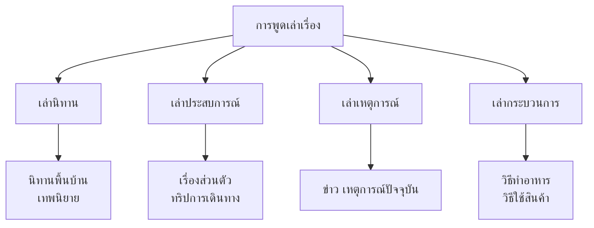

# การพูดเล่าเรื่อง

> เล่านิทาน เล่าประสบการณ์ เล่าเรื่องตามลำดับเหตุการณ์ — ทักษะการเล่าเรื่องเพื่อสื่อสาร

**การพูดเล่าเรื่อง** คือ การใช้ภาษาพูดเพื่อเล่าเหตุการณ์ ประสบการณ์ หรือนิทานให้ผู้อื่นฟัง การเล่าเรื่องที่ดีต้องมีลำดับเหตุการณ์ชัดเจน ใช้ภาษาที่น่าสนใจ และทำให้ผู้ฟังเข้าใจและเพลิดเพลิน

---

## เนื้อหาตามช่วงชั้น

| ช่วงชั้น | เนื้อหา |
|---|---|
| **ป.1–3** | เล่านิทานสั้นๆ เล่าเรื่องตามภาพ |
| **ป.4–6** | เล่าประสบการณ์ เล่าเรื่องตามลำดับ |
| **ม.1–3** | เล่าเรื่องที่ซับซ้อนขึ้น ใช้เทคนิคการเล่าเรื่อง |

---

## ประเภทของการเล่าเรื่อง

---

## โครงสร้างการเล่าเรื่อง

### โครงเรื่องแบบ 3 ส่วน

| ส่วน | รายละเอียด |
|---|---|
| **ต้นเรื่อง (Beginning)** | แนะนำตัวละคร สถานที่ เวลา สถานการณ์เริ่มต้น |
| **กลางเรื่อง (Middle)** | เหตุการณ์ที่เกิดขึ้น ปัญหา จุดสูงสุด |
| **ท้ายเรื่อง (End)** | การแก้ปัญหา บทสรุป ข้อคิด |

### การเล่าตามลำดับเหตุการณ์

**คำเชื่อมที่ใช้:**

| ลำดับ | คำเชื่อม |
|---|---|
| เริ่มต้น | "วันนั้น..." "ก่อนอื่น..." |
| ถัดไป | "แล้ว..." "หลังจากนั้น..." "ต่อมา..." |
| พร้อมกัน | "ขณะที่..." "ในเวลาเดียวกัน..." |
| สุดท้าย | "ในที่สุด..." "สุดท้ายแล้ว..." |

---

## เทคนิคการเล่าเรื่องที่น่าสนใจ

### 1. ใช้น้ำเสียง

| เทคนิค | วิธีการ | ผล |
|---|---|---|
| **เปลี่ยนน้ำเสียง** | ปรับสูง-ต่ำตามตัวละคร | ตัวละครชัดเจน |
| **เน้นคำสำคัญ** | พูดดังขึ้น/ช้าลง | ดึงดูดความสนใจ |
| **หยุดพัก** | เงียบสักครู่ก่อนจุดสำคัญ | สร้างความตื่นเต้น |

### 2. ใช้ท่าทางและสีหน้า

- ขยับมือประกอบคำพูด
- เปลี่ยนสีหน้าตามเรื่อง
- ทำท่าเลียนแบบตัวละคร

### 3. ใช้คำพูดที่สร้างภาพ

| ธรรมดา | สร้างสรรค์ |
|---|---|
| "เดินไป" | "เดินจ้ำๆ ไป" |
| "ร้องไห้" | "ร้องไห้สะอื้นไห้" |
| "หัวเราะ" | "หัวเราะดังลั่น" |
| "กลัว" | "กลัวจนขนลุก" |

### 4. เชิญผู้ฟังมีส่วนร่วม

- ถามคำถามระหว่างเล่า
- ให้ผู้ฟังทายว่าจะเกิดอะไรขึ้น
- ทำเสียงเอฟเฟกต์

---

## ตัวอย่างการเล่าเรื่อง

### การเล่านิทาน (ป.1–3)

> วันหนึ่ง มีกระต่ายน้อยที่ชอบโอ้อวด **(ต้นเรื่อง)**
>
> กระต่ายบอกว่า "ฉันวิ่งเร็วที่สุดในป่า!" เต่าที่ได้ยินก็พูดว่า "งั้นเรามาแข่งกัน" **(ปัญหา)**
>
> กระต่ายวิ่งนำห่าง แล้วคิดว่า "ฉันเร็วกว่า นอนพักก่อนก็ได้" ส่วนเต่าก็เดินต่อไปเรื่อยๆ ไม่หยุด **(กลางเรื่อง)**
>
> ในที่สุด เต่ามาถึงเส้นชัยก่อนกระต่ายที่กำลังนอนหลับ **(จุดสูงสุด)**
>
> กระต่ายตื่นขึ้นมา วิ่งตามไป แต่สายเกินไป เต่าชนะ! **(ท้ายเรื่อง)**
>
> เราได้เรียนรู้ว่า การขยันไม่ทิ้งนำชัยชนะมาให้ **(ข้อคิด)**

### การเล่าประสบการณ์ (ป.4–6)

> ช่วงปิดเทอม ครอบครัวของฉันได้ไปเที่ยวทะเลที่หัวหิน **(ต้นเรื่อง)**
>
> วันแรกเราไปเล่นน้ำทะเล น้ำใสมาก ทรายขาวสะอาด ฉันได้สร้างปราสาททรายใหญ่โต **(รายละเอียด)**
>
> ตอนเย็นเราไปกินอาหารทะเลสดๆ ที่ร้านริมหาด ปูเผาอร่อยมาก **(รายละเอียด)**
>
> แต่วันที่สอง ฝนตกทั้งวัน เราเลยไปช้อปปิ้งที่ตลาดน้ำแทน ก็สนุกไม่แพ้กัน **(ความขัดแย้งและแก้ไข)**
>
> ทริปนี้ทำให้ฉันรู้ว่า การได้อยู่กับครอบครัวคือความสุขที่ใหญ่ที่สุด **(ข้อคิด)**

---

## ขั้นตอนการเตรียมการเล่าเรื่อง

1. **เลือกเรื่องที่จะเล่า**: นิทาน ประสบการณ์ เหตุการณ์
2. **จดประเด็นสำคัญ**: ต้นเรื่อง กลางเรื่อง ท้ายเรื่อง
3. **ฝึกเล่า**: ซ้อมพูด 2-3 รอบ
4. **เตรียมท่าทาง**: น้ำเสียง สีหน้า มือ
5. **เล่าด้วยใจ**: อย่าอ่านจากสมุดตลอดเวลา

---

## เคล็ดลับการเล่าเรื่องดี

1. **เริ่มต้นน่าสนใจ**: ดึงดูดผู้ฟังตั้งแต่แรก
2. **ลำดับเหตุการณ์ชัดเจน**: ต้น-กลาง-ท้าย
3. **ใช้น้ำเสียงและท่าทาง**: ทำให้เรื่องมีชีวิต
4. **รู้เรื่องก่อนเล่า**: อย่าเล่าเรื่องที่ไม่รู้จัก
5. **ดูปฏิกิริยาผู้ฟัง**: ปรับให้เหมาะสม
6. **จบให้ประทับใจ**: ทิ้งข้อคิดให้ผู้ฟัง

---

## ดูเพิ่มเติม

- [[05_การพูดในชีวิตประจำวัน|การพูดในชีวิตประจำวัน]]
- [[07_การพูดแสดงความคิดเห็น|การพูดแสดงความคิดเห็น]]
