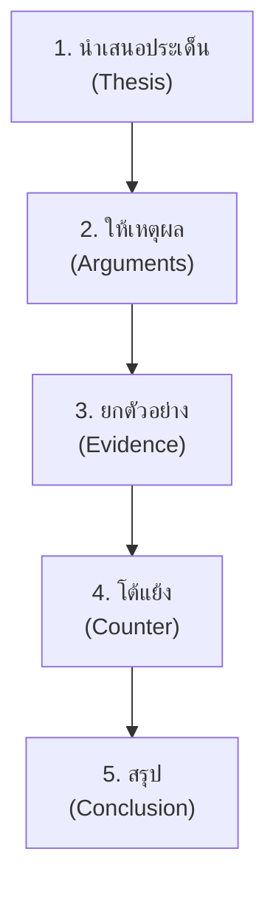
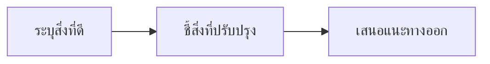

# การพูดแสดงความคิดเห็น

> แสดงความคิดเห็น วิพากษ์อย่างสร้างสรรค์ โต้วาที — พูดอย่างมีเหตุผลและมารยาท

**การพูดแสดงความคิดเห็น** คือ การพูดเพื่อแสดงทัศนะหรือจุดยืนเ่กี่ยวกับประเด็นใดประเด็นหนึ่ง โดยมีเหตุผลและหลักฐานสนับสนุน ตลอดจนการโต้วาทีและการวิพากษ์อย่างสร้างสรรค์

---

## เนื้อหาตามช่วงชั้น

| ช่วงชั้น | เนื้อหา |
|---|---|
| **ป.4–6** | แสดงความรู้สึก แสดงความคิดเห็นเบื้องต้น |
| **ม.1–3** | โต้วาที โต้แย้งอย่างมีเหตุผล |
| **ม.4–6** | วิพากษ์สร้างสรรค์ โต้วาทีเชิงวิชาการ |

---

## โครงสร้างการพูดแสดงความคิดเห็น

---

## หลักการแสดงความคิดเห็นที่ดี

### โครงสร้าง PREP

| ขั้น | ความหมาย | ตัวอย่าง |
|---|---|---|
| **P** — Point | นำเสนอจุดยืน | "ฉันเห็นด้วยกับการห้ามใช้โทรศัพท์ในห้องเรียน" |
| **R** — Reason | ให้เหตุผล | "เพราะโทรศัพท์ทำให้เสียสมาธิจากบทเรียน" |
| **E** — Example | ยกตัวอย่าง | "เช่น เมื่อเดือนที่แล้ว..." |
| **P** — Point | ย้ำจุดยืน | "ดังนั้น ฉันจึงเห็นด้วยกับการห้าม" |

---

## การโต้วาที (Debate)

### รูปแบบการโต้วาที

| รูปแบบ | โครงสร้าง |
|---|---|
| **ฝ่ายตาม 2 ฝ่าย** | ฝ่ายเห็นด้วย vs ฝ่ายไม่เห็นด้วย |
| **โอกาสพูด** | แต่ละฝ่ายพูดตามลำดับ |
| **เวลาจำกัด** | แต่ละคนพูดได้จำกัดเวลา |
| **ผู้ตัดสิน** | ครูหรือคณะกรรมการ |

### เทคนิคการโต้แย้ง

| เทคนิค | รายละเอียด |
|---|---|
| **ยอมรับบางส่วน** | ยอมรับจุดที่คู่กรณีพูดถูก แต่เสริมมุมมองใหม่ |
| **ชี้จุดอ่อน** | ชี้ให้เห็นจุดอ่อนในการให้เหตุผลของคู่กรณี |
| **ยกตัวอย่างตรงกันข้าม** | ยกตัวอย่างที่ขัดแย้งกับคู่กรณี |
| **ถามคำถาม** | ถามคำถามที่ทำให้คู่กรณีตอบยาก |
| **สรุปให้หนักแน่น** | สรุปจุดยืนให้ชัดเจน |

---

## การวิพากษ์อย่างสร้างสรรค์

### หลักการวิพากษ์ที่ดี

| ไม่ควรทำ ❌ | ควรทำ ✅ |
|---|---|
| โจมตีบุคคล | โต้แย้งด้วยเหตุผล |
| ใช้คำหยาบ | ใช้คำสุภาพ |
| อคติ | เป็นกลาง |
| ปิดกั้นความคิดอื่น | เปิดรับมุมมอง |
| สรุปเร็ว | ฟังให้จบ |

---

## ตัวอย่างการพูดแสดงความคิดเห็น

**ประเด็น:** โรงเรียนควรลดการบ้านหรือไม่

**จุดยืน:** เห็นด้วยกับการลด

**เหตุผล:**
1. นักเรียนมีเวลาพักผ่อนน้อยเกินไป
2. การบ้านจำนวนมากทำให้เครียด
3. เวลาว่างสามารถใช้พัฒนาทักษะอื่น เช่น กีฬา ศิลปะ

**ตัวอย่าง:**
- จากการสำรวจ นักเรียนส่วนใหญ่นอนไม่ถึง 8 ชั่วโมง
- นักเรียนที่มีเวลาออกกำลังกายมีสุขภาพและสมาธิดีกว่า

**โต้แย้งฝ่ายตรงข้าม:**
- บางคนกังวลว่าลดการบ้านจะทำให้ผลการเรียนแย่ลง แต่จริงๆ การบ้านน้อยแต่มีคุณภาพดีกว่ามากแต่ทำเอาหน่วยก้าวเร็ว

---

## การวิพากษ์สร้างสรรค์

**ตัวอย่าง (ม.4–6):**
> ภาพยนตร์เรื่องนี้มีการถ่ายทำที่สวยงาม โดยเฉพาะฉากธรรมชาติที่ใช้แสงสีได้สร้างความรู้สึกสะเทือนใจ แต่โครงเรื่องค่อนข้างจืด การพัฒนาตัวละครเอกยังไม่ลึกพอ ถ้าเพิ่มเหตุผลในการกระทำของตัวเอกจะทำใche้สมบูรณ์ขึ้น

---

## เคล็ดลับการพูดแสดงความคิดเห็น

1. **ระบุจุดยืนชัดเจน**: เห็นด้วยหรือไม่เห็นด้วย
2. **ให้เหตุผล 2-3 ข้อ**: อย่าอ้างเพียงความรู้สึก
3. **ใช้ PREP**: Point-Reason-Example-Point
4. **โต้แย้งด้วยเหตุผล**: ไม่โจมตีบุคคล
5. **ใช้คำสุภาพ**: "คิดว่า..." "หากมองในอีกแง่..."
6. **ฟังให้จบ**: รอให้ผู้อื่นพูดจบก่อนตอบ

---

## ดูเพิ่มเติม

- [[06_การพูดเล่าเรื่อง|การพูดเล่าเรื่อง]]
- [[08_การพูดในที่ประชุม|การพูดในที่ประชุม]]
