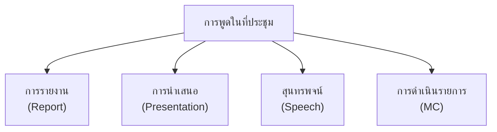
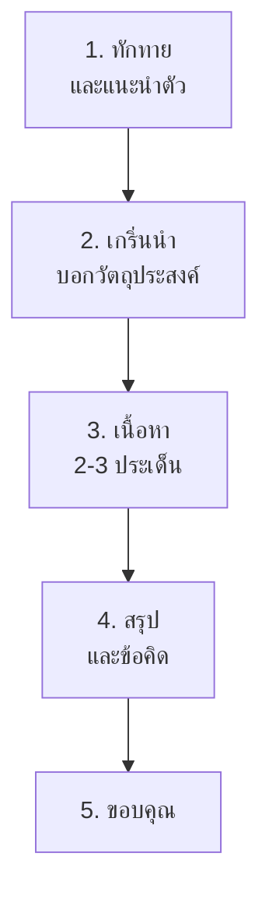

# การพูดในที่ประชุม

> พูดรายงาน นำเสนอผลงาน กล่าวสุนทรพจน์ — ทักษะการพูดในที่สาธารณะ

**การพูดในที่ประชุม** คือ การพูดต่อกลุ่มคนในสถานการณ์ที่เป็นทางการหรือกึ่งทางการ เพื่อรายงาน นำเสนอ หรือกล่าวสุนทรพจน์ ต้องมีการเตรียมตัว โครงสร้างชัดเจน และการสื่อสารที่มีประสิทธิภาพ

---

## เนื้อหาตามช่วงชั้น

| ช่วงชั้น | เนื้อหา |
|---|---|
| **ป.4–6** | รายงานกลุ่ม นำเสนอง่ายๆ |
| **ม.1–3** | นำเสนอผลงาน ใช้สื่อช่วย |
| **ม.4–6** | สุนทรพจน์ การพูดในโอกาสต่างๆ |

---

## ประเภทการพูดในที่ประชุม

---

## การรายงานและนำเสนอ

### โครงสร้างการนำเสนอ

| ส่วน | เนื้อหา | เวลา |
|---|---|---|
| **เปิด** | ทักทาย แนะนำตัว บอกหัวข้อ | 10% |
| **เนื้อหา** | ประเด็นหลัก ย่อหน้าตามลำดับ | 70% |
| **สรุป** | สรุปประเด็น ขอบคุณ | 10% |
| **ถาม-ตอบ** | ตอบคำถาม | 10% |

### เคล็ดลับการนำเสนอดี

1. **เตรียมสื่อ**: สไลด์ ภาพ วิดีโอ
2. **ซ้อมพูด**: จับเวลา อย่าอ่านทุกคำ
3. **สบตา**: มองผู้ฟัง ไม่มองสไลด์
4. **ใช้น้ำเสียง**: เน้นคำสำคัญ เปลี่ยนจังหวะ
5. **ท่าทาง**: มือ สีหน้า การยืน
6. **เวลาพอเหมาะ**: ไม่สั้นหรือยาวเกินไป

---

## การกล่าวสุนทรพจน์

### โครงสร้างสุนทรพจน์

### โอกาสกล่าวสุนทรพจน์

| โอกาส | จุดประสงค์ |
|---|---|
| รับปริญญา | กล่าวในฐานะผู้แทนนักศึกษา |
| งานแต่งงาน | แสดงความยินดี อวยพร |
| งานวันเกิด | แสดงความรัก ขอบคุณ |
| งานรำลึก | เชิดชูเกียรติ ระลึกถึง |
| งานส่งนักเรียน | กล่าวคำอำลา อวยพร |

### ตัวอย่างสุนทรพจน์

**โอกาส: วันครู**

> คณะผู้บริหาร ครู และเพื่อนนักเรียนที่นับถือ
>
> วันนี้เป็นวันครู วันที่เราต้องขอบคุณครูทุกท่าน ครูไม่ได้แค่สอนหนังสือ แต่ยังปลูกฝังคุณธรรมและค่านิยมที่ดีให้เรา
>
> ขอให้ครูทุกท่านมีความสุขและสุขภาพแล้วกันนะครับ และขอให้เรานักเรียนตอบแทนครูด้วยการเป็นนักเรียนที่ดี
>
> ขอบคุณครับ

---

## การดำเนินรายการ (MC)

### โครงสร้างการดำเนินรายการ

| ส่วน | รายละเอียด |
|---|---|
| **เปิดรายการ** | ทักทาย แนะนำตัว บอกชื่อรายการ |
| **เนื้อหา** | นำเสนอรายการตามลำดับ |
| **เชื่อมต่อ** | เชื่อมระหว่างรายการต่างๆ |
| **ปิดรายการ** | สรุป ขอบคุณ ลา |
| **สถานการณ์ฉุกเฉิน** | ยิ้ม ปรับตัว ไม่ตื่น |

### เคล็ดลับ MC ดี

1. **เตรียมบท**: แต่ไม่อ่านทุกคำ
2. **สบตากับผู้ฟัง**: มองห้องประชุม
3. **ใช้น้ำเสียง**: ดึงดูดความสนใจ
4. **รู้เรื่องราว**: เข้าใจเนื้อหาที่นำเสนอ
5. **รับมือกับเหนื่อยยาก**: ยิ้ม ปรับตัว

---

## การเอาชนะความกลัวการพูดในที่สาธารณะ

| วิธี | รายละเอียด |
|---|---|
| **เตรียมตัวให้ดี** | ยิ่งเตรียมดียิ่งมั่นใจ |
| **ซ้อมพูกหลายครั้ง** | ซ้อมหน้ากระจก หน้าเพื่อน |
| **หายใจลึก** | ช่วยสงบใจ |
| **เริ่มต้นด้วยกลุ่มเล็ก** | ค่อยๆ เพิ่มจำนวนผู้ฟัง |
| **เน้นเนื้อหา** | ไม่เน้นตัวเอง |
| **ยอมรับความผิดพลาด** | ไม่มีใครสมบูรณ์ |

---

## เคล็ดลับการพูดในที่ประชุม

1. **เตรียมตัวให้ดี**: เตรียมเนื้อหาและสื่อ
2. **ซ้อมพูด**: จับเวลา ซ้อมหน้ากระจก
3. **สบตา**: มองผู้ฟังทั่วห้อง
4. **ใช้น้ำเสียง**: เน้นคำสำคัญ
5. **เวลาพอเหมาะ**: ไม่สั้นหรือยาวเกิน
6. **มั่นใจ**: ทำตามที่เตรียมไว้

---

## ดูเพิ่มเติม

- [[07_การพูดแสดงความคิดเห็น|การพูดแสดงความคิดเห็น]]
- [[10_การแสดงและการนำเสนอ|การแสดงและการนำเสนอ]]
