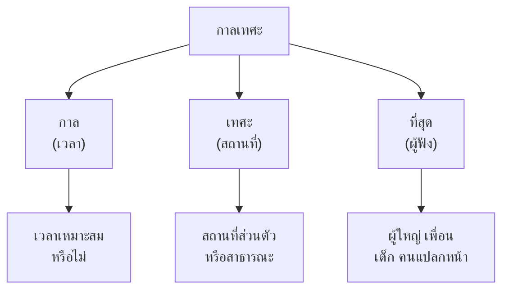

# มารยาทในการฟังและการพูด

> กาลเทศะ การใช้ถ้อยคำสุภาพ การเคารพผู้ฟัง — มารยาทที่ดีสร้างความสัมพันธ์

**มารยาทในการฟังและการพูด** คือ การประพฤติตนที่เหมาะสมเมื่อเป็นผู้ฟังและผู้พูด ครอบคลุมการรู้จักกาลเทศะ (knowing time and place) การใช้ถ้อยคำสุภาพ และการเคารพผู้อื่น

---

## เนื้อหาตามช่วงชั้น

| ช่วงชั้น | เนื้อหา |
|---|---|
| **ป.1–3** | มารยาทพื้นฐาน การพูดกับผู้ใหญ่ |
| **ป.4–6** | ตามกาลเทศะ คำสุภาพ |
| **ม.1–3** | ใช้ภาษาเหมาะสมกับสถานการณ์ |
| **ม.4–6** | มารยาทสากล การสื่อสารข้ามวัฒนธรรม |

---

## กาลเทศะ (Time and Place)

**กาลเทศะ** คือ ความรู้จักจังหวะเวลาและสถานที่ที่เหมาะสม รู้ว่าเมื่อไรควรพูดอะไร ที่ไหน เมื่อไร

### การพูดตามกาลเทศะ

| สถานการณ์ | ควรพูด | ไม่ควรพูด |
|---|---|---|
| ห้องสมุด | เสียงเบา กระซิบ | พูดดัง หัวเราะดัง |
| โบสถ์/วัด | สงบ นุ่มนวล | พูดดัง เรื่องไม่เหมาะสม |
| งานศพ | นุ่มนวล เย็นชา | หัวเราะ เรื่องสนุก |
| งานแต่งงาน | ยินดี ร่าเริง | เรื่องเศร้า |
| ห้องเรียน | ถาม-ตอบ มีส่วนร่วม | คุยกับเพื่อน เสียงดัง |
| โรงหนัง | เงียบ กระซิบ | พูดดัง โทรศัพท์ |

---

## การใช้ถ้อยคำสุภาพ

### คำสุภาพพื้นฐาน

| สถานการณ์ | คำสุภาพ |
|---|---|
| ได้รับสิ่งของ | "ขอบคุณครับ/ค่ะ" |
| ทำผิดพลาด | "ขอโทษครับ/ค่ะ" |
| ขอรบกวน | "รบกวน...หน่อยครับ/ค่ะ" |
| ไม่ได้ยิน | "ขอโทษครับ/ค่ะ รบกวนพูดอีกครั้ง" |
| ก่อนกิน | "ขอให้อิ่มหนำสำราญ" |
| ก่อนนอน | "ขอให้หลับฝันดี" |

### ความแตกต่าง: คำสุภาพ vs คำทั่วไป

| คำทั่วไป | คำสุภาพ | ใช้กับ |
|---|---|---|
| กิน | รับประทาน | ผู้ใหญ่ |
| มา | มาถึง, เสด็จ | ผู้ใหญ่ |
| ตาย | ถึงแก่กรรม | ผู้ใหญ่ |
| ชื่อ | นาม | ผู้ใหญ่ |
| ให้ | มอบ | ผู้ใหญ่ |
| บอก | กราบเรียน | ผู้ใหญ่ |
| เกลียด | ไม่ชอบ | ผู้ใหญ่ |

---

## การพูดกับผู้ใหญ่

### หลักการพูดกับผู้ใหญ่

1. **ใช้คำสุภาพ**: "ครับ" "ค่ะ" "นะครับ" "นะคะ"
2. **ไม่เรียกชื่อตรงๆ**: ใช้คำนำหน้า เช่น "คุณพ่อ" "คุณครู"
3. **ไม่พูดตัดบท**: รอให้ผู้ใหญ่พูดจบ
4. **ไม่โต้แย้งโดยตรง**: "รับทราบครับ แต่ผมคิดว่า..."
5. **พูดเบาและชัด**: ไม่ดังเกินไป

### คำนำหน้าชื่อ

| คำนำหน้า | ใช้กับ |
|---|---|
| คุณ | ผู้ใหญ่ทั่วไป |
| ครู | ครูผู้สอน |
| ลุง/ป้า | ผู้ใหญ่ที่สนิท |
| พี่ | ผู้ที่อายุมากกว่า |
| น้อง | ผู้ที่อายุน้อยกว่า |
| ท่าน | ผู้ใหญ่ที่เคารพสูง |

---

## มารยาทผู้ฟัง

| ควรทำ ✅ | ไม่ควรทำ ❌ |
|---|---|
| สบตากับผู้พูด | เล่นโทรศัพท์ |
| พยักหน้า | ทำเสียงรบกวน |
| ถามเมื่อผู้พูดพูดจบ | ตัดบทผู้พูด |
| จดบันทึก (ถ้าจำเป็น) | กระซิบกับคนข้างๆ |
| ให้ความสนใจ | ทำกิจกรรมอื่น |

---

## มารยาทผู้พูด

| ควรทำ ✅ | ไม่ควรทำ ❌ |
|---|---|
| ใช้คำสุภาพ | ใช้คำหยาบ |
| เสียงปกติ | เสียงดังเกินไป |
| สบตากับผู้ฟัง | มองที่อื่น |
| เนื้อหาเหมาะสม | พูดเรื่องส่วนตัว |
| เคารพผู้ฟัง | ดูถูกผู้ฟัง |

---

## มารยาทสากล (ม.4–6)

### การสื่อสารข้ามวัฒนธรรม

| ประเด็น | รายละเอียด |
|---|---|
| **การทักทาย** | แต่ละวัฒนธรรมมีแบบแผนต่างกัน |
| **ระยะห่าง** | บางวัฒนธรรมยืนใกล้ บางวัฒนธรรมยืนไกล |
| **การสบตา** | บางวัฒนธรรมถือว่าเคารพ บางวัฒนธรรมถือว่าไม่สุภาพ |
| **ภาษากาย** | ท่าทางเดียวกันอาจมีควะนายแตกต่างกัน |
| **หัวข้อต้องห้าม** | บางวัฒนธรรมห้ามพูดเรื่องเงิน ศาสนา |

---

## เคล็ดลับมารยาทในการฟังและการพูด

1. **รู้จักกาลเทศะ**: รู้ว่าเมื่อไร ที่ไหน พูดอะไร
2. **ใช้คำสุภาพ**: สร้างความประทับใจ
3. **เคารพผู้อื่น**: ไม่ว่าจะผู้ฟังหรือผู้พูด
4. **เสียงปกติ**: ไม่ดังหรือเบาเกินไป
5. **สบตา**: แสดงความจริงใจ
6. **มีอารมณ์ขัน**: แต่ใช้พอเหมาะ

---

## ดูเพิ่มเติม

- [[05_การพูดในชีวิตประจำวัน|การพูดในชีวิตประจำวัน]]
- [[01_การฟังอย่างตั้งใจ|การฟังอย่างตั้งใจ]]
