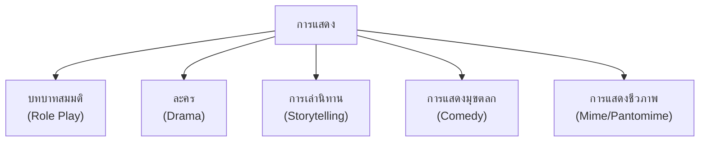
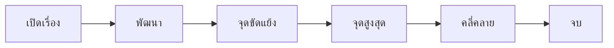

# การแสดงและการนำเสนอ

> แสดงบทบาทสมมติ แสดงละคร เล่านิทานประกอบท่าทาง — ส่งเสริมความมั่นใจและการแสดงออก

**การแสดงและการนำเสนอ** คือ การใช้ร่างกาย น้ำเสียง และอารมณ์เพื่อถ่ายทอดเรื่องราวหรือสาระให้ผู้ชม การแสดงช่วยพัฒนาความมั่นใจ การแสดงออก และการทำงานเป็นทีม

---

## เนื้อหาตามช่วงชั้น

| ช่วงชั้น | เนื้อหา |
|---|---|
| **ป.1–3** | แสดงบทบาทสมมติ เล่านิทานประกอบท่าทาง |
| **ป.4–6** | แสดงละครสั้น นำเสนอกลุ่ม |
| **ม.1–3** | นำเสนอกลุ่ม แสดงละครที่ซับซ้อนขึ้น |
| **ม.4–6** | การแสดงเชิงศิลปะ การนำเสนอเชิงวิชาการ |

---

## ประเภทของการแสดง

---

## การแสดงบทบาทสมมติ (Role Play)

**การแสดงบทบาทสมมติ** คือ การสวมบทบาทเป็นคนอื่นในสถานการณ์สมมติ เพื่อเรียนรู้หรือแก้ปัญหา

### ขั้นตอนการแสดงบทบาทสมมติ

1. **กำหนดสถานการณ์**: เลือกเรื่องที่จะแสดง
2. **กำหนดตัวละคร**: ใครเป็นใคร บุคลิกอย่างไร
3. **กำหนดปัญหา**: ตัวละครต้องเผชิญปัญหาอะไร
4. **แสดง**: แต่ละคนสวมบทบาทและแสดงตามสถานการณ์
5. **สรุป**: หลังแสดง อภิปรายสิ่งที่เรียนรู้

### ตัวอย่างสถานการณ์บทบาทสมมติ

| สถานการณ์ | ทักษะที่พัฒนา |
|---|---|
| ซื้อของที่ตลาด | การพูดสุภาพ การต่อรอง |
| ไปหาหมอ | การอธิบายอาการ |
| แก้ปัญหาเพื่อนทะเลาะกัน | การไกล่เกลี่ย |
| สัมภาษณ์งาน | การแนะนำตัว การตอบคำถาม |

---

## การแสดงละคร (Drama)

### องค์ประกอบของละคร

| องค์ประกอบ | รายละเอียด |
|---|---|
| **บทละคร (Script)** | เนื้อเรื่อง บทพูด ฉาก |
| **ตัวละคร (Characters)** | ตัวเอก ตัวรอง ตัวประกอบ |
| **ฉาก (Setting)** | สถานที่ เวลา บรรยากาศ |
| **เครื่องแต่งกาย (Costume)** | ชุด เครื่องประดับ |
| **อุปกรณ์ประกอบ (Props)** | ของใช้ในการแสดง |
| **แสง-เสียง** | สร้างบรรยากาศ |

### โครงเรื่องละคร

### ขั้นตอนการเตรียมการแสดงละคร

1. **เลือกเรื่อง**: กำหนดเนื้อเรื่องและแก่นเรื่อง
2. **เขียนบท**: บทพูด ฉาก ลำดับเหตุการณ์
3. **แจกบทบาท**: ใครเป็นตัวละครไหน
4. **ซ้อม**: บทพูด ท่าทาง การเคลื่อนไหว
5. **เตรียมอุปกรณ์**: ฉาก เครื่องแต่งกาย อุปกรณ์
6. **แสดง**: แสดงอย่างมั่นใจ
7. **สรุป**: รับฟังคำวิจารณ์

---

## การเล่านิทานประกอบท่าทาง

### เทคนิคการเล่านิทาน

| เทคนิค | วิธีการ |
|---|---|
| **เปลี่ยนเสียง** | เสียงตามตัวละคร เช่น เสียงแม่เสือ เสียงกระต่าย |
| **ท่าทาง** | ขยับมือ เท้า สีหน้า ตามเรื่อง |
| **การหยุดพัก** | หยุดก่อนจุดสำคัญ เพื่อสร้างความตื่นเต้น |
| **การเน้น** | พูดดังขึ้นหรือเบาลงตามเรื่อง |
| **การมีส่วนร่วม** | ให้ผู้ฟังช่วยทำเสียง ทำท่า |

---

## การนำเสนอ (Presentation)

### ประเภทการนำเสนอ

| ประเภท | ลักษณะ |
|---|---|
| **นำเสนอด้วยปากเปล่า** | พูดอย่างเดียว ไม่มีสื่อ |
| **นำเสนอด้วยสื่อ** | ใช้สไลด์ ภาพ วิดีโอ |
| **นำเสนอเชิงโต้ตอบ** | มีกิจกรรม ถาม-ตอบ |
| **นำเสนอแบบโปสเตอร์** | นำเสนอด้วยโปสเตอร์ |

### การใช้ภาษากายในการนำเสนอ

| ส่วนของร่างกาย | วิธีใช้ |
|---|---|
| **ดวงตา** | สบตากับผู้ฟังทั่วห้อง |
| **ใบหน้า** | ยิ้ม เปลี่ยนสีหน้าตามเรื่อง |
| **มือ** | ชี้ เปิด กระทำประกอบ |
| **ท่ายืน** | ยืนตรง มั่นใจ ไม่โยกเยก |
| **การเดิน** | เดินช้าๆ ไม่เดินไปมาด่วน |
| **น้ำเสียง** | ดังพอได้ยิน เปลี่ยนจังหวะ |

---

## การเอาชนะความกลัวการแสดง

| วิธี | รายละเอียด |
|---|---|
| **ซ้อมให้ชำนาญ** | ยิ่งซ้อมยิ่งมั่นใจ |
| **หายใจลึก** | ช่วยสงบเสียงสั่น |
| **เริ่มจากบทเล็ก** | ค่อยๆ เพิ่มความท้าทาย |
| **มองเห็นผู้ชมเป็นเพื่อน** | ไม่ใช่ผู้ตัดสิน |
| **ยอมรับความผิดพลาด** | แม้นักแสดงมืออาชีพก็พลาดได้ |
| **เพลิดเพลินกับการแสดง** | ทำให้ลืมความกลัว |

---

## เคล็ดลับการแสดงและการนำเสนอดี

1. **เตรียมตัวให้ดี**: บท อุปกรณ์ ฉาก
2. **ซ้อมหลายครั้ง**: ซ้อมจนคล่อง
3. **ใช้ภาษากาย**: มือ สีหน้า ท่าทาง
4. **ใช้น้ำเสียง**: เปลี่ยนตามตัวละครหรือเนื้อหา
5. **สบตากับผู้ชม**: สร้างการเชื่อมโยง
6. **มั่นใจ**: แสดงอย่างสนุกสนาน

---

## ดูเพิ่มเติม

- [[08_การพูดในที่ประชุม|การพูดในที่ประชุม]]
- [[06_การพูดเล่าเรื่อง|การพูดเล่าเรื่อง]]
