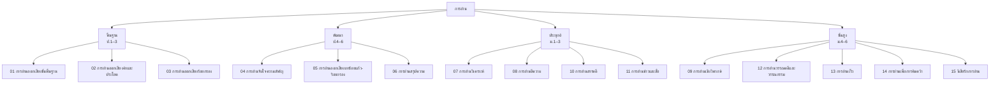

# สาระที่ 1: การอ่าน

> ทักษะการอ่านเป็นพื้นฐานของการเรียนรู้ทุกสาขา — ตั้งแต่การอ่านออกเสียงเบื้องต้นจนถึงการอ่านเชิงวิพากษ์

**การอ่าน** คือ สาระหลักของวิชาภาษาไทย ครอบคลุมตั้งแต่ทักษะพื้นฐาน (การอ่านออกเสียง) ไปจนถึงทักษะขั้นสูง (การอ่านเชิงวิพากษ์ การรู้เท่าทันสื่อ) ผู้เรียนจะพัฒนาทักษะตามลำดับจากง่ายไปยาก

---

## แผนภาพโครงสร้างสาระการอ่าน

---

## รายชื่อบทความ

| ลำดับ | หัวข้อ                                                                        | ระดับชั้น   |
| ----- | ----------------------------------------------------------------------------- | ----------- |
| 01    | [[01_การอ่านออกเสียงขั้นพื้นฐาน\|การอ่านออกเสียงขั้นพื้นฐาน]]                 | ป.1–3       |
| 02    | [[02_การอ่านออกเสียงคำและประโยค\|การอ่านออกเสียงคำและประโยค]]                 | ป.1–3       |
| 03    | [[03_การอ่านออกเสียงร้อยกรอง\|การอ่านออกเสียงร้อยกรอง]]                       | ป.1–3       |
| 04    | [[04_การอ่านจับใจความสำคัญ\|การอ่านจับใจความสำคัญ]]                           | ป.4–6       |
| 05    | [[05_การอ่านออกเสียงบทร้อยแก้ว-ร้อยกรอง\|การอ่านออกเสียงบทร้อยแก้ว-ร้อยกรอง]] | ป.4–6       |
| 06    | [[06_การอ่านสรุปความ\|การอ่านสรุปความ]]                                       | ป.4–6       |
| 07    | [[07_การอ่านวิเคราะห์\|การอ่านวิเคราะห์]]                                     | ม.1–3       |
| 08    | [[08_การอ่านตีความ\|การอ่านตีความ]]                                           | ม.1–3       |
| 09    | [[09_การอ่านเชิงวิพากษ์\|การอ่านเชิงวิพากษ์]]                                 | ม.4–6       |
| 10    | [[10_การอ่านสารคดี\|การอ่านสารคดี]]                                           | ม.1–3       |
| 11    | [[11_การอ่านข่าวและสื่อ\|การอ่านข่าวและสื่อ]]                                 | ม.1–6       |
| 12    | [[12_การอ่านวรรณคดีและวรรณกรรม\|การอ่านวรรณคดีและวรรณกรรม]]                   | ทุกช่วงชั้น |
| 13    | [[13_การอ่านเร็ว\|การอ่านเร็ว]]                                               | ม.4–6       |
| 14    | [[14_การอ่านเพื่อการค้นคว้า\|การอ่านเพื่อการค้นคว้า]]                         | ป.4–ม.6     |
| 15    | [[15_นิสัยรักการอ่าน\|นิสัยรักการอ่าน]]                                       | ทุกช่วงชั้น |

---

## การเชื่อมโยงกับสาระอื่น

| สาระ | เชื่อมโยงอย่างไร |
|---|---|
| [[../การเขียน/00_ภาพรวมการเขียน\|การเขียน]] | อ่านเพื่อเรียนรู้รูปแบบการเขียน |
| [[../การฟัง การดู และการพูด/00_ภาพรวมการฟัง\|การฟัง การดู และการพูด]] | อ่านออกเสียงเพื่อการนำเสนอ |
| [[../หลักการใช้ภาษาไทย/00_ภาพรวมหลักการใช้ภาษาไทย\|หลักการใช้ภาษาไทย]] | ใช้หลักภาษาในการวิเคราะห์คำและประโยค |
| [[../วรรณคดีและวรรณกรรม/00_ภาพรวมวรรณคดี\|วรรณคดีและวรรณกรรม]] | อ่านวรรณคดีเพื่อความซาบซึ้ง |
