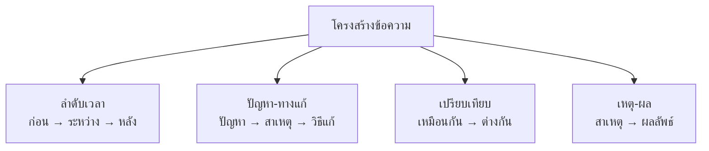

# การอ่านวิเคราะห์

> แยกแยะองค์ประกอบของเรื่อง: ข้อเท็จจริง ข้อคิดเห็น จุดประสงค์ผู้เขียน โครงสร้างข้อความ

**การอ่านวิเคราะห์** คือ การอ่านอย่างลึกซึ้งเพื่อแยกแยะองค์ประกอบต่างๆ ของเรื่อง ไม่ใช่แค่เข้าใจว่า "เขียนอะไร" แต่ต้องเข้าใจว่า "เขียนอย่างไร" และ "เขียนทำไม"

---

## เนื้อหาตามช่วงชั้น

| ช่วงชั้น | เนื้อหา |
|---|---|
| **ป.4–6** | แยกตัวละครและเหตุการณ์ แยกข้อเท็จจริงกับข้อคิดเห็น |
| **ม.1–3** | วิเคราะห์โครงสร้างข้อความ จุดประสงค์ผู้เขียน เทคนิคการโน้มน้าว |
| **ม.4–6** | วิเคราะห์การโต้แย้ง เทคนิคทางวรรณศิลป์ ความสมเหตุสมผลของข้อโต้แย้ง |

---

## ข้อเท็จจริง vs ข้อคิดเห็น

| ข้อเท็จจริง | ข้อคิดเห็น |
|---|---|
| พิสูจน์ได้ ตรวจสอบได้ | เป็นความเห็นส่วนตัว |
| มีข้อมูลสนับสนุน | ไม่มีหลักฐานชัดเจน |
| "น้ำเดือดที่ 100 องศาเซลเซียส" | "อากาศวันนี้ร้อนมาก" |
| "กรุงเทพฯ เป็นเมืองหลวงของไทย" | "กรุงเทพฯ เป็นเมืองที่สวยงามที่สุด" |

---

## จุดประสงค์ของผู้เขียน

| จุดประสงค์ | ลักษณะ |
|---|---|
| **ให้ความรู้** | ให้ข้อมูล ข้อเท็จจริง คำอธิบาย |
| **โน้มน้าวใจ** | ชักจูงให้เชื่อ ให้ทำ ใช้ภาษาชักชวน |
| **ให้ความบันเทิง** | เล่าเรื่องสนุกสนาน ใช้ภาษาที่มีสีสัน |
| **แสดงความคิดเห็น** | แสดงทัศนะส่วนตัว มีเหตุผลประกอบ |

---

## โครงสร้างข้อความที่พบบ่อย

---

## ดูเพิ่มเติม

- [[08_การอ่านตีความ|การอ่านตีความ]]
- [[09_การอ่านเชิงวิพากษ์|การอ่านเชิงวิพากษ์]]
