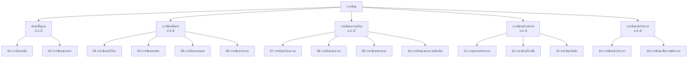

# สาระที่ 2: การเขียน

> ทักษะการเขียนเป็นพื้นฐานของการศึกษาขั้นพื้นฐาน — ตั้งแต่การคัดลายมือในระดับต้น ไปจนถึงการเขียนเชิงวิชาการในระดับสูง

**การเขียน** เป็นทักษะการสื่อสารที่ซับซ้อนที่สุด ต้องอาศัยทั้งความรู้ด้านหลักภาษา ความคิดสร้างสรรค์ และความสามารถในการเรียบเรียงความคิด หลักสุตรเริ่มตั้งแต่การคัดลายมือในระดับต้น ไปจนถึงการเขียนเชิงวิชาการในระดับสูง

---

## แผนภาพโครงสร้างสาระการเขียน

---

## รายชื่อบทความ

| ลำดับ | หัวข้อ                          | ระดับชั้น   |
| ----- | ------------------------------- | ----------- |
| 01    | [[01_การคัดลายมือ]]             | ป.1–3       |
| 02    | [[02_การเขียนสะกดคำ]]           | ป.1–6       |
| 03    | [[03_การเขียนประโยค]]           | ป.1–6       |
| 04    | [[04_การเขียนย่อหน้า]]          | ป.4–ม.3     |
| 05    | [[05_การเขียนจดหมาย]]           | ป.4–ม.3     |
| 06    | [[06_การเขียนรายงาน]]           | ม.1–6       |
| 07    | [[07_การเขียนเรียงความ]]        | ม.1–6       |
| 08    | [[08_การเขียนย่อความ]]          | ม.1–6       |
| 09    | [[09_การเขียนพรรณนา]]           | ม.1–6       |
| 10    | [[10_การเขียนแสดงความคิดเห็น]]  | ม.1–6       |
| 11    | [[11_การแต่งบทร้อยกรอง]]        | ป.4–ม.6     |
| 12    | [[12_การเขียนเรื่องสั้น]]       | ม.1–6       |
| 13    | [[13_การเขียนบันทึก]]           | ทุกช่วงชั้น |
| 14    | [[14_การเขียนเชิงวิชาการ]]      | ม.4–6       |
| 15    | [[15_การเขียนเพื่อการสมัครงาน]] | ม.4–6       |

---

## การเชื่อมโยงกับสาระอื่น

| สาระ                                                | เชื่อมโยงอย่างไร                |
| --------------------------------------------------- | ------------------------------- |
| [[../การอ่าน/00_ภาพรวมการอ่าน]]                     | อ่านเพื่อเรียนรู้รูปแบบการเขียน |
| [[../การฟัง การดู และการพูด/00_ภาพรวมการฟัง]]       | เขียนเพื่อเตรียมการพูด          |
| [[../หลักการใช้ภาษาไทย/00_ภาพรวมหลักการใช้ภาษาไทย]] | ใช้หลักภาษาในการเขียน           |
| [[../วรรณคดีและวรรณกรรม/00_ภาพรวมวรรณคดี]]          | เรียนรู้เทคนิคจากวรรณคดี        |
