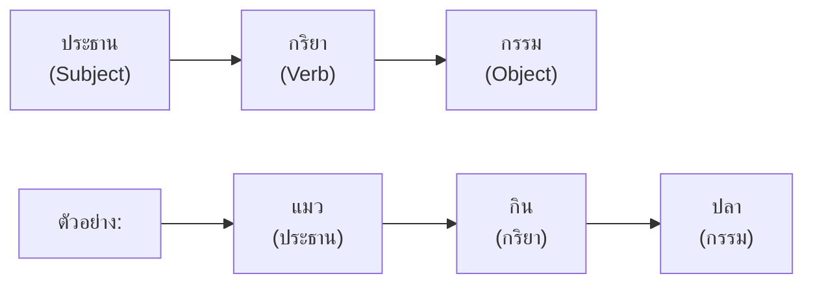

# การเขียนประโยค

> เขียนประโยคให้ถูกต้องตามหลักไวยากรณ์: ประธาน กริยา กรรม

**การเขียนประโยค** คือ การนำคำมาเรียงกันเป็นประโยคที่สมบูรณ์ มีความหมายชัดเจน และถูกต้องตามหลักไวยากรณ์ การเขียนประโยคที่ดีเป็นพื้นฐานของการเขียนย่อหน้าและความเรียง

---

## เนื้อหาตามช่วงชั้น

| ช่วงชั้น | เนื้อหา |
|---|---|
| **ป.1–3** | ประโยคพื้นฐาน (ประธาน + กริยา) ประโยคบอกเล่า ปฏิเสธ คำถาม |
| **ป.4–6** | ประโยคขยาย (มีคำขยาย) ประโยคความรวม (ใช้คำเชื่อม) |
| **ม.1–3** | ประโยคความซ้อน (มีอนุประโยค) ประโยคซับซ้อน |

---

## โครงสร้างประโยคพื้นฐาน

---

## ประเภทของประโยค

### ตามโครงสร้าง

| ประเภท | ลักษณะ | ตัวอย่าง |
|---|---|---|
| **ประโยคความเดียว** | ประธาน 1 + กริยา 1 | เด็กวิ่ง |
| **ประโยคความรวม** | หลายประโยคเชื่อมกัน | เด็กวิ่งและกระโดด |
| **ประโยคความซ้อน** | มีประโยคหลักและประโยคย่อย | เด็กที่วิ่งเร็วที่สุดชนะการแข่งขัน |

### ตามจุดประสงค์

| ประเภท | ลักษณะ | ตัวอย่าง |
|---|---|---|
| **ประโยคบอกเล่า** | แจ้งข้อมูล | วันนี้อากาศดี |
| **ประโยคปฏิเสธ** | ปฏิเสธข้อมูล | ฉันไม่ไป |
| **ประโยคคำถาม** | ถามข้อมูล | เธอไปไหน |
| **ประโยคขอร้อง** | ขอร้อง | กรุณาช่วยฉันหน่อย |
| **ประโยคคำสั่ง** | สั่ง | นั่งลง |
| **ประโยคอุทาน** | แสดงอารมณ์ | สวยจังเลย! |

---

## คำเชื่อมประโยค

| คำเชื่อม | ใช้สำหรับ | ตัวอย่าง |
|---|---|---|
| **และ** | เชื่อมความที่เหมือนกัน | ฉันชอบสีแดงและสีน้ำเงิน |
| **แต่** | เชื่อมความที่ต่างกัน | เขาขยันแต่สอบตก |
| **หรือ** | เลือกอย่างใดอย่างหนึ่ง | กินข้าวหรือกินก๋วยเตี๋ยว |
| **เพราะ** | บอกเหตุผล | ฉันไม่ไปเพราะป่วย |
| **ดังนั้น** | แสดงผล | ฝนตกดังนั้นถนนลื่น |

---

## เคล็ดลับการเขียนประโยคดี

1. **มีประธานและกริยาครบ**: อย่าเขียนประโยคไม่สมบูรณ์
2. **ใช้คำเชื่อมให้เหมาะสม**: เพื่อความต่อเนื่อง
3. **หลีกเลี่ยงประโยคยาวเกินไป**: แยกเป็นหลายประโยคถ้าจำเป็น
4. **ใช้เครื่องหมายวรรคตอน**: จุด เครื่องหมายคำถาม ฯลฯ
5. **อ่านทบทวน**: เช็คว่าประโยคชัดเจนหรือไม่

---

## ดูเพิ่มเติม

- [[02_การเขียนสะกดคำ|การเขียนสะกดคำ]]
- [[04_การเขียนย่อหน้า|การเขียนย่อหน้า]]
