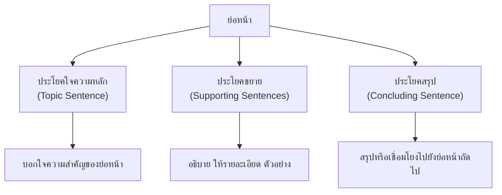

# การเขียนย่อหน้า

> เขียนย่อหน้าให้สมบูรณ์: มีใจความหลักและประโยคขยาย

**การเขียนย่อหน้า** คือ การนำประโยคหลายประโยคมาเรียงกันเป็นเรื่องเดียวกัน โดยมีย่อหน้าละหนึ่งใจความหลัก (main idea) และมีประโยคขยาย (supporting sentences) เพื่ออธิบายหรือสนับสนุนใจความหลัก

---

## เนื้อหาตามช่วงชั้น

| ช่วงชั้น | เนื้อหา |
|---|---|
| **ป.4–6** | เขียนย่อหน้าสั้นๆ 3-5 ประโยค ระบุใจความหลักและประโยคขยาย |
| **ม.1–3** | เขียนย่อหน้าที่มีโครงสร้างสมบูรณ์ ใช้คำเชื่อมที่เหมาะสม |
| **ม.4–6** | เขียนความเรียงหลายย่อหน้า เชื่อมโยงย่อหน้าอย่างเป็นระบบ |

---

## โครงสร้างของย่อหน้า

---

## องค์ประกอบของย่อหน้า

| องค์ประกอบ | หน้าที่ | ตำแหน่ง |
|---|---|---|
| **ประโยคใจความหลัก** | บอกใจความสำคัญของย่อหน้า | ส่วนใหญ่อยู่ต้นย่อหน้า |
| **ประโยคขยาย** | อธิบาย ให้รายละเอียด ยกตัวอย่าง | กลางย่อหน้า |
| **ประโยคสรุป** | สรุปหรือเชื่อมโยง | ท้ายย่อหน้า |

---

## ตัวอย่างย่อหน้า

> **สัตว์เลี้ยงมีประโยชน์หลายอย่าง** ประการแรก สัตว์เลี้ยงเป็นเพื่อนที่ดี ช่วยลดความเหงาและความเครียด ประการที่สอง สัตว์เลี้ยงช่วยให้เรามีความรับผิดชอบ ต้องให้อาหาร ดูแล และพาสัตว์ไปหาหมอ ประการที่สาม สัตว์เลี้ยงบางชนิดช่วยป้องกันบ้าน เช่น สุนัขที่เห่าเมื่อมีคนแปลกหน้ามา **ดังนั้น การเลี้ยงสัตว์จึงมีประโยชน์มากกว่าที่คิด**

| องค์ประกอบ | ข้อความ |
|---|---|
| ประโยคใจความหลัก | สัตว์เลี้ยงมีประโยชน์หลายอย่าง |
| ประโยคขยาย | ประการแรก... ประการที่สอง... ประการที่สาม... |
| ประโยคสรุป | ดังนั้น การเลี้ยงสัตว์จึงมีประโยชน์มากกว่าที่คิด |

---

## เคล็ดลับการเขียนย่อหน้าดี

1. **มีใจความหลักเดียว**: อย่าเขียนหลายเรื่องในย่อหน้าเดียว
2. **ประโยคใจความหลักชัดเจน**: อยู่ต้นย่อหน้าเพื่อให้ผู้อ่านเข้าใจทันที
3. **ใช้คำเชื่อม**: เพื่อเชื่อมโยงประโยค (ประการแรก, นอกจากนี้, ดังนั้น)
4. **ย่อหน้ามีความยาวเหมาะสม**: 3-7 ประโยคต่อ 1 ย่อหน้า
5. **ขึ้นย่อหน้าใหม่**: เมื่อเปลี่ยนเรื่องหรือประเด็น

---

## ดูเพิ่มเติม

- [[03_การเขียนประโยค|การเขียนประโยค]]
- [[07_การเขียนเรียงความ|การเขียนเรียงความ]]
