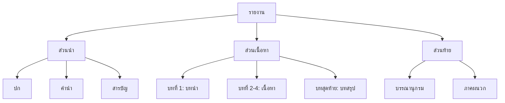

# การเขียนรายงาน

> เขียนรายงานเชิงวิชาการ: มีโครงสร้างครบถ้วน อ้างอิงแหล่งข้อมูล

**การเขียนรายงาน** คือ การนำเสนอผลการค้นคว้าหรือการศึกษาเรื่องใดเรื่องหนึ่งอย่างเป็นระบบ รายงานที่ดีต้องมีโครงสร้างชัดเจน มีข้อมูลสนับสนุน และอ้างอิงแหล่งที่มาอย่างถูกต้อง

---

## เนื้อหาตามช่วงชั้น

| ช่วงชั้น | เนื้อหา |
|---|---|
| **ม.1–3** | เขียนรายงานพื้นฐาน โครงเรื่อง สารบัญ เนื้อหา บรรณานุกรม |
| **ม.4–6** | เขียนรายงานเชิงวิชาการ วิจัย การอ้างอิงที่ซับซ้อน |

---

## โครงสร้างของรายงาน



---

## ส่วนประกอบของรายงาน

### ส่วนนำ

| ส่วน | เนื้อหา |
|---|---|
| **ปก** | ชื่อเรื่อง ชื่อผู้จัดทำ ชั้นเรียน โรงเรียน |
| **คำนำ** | กล่าวถึงจุดประสงค์และขอบเขตของรายงาน |
| **สารบัญ** | รายชื่อบทและหัวข้อพร้อมเลขหน้า |

### ส่วนเนื้อหา

| ส่วน | เนื้อหา |
|---|---|
| **บทนำ** | ที่มา ความสำคัญ ขอบเขต |
| **เนื้อหา** | ข้อมูลจากการค้นคว้า แบ่งเป็นบท/หัวข้อ |
| **บทสรุป** | สรุปผลการค้นคว้า ข้อเสนอแนะ |

### ส่วนท้าย

| ส่วน | เนื้อหา |
|---|---|
| **บรรณานุกรม** | รายชื่อแหล่งข้อมูลทั้งหมด |
| **ภาคผนวก** | ข้อมูลเพิ่มเติม (ถ้ามี) |

---

## การเขียนบรรณานุกรม

**รูปแบบพื้นฐาน:**
```
ผู้แต่ง. (ปีที่พิมพ์). ชื่อเรื่อง. สถานที่พิมพ์: สำนักพิมพ์.
```

**ตัวอย่าง:**
```
สมชาย ใจดี. (2560). หลักภาษาไทย. กรุงเทพฯ: จุฬาลงกรณ์มหาวิทยาลัย.
```

---

## เคล็ดลับการเขียนรายงาน

1. **วางแผนก่อนเขียน**: กำหนดหัวข้อ โครงสร้าง ขอบเขต
2. **ค้นคว้าจากหลายแหล่ง**: อย่าใช้แหล่งเดียว
3. **จดบันทึกแหล่งข้อมูล**: เพื่อเขียนบรรณานุกรม
4. **เขียนด้วยภาษาของตนเอง**: อย่าคัดลอกมาทั้งดุ้น
5. **ตรวจสอบและแก้ไข**: อ่านทบทวนก่อนส่ง

---

## ดูเพิ่มเติม

- [[05_การเขียนจดหมาย|การเขียนจดหมาย]]
- [[13_การเขียนเชิงวิชาการ|การเขียนเชิงวิชาการ]]
