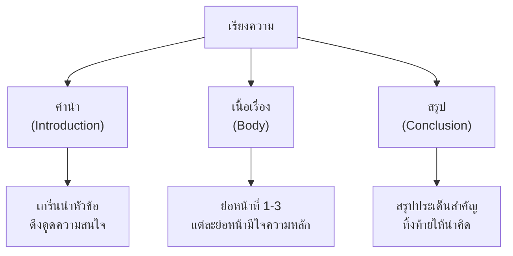

# การเขียนเรียงความ

> เขียนเรียงความอย่างมีโครงสร้าง: คำนำ เนื้อเรื่อง สรุป

**เรียงความ** คือ งานเขียนที่แสดงความคิดเห็น ความรู้ หรือประสบการณ์ในหัวข้อใดหัวข้อหนึ่ง โดยมีโครงสร้างชัดเจน ประกอบด้วย 3 ส่วนหลัก: คำนำ เนื้อเรื่อง และสรุป

---

## เนื้อหาตามช่วงชั้น

| ช่วงชั้น | เนื้อหา |
|---|---|
| **ป.4–6** | เขียนเรียงความสั้นๆ 3-5 ย่อหน้า |
| **ม.1–3** | เขียนเรียงความเชิงพรรณนา ใช้โวหารหลากหลาย |
| **ม.4–6** | เขียนเรียงความเชิงวิชาการ โต้แย้ง วิเคราะห์ |

---

## โครงสร้างของเรียงความ



---

## ส่วนประกอบของเรียงความ

### 1. คำนำ (Introduction)

**หน้าที่:**
- เกริ่นนำหัวข้อ
- ดึงดูดความสนใจผู้อ่าน
- บอกขอบเขตหรือจุดประสงค์

**เทคนิคการเปิดเรื่อง:**

| เทคนิค | ตัวอย่าง |
|---|---|
| ตั้งคำถาม | "คุณเคยสงสัยไหมว่า..." |
| ยกสถิติ | "จากการสำรวจพบว่า 70% ของ..." |
| เล่าเรื่องสั้น | "เมื่อวานนี้ ฉันได้เห็น..." |
| ยกคำพูด | "พระพุทธเจ้าตรัสว่า..." |

### 2. เนื้อเรื่อง (Body)

**หน้าที่:**
- อธิบาย วิเคราะห์ โต้แย้ง
- แต่ละย่อหน้ามีใจความหลัก
- ใช้หลักฐานและตัวอย่างสนับสนุน

**โครงสร้างย่อหน้าเนื้อหา:**
```
ย่อหน้าที่ 1: ประเด็นที่ 1
  - ใจความหลัก
  - คำอธิบาย
  - ตัวอย่าง/หลักฐาน

ย่อหน้าที่ 2: ประเด็นที่ 2
  - ใจความหลัก
  - คำอธิบาย
  - ตัวอย่าง/หลักฐาน

ย่อหน้าที่ 3: ประเด็นที่ 3
  - ใจความหลัก
  - คำอธิบาย
  - ตัวอย่าง/หลักฐาน
```

### 3. สรุป (Conclusion)

**หน้าที่:**
- สรุปประเด็นสำคัญ
- ทิ้งท้ายให้น่าคิด
- ไม่เพิ่มประเด็นใหม่

**เทคนิคการปิดเรื่อง:**

| เทคนิค | ตัวอย่าง |
|---|---|
| สรุปประเด็น | "ดังนั้น เราจึงเห็นว่า..." |
| ให้ข้อคิด | "เรื่องนี้สอนให้เรา..." |
| เชื่อมโยงกลับคำนำ | "ดังที่ได้กล่าวไว้ในตอนต้น..." |
| ชักชวนให้คิด | "ถึงเวลาแล้วที่เราต้อง..." |

---

## ประเภทของเรียงความ

| ประเภท | จุดประสงค์ | ตัวอย่างหัวข้อ |
|---|---|---|
| **เรียงความพรรณนา** | บรรยายให้เห็นภาพ | "ความงามของทะเล" |
| **เรียงความอธิบาย** | อธิบายให้เข้าใจ | "การทำงานของอินเทอร์เน็ต" |
| **เรียงความโน้มน้าว** | ชักจูงให้เชื่อ/ทำ | "ทำไมควรออกกำลังกาย" |
| **เรียงความโต้แย้ง** | โต้แย้งความคิดเห็น | "เกมไม่ใช่ตัวร้าย" |
| **เรียงความเล่าเรื่อง** | เล่าประสบการณ์ | "วันหยุดที่ประทับใจ" |

---

## เคล็ดลับการเขียนเรียงความดี

1. **วางแผนก่อนเขียน**: กำหนดหัวข้อ โครงสร้าง ประเด็นหลัก
2. **เขียนคำนำให้น่าสนใจ**: ดึงดูดผู้อ่านตั้งแต่ประโยคแรก
3. **แต่ละย่อหน้ามีใจความหลักเดียว**: อย่าเขียนหลายเรื่องในย่อหน้าเดียว
4. **ใช้คำเชื่อม**: เพื่อความต่อเนื่อง (นอกจากนี้, อย่างไรก็ตาม, ดังนั้น)
5. **เขียนสรุปให้กระชับ**: สรุปประเด็นสำคัญ ไม่เพิ่มเรื่องใหม่
6. **อ่านทบทวน**: แก้ไขภาษาและโครงสร้าง

---

## ดูเพิ่มเติม

- [[04_การเขียนย่อหน้า|การเขียนย่อหน้า]]
- [[09_การเขียนพรรณนา|การเขียนพรรณนา]]
- [[10_การเขียนแสดงความคิดเห็น|การเขียนแสดงความคิดเห็น]]
