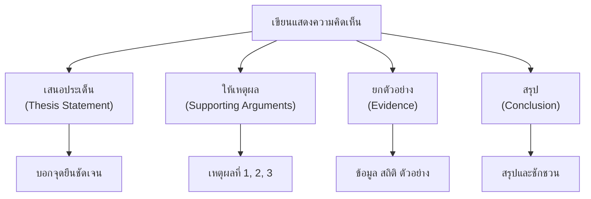

# การเขียนแสดงความคิดเห็น

> เขียนเชิงโต้แย้งและแสดงทรรศนะ: มีเหตุผล หลักฐาน สนับสนุน

**การเขียนแสดงความคิดเห็น** คือ การเขียนที่แสดงทัศนะหรือจุดยืนต่อประเด็นใดประเด็นหนึ่ง โดยต้องมีเหตุผล หลักฐาน และตัวอย่างสนับสนุน เพื่อโน้มน้าวให้ผู้อ่านเห็นด้วยหรือเข้าใจมุมมองของผู้เขียน

---

## เนื้อหาตามช่วงชั้น

| ช่วงชั้น | เนื้อหา |
|---|---|
| **ม.1–3** | แสดงความคิดเห็นเบื้องต้น ให้เหตุผลประกอบ |
| **ม.4–6** | เขียนเชิงโต้แย้ง โต้แย้งความคิดเห็นของผู้อื่น วิเคราะห์ประเด็นซับซ้อน |

---

## โครงสร้างการเขียนแสดงความคิดเห็น

---

## องค์ประกอบสำคัญ

| องค์ประกอบ | รายละเอียด |
|---|---|
| **ประเด็น (Thesis)** | จุดยืนหรือความคิดเห็นหลัก |
| **เหตุผล (Arguments)** | เหตุผลสนับสนุน 2-3 ข้อ |
| **หลักฐาน (Evidence)** | ข้อมูล สถิติ ตัวอย่างประกอบ |
| **การโต้แย้ง (Counter-argument)** | กล่าวถึงความคิดเห็นฝั่งตรงข้าม |
| **สรุป (Conclusion)** | สรุปประเด็นและชักชวน |

---

## ตัวอย่างการเขียน

**ประเด็น:** โรงเรียนควรอนุญาตให้นักเรียนใช้โทรศัพท์มือถือในห้องเรียน

**จุดยืน:** เห็นด้วย

**เหตุผล:**
1. โทรศัพท์เป็นเครื่องมือค้นคว้าที่สะดวก
2. ช่วยพัฒนาทักษะการใช้เทคโนโลยี
3. เตรียมความพร้อมสำหรับโลกดิจิทัล

**หลักฐาน:**
- จากการศึกษาพบว่า 85% ของนักเรียนใช้โทรศัพท์ในการค้นคว้า
- ประเทศที่นำเทคโนโลยีเข้ามาใช้ในห้องเรียนมีผลสัมฤทธิ์ทางการศึกษาสูงขึ้น

**โต้แย้งฝั่งตรงข้าม:**
- บางคนกังวลว่าโทรศัพท์จะทำให้นักเรียนเสียสมาธิ แต่ถ้านำมาใช้ภายใต้กฎเกณฑ์ที่ชัดเจน ปัญหาเหล่านี้สามารถควบคุมได้

---

## เคล็ดลับการเขียนแสดงความคิดเห็นดี

1. **ระบุจุดยืนชัดเจน**: อย่าคลุมเครือ
2. **ให้เหตุผลหลากหลาย**: 2-3 เหตุผลที่แตกต่างกัน
3. **ใช้หลักฐานสนับสนุน**: ข้อมูล สถิติ ตัวอย่าง
4. **กล่าวถึงฝั่งตรงข้าม**: แสดงว่าคิดรอบด้าน
5. **ใช้ภาษาสุภาพ**: อย่าโจมตีบุคคล โต้แย้งด้วยเหตุผล
6. **สรุปให้หนักแน่น**: ทิ้งท้ายให้ผู้อ่านเห็นด้วย

---

## ดูเพิ่มเติม

- [[07_การเขียนเรียงความ|การเขียนเรียงความ]]
- [[09_การเขียนพรรณนา|การเขียนพรรณนา]]
