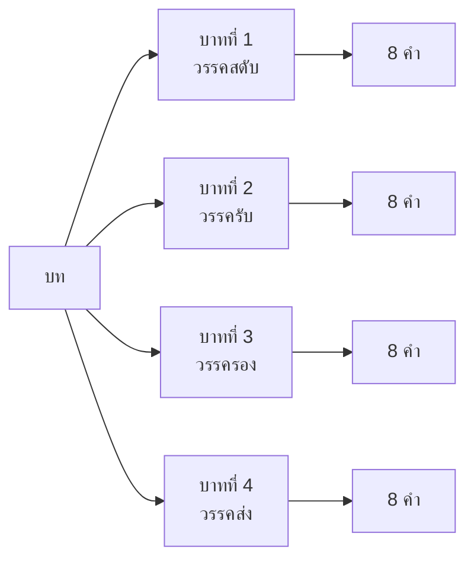

# การแต่งบทร้อยกรอง

> แต่งบทร้อยกรองตามฉันทลักษณ์: กาพย์ กลอน โคลง

**การแต่งบทร้อยกรอง** คือ การประพันธ์บทกวีตามรูปแบบที่กำหนด (ฉันทลักษณ์) ซึ่งรวมถึงจำนวนคำ เสียงสัมผัส และโครงสร้าง บทร้อยกรองไทยมีหลายประเภท ตั้งแต่กาพย์ กลอน ไปจนถึงโคลงและฉันท์

---

## เนื้อหาตามช่วงชั้น

| ช่วงชั้น | เนื้อหา |
|---|---|
| **ป.4–6** | แต่งกาพย์ง่ายๆ กาพย์ยานี กาพย์สุภาพ |
| **ม.1–3** | แต่งกลอนสุภาพ (กลอนแปด) |
| **ม.4–6** | แต่งโคลงสี่สุภาพ ฉันท์ |

---

## ประเภทของบทร้อยกรอง

### 1. กาพย์ยานี 11

**โครงสร้าง:** 1 บาท = 2 วรรค (วรรคหน้า 5 คำ, วรรคหลัง 6 คำ)

```
วรรคหน้า: 5 คำ
วรรคหลัง: 6 คำ
```

**ตัวอย่าง:**
> อันของสูงหมายปอง (5)  
> ต้องจิต (6)  
> ถ้าไม่คิดปีนป่าย (5)  
> จะได้หรือ (6)

### 2. กลอนสุภาพ (กลอนแปด)

**โครงสร้าง:** 1 บท = 4 บาท (8 คำต่อวรรค)



**สัมผัสบังคับ:**
- คำสุดท้ายของวรรคสดับ สัมผัสกับคำที่ 3 หรือ 5 ของวรรครับ
- คำสุดท้ายของวรรครับ สัมผัสกับคำสุดท้ายของวรรครอง
- คำสุดท้ายของวรรครอง สัมผัสกับคำที่ 3 หรือ 5 ของวรรคส่ง

**ตัวอย่าง:**
> ดวงอาทิตย์ส่องแสงแจ่มกระจ่าง (สดับ)  
> ส่องสว่างทั่วท้องฟ้ากว้างใหญ่ (รับ)  
> นกร้องเพลงบรรเลงให้สุขใจ (รอง)  
> ดอกไม้บานไสวในสวนงาม (ส่ง)

### 3. โคลงสี่สุภาพ

**โครงสร้าง:** 1 บาท = 2 วรรค (วรรคหน้า 5 คำ, วรรคหลัง 2 คำ)

```
วรรคหน้า: 5 คำ
วรรคหลัง: 2 คำ
```

**ตัวอย่าง:**
> ๏ เดือนสิบสองน้ำนอง (5)  
> เต็มตลิ่ง (2)  
> ฝูงปลาว่ายเวียนวิ่ง (5)  
> ไปมา (2)

---

## ขั้นตอนการแต่งบทร้อยกรอง

1. **กำหนดหัวข้อ**: เลือกเรื่องที่ต้องการแต่ง
2. **เลือกรูปแบบ**: กาพย์ กลอน หรือโคลง
3. **วางโครงสร้าง**: นับจำนวนคำในแต่ละวรรค
4. **เขียนวรรคแรก**: เริ่มด้วยวรรคสดับ
5. **หาสัมผัส**: เชื่อมคำตามกฎสัมผัส
6. **ตรวจสอบ**: นับคำและตรวจสอบสัมผัส
7. **แก้ไข**: ปรับแก้ให้สมบูรณ์

---

## เคล็ดลับการแต่งบทร้อยกรอง

1. **นับคำให้ถูกต้อง**: สำคัญที่สุด
2. **หาสัมผัสให้ถูกตำแหน่ง**: ตามฉันทลักษณ์
3. **ใช้คำที่มีความหมาย**: อย่าใช้คำเพียงเพื่อให้สัมผัส
4. **อ่านออกเสียง**: ฟังจังหวะและความไพเราะ
5. **ฝึกแต่งบ่อยๆ**: ยิ่งฝึกยิ่งเก่ง

---

## ดูเพิ่มเติม

- [[03_การอ่านออกเสียงร้อยกรอง|การอ่านออกเสียงร้อยกรอง]]
- [[12_การเขียนเรื่องสั้น|การเขียนเรื่องสั้น]]
