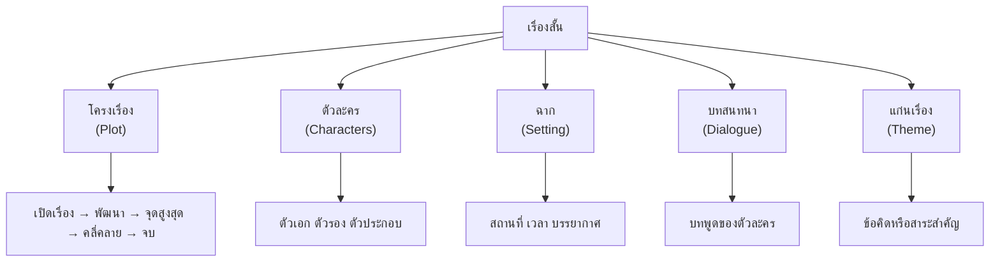

# การเขียนเรื่องสั้น

> เขียนเรื่องสั้น: โครงเรื่อง ตัวละคร ฉาก บทสนทนา

**การเขียนเรื่องสั้น** คือ การเล่าเรื่องด้วยร้อยแก้วที่มีโครงสร้างสมบูรณ์ ประกอบด้วยโครงเรื่อง ตัวละคร ฉาก และบทสนทนา เรื่องสั้นที่ดีต้องมีจุดเริ่มต้น การพัฒนา และจุดจบที่ชัดเจน

---

## เนื้อหาตามช่วงชั้น

| ช่วงชั้น | เนื้อหา |
|---|---|
| **ป.4–6** | เล่าเรื่องจากภาพ เขียนเรื่องสั้นง่ายๆ |
| **ม.1–3** | เขียนเรื่องสั้นที่มีโครงเรื่องชัดเจน พัฒนาตัวละคร |
| **ม.4–6** | เขียนเรื่องสั้นเชิงวรรณศิลป์ ใช้เทคนิคการเล่าเรื่องที่หลากหลาย |

---

## องค์ประกอบของเรื่องสั้น



---

## โครงเรื่องของเรื่องสั้น

| ส่วน | เนื้อหา |
|---|---|
| **เปิดเรื่อง (Exposition)** | แนะนำตัวละคร ฉาก สถานการณ์เริ่มต้น |
| **พัฒนา (Rising Action)** | เหตุการณ์ที่นำไปสู่จุดขัดแย้ง |
| **จุดสูงสุด (Climax)** | จุดตื่นเต้นที่สุดของเรื่อง |
| **คลี่คลาย (Falling Action)** | เหตุการณ์หลังจุดสูงสุด |
| **จบ (Resolution)** | สรุปเรื่อง แก้ปัญหา |

---

## การสร้างตัวละคร

### ประเภทของตัวละคร

| ประเภท | ลักษณะ |
|---|---|
| **ตัวเอก (Protagonist)** | ตัวละครหลักของเรื่อง |
| **ตัวร้าย (Antagonist)** | ตัวละครที่ขัดขวางตัวเอก |
| **ตัวรอง (Supporting)** | ตัวละครที่สนับสนุนตัวเอก |
| **ตัวประกอบ (Minor)** | ตัวละครที่ปรากฏสั้นๆ |

### การพัฒนาตัวละคร

| วิธี | รายละเอียด |
|---|---|
| **บรรยายลักษณะ** | รูปร่าง หน้าตา การแต่งกาย |
| **การกระทำ** | ตัวละครทำอะไร แสดงบุคลิกอย่างไร |
| **บทสนทนา** | ตัวละครพูดอะไร ใช้ภาษาแบบไหน |
| **ความคิด** | ตัวละครคิดอะไร รู้สึกอย่างไร |

---

## การเขียนบทสนทนา

**รูปแบบ:**
```
"บทพูด" ตัวละครพูด

"บทพูด" ตัวละครพูด

ตัวละครพูด "บทพูด"
```

**เคล็ดลับ:**
- ใช้ภาษาที่เป็นธรรมชาติ
- แสดงบุคลิกของตัวละครผ่านบทพูด
- อย่าเขียนบทสนทนายาวเกินไป
- ใช้บทสนทนาเพื่อขับเคลื่อนเรื่อง

---

## ขั้นตอนการเขียนเรื่องสั้น

1. **คิดไอเดีย**: เลือกเรื่องที่ต้องการเล่า
2. **วางโครงเรื่อง**: กำหนดเปิดเรื่อง พัฒนา จุดสูงสุด จบ
3. **สร้างตัวละคร**: กำหนดตัวเอก ตัวรอง บุคลิก
4. **กำหนดฉาก**: สถานที่ เวลา บรรยากาศ
5. **เขียนร่างแรก**: เขียนโดยไม่กังวลเรื่องความสมบูรณ์
6. **แก้ไข**: ปรับแก้โครงเรื่อง ตัวละคร ภาษา
7. **อ่านทบทวน**: อ่านออกเสียง ฟังจังหวะ

---

## เคล็ดลับการเขียนเรื่องสั้นดี

1. **เริ่มต้นน่าสนใจ**: ดึงดูดผู้อ่านตั้งแต่ประโยคแรก
2. **มีจุดขัดแย้ง**: ทำให้เรื่องน่าสนใจ
3. **แสดงไม่บอก (Show, don't tell)**: บรรยายการกระทำแทนบอกความรู้สึก
4. **จบให้ประทับใจ**: ทิ้งท้ายให้น่าคิด
5. **อ่านเรื่องสั้นของคนอื่น**: เรียนรู้จากนักเขียนมืออาชีพ

---

## ดูเพิ่มเติม

- [[09_การเขียนพรรณนา|การเขียนพรรณนา]]
- [[11_การแต่งบทร้อยกรอง|การแต่งบทร้อยกรอง]]
