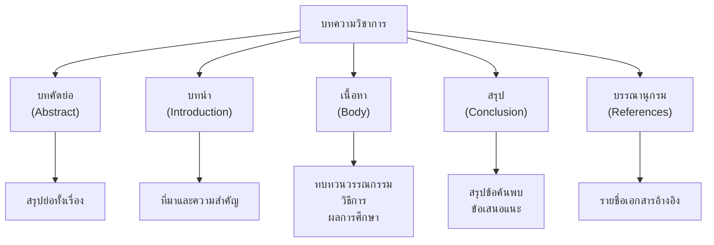

# การเขียนเชิงวิชาการ

> เขียนเชิงวิชาการ: อ้างอิงข้อมูล ใช้ภาษาเป็นทางการ

**การเขียนเชิงวิชาการ** คือ การเขียนที่ใช้ภาษาเป็นทางการ มีโครงสร้างชัดเจน มีการอ้างอิงแหล่งข้อมูลที่น่าเชื่อถือ และมุ่งเสนอข้อเท็จจริงหรือข้อค้นพบจากการศึกษาวิจัย

---

## เนื้อหาตามช่วงชั้น

| ช่วงชั้น | เนื้อหา |
|---|---|
| **ม.4–6** | เขียนบทความวิชาการ รายงานการวิจัย วิทยานิพนธ์เบื้องต้น |

---

## ลักษณะของการเขียนเชิงวิชาการ

| ลักษณะ | รายละเอียด |
|---|---|
| **ภาษาเป็นทางการ** | ใช้ภาษาเขียน ไม่ใช้ภาษาพูด |
| **มีหลักฐานสนับสนุน** | อ้างอิงข้อมูลจากแหล่งที่น่าเชื่อถือ |
| **โครงสร้างชัดเจน** | มีบทนำ เนื้อหา สรุป |
| **เป็นกลาง** | นำเสนอข้อเท็จจริง ไม่อคติ |
| **มีระบบอ้างอิง** | ระบุแหล่งที่มาของข้อมูล |

---

## โครงสร้างบทความวิชาการ



---

## ภาษาเชิงวิชาการ

### คำที่ควรใช้ vs ไม่ควรใช้

| ไม่ควรใช้ (ภาษาพูด) | ควรใช้ (ภาษาเขียน) |
|---|---|
| มาก | จำนวนมาก, อย่างมีนัยสำคัญ |
| น้อย | จำนวนน้อย, ไม่มากนัก |
| ดี | มีคุณภาพ, มีประสิทธิภาพ |
| แย่ | ไม่มีคุณภาพ, ขาดประสิทธิภาพ |
| เพราะว่า | เนื่องจาก, เพราะ |
| แต่ | อย่างไรก็ตาม, ทว่า |
| ก็คือ | ได้แก่, คือ |

---

## การอ้างอิงแหล่งข้อมูล

### รูปแบบการอ้างอิงในเนื้อหา

| รูปแบบ | ตัวอย่าง |
|---|---|
| **APA** | (สมชาย, 2565, น. 45) |
| **MLA** | (สมชาย 45) |
| **Chicago** | (สมชาย 2565, 45) |

### รูปแบบบรรณานุกรม

**APA:**
```
สมชาย ใจดี. (2565). การศึกษาภาษาไทยในระดับมัธยมศึกษา. กรุงเทพฯ: สำนักพิมพ์มหาวิทยาลัย.
```

**เว็บไซต์:**
```
ชื่อผู้แต่ง. (ปีที่เผยแพร่). ชื่อเรื่อง. สืบค้นจาก URL
```

---

## เคล็ดลับการเขียนเชิงวิชาการดี

1. **ใช้ภาษาเป็นทางการ**: หลีกเลี่ยงภาษาพูด
2. **อ้างอิงทุกข้อมูล**: อย่าคัดลอกโดยไม่อ้างอิง
3. **มีโครงสร้างชัดเจน**: บทนำ เนื้อหา สรุป
4. **เป็นกลาง**: นำเสนอข้อเท็จจริง
5. **ตรวจทาน**: แก้ไขภาษาและรูปแบบอ้างอิง

---

## ดูเพิ่มเติม

- [[06_การเขียนรายงาน|การเขียนรายงาน]]
- [[07_การเขียนเรียงความ|การเขียนเรียงความ]]
