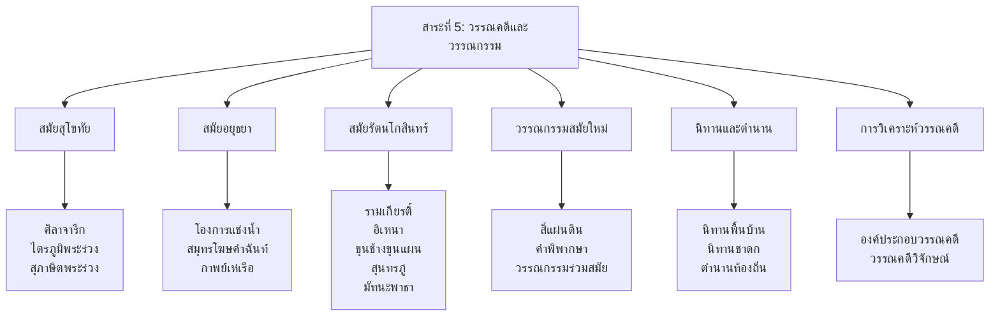
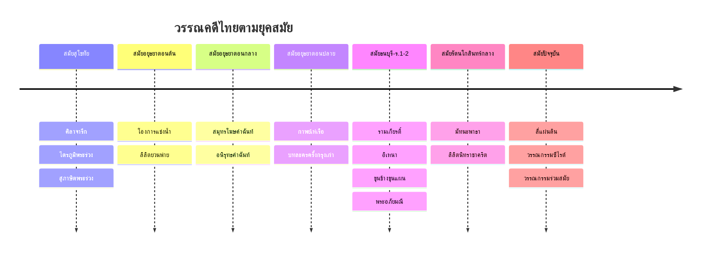

# สาระที่ 5: วรรณคดีและวรรณกรรม

> วรรณคดีเป็นทั้งคลังปัญญาของชาติและแบบอย่างของการใช้ภาษาไทยที่งดงาม

**วรรณคดีและวรรณกรรม** เป็นสาระที่เปิดโลกทัศน์ของผู้เรียนผ่านมรดกทางวรรณศิลป์ของไทย ตั้งแต่เรื่องเล่าพื้นบ้านไปจนถึงวรรณกรรมเอกของชาติ การศึกษาวรรณคดีไม่เพียงแต่ให้ความรู้ทางภาษา แต่ยังปลูกฝังคุณธรรม จริยธรรม และความเข้าใจในสังคมวัฒนธรรมไทย

---

## โครงสร้างของสาระ

---

## ลำดับเวลาของวรรณคดีไทย

---

## วรรณคดีสำคัญตามระดับชั้น

| ระดับชั้น | วรรณคดีหลัก | วรรณคดีเสริม |
|---|---|---|
| **ป.1-3** | นิทานอีสป เพลงกล่อมเด็ก | นิทานพื้นบ้าน นิทานชาดก |
| **ป.4-6** | กาพย์พระไชยสุริยา สุภาษิตสอนหญิง (บางตอน) | นิทานชาดก วรรณกรรมเยาวชน |
| **ม.1** | ราชาธิราช กาพย์เห่เรือ (บางตอน) | นิทานพื้นบ้านภาคต่างๆ |
| **ม.2** | รามเกียรติ์ โคลงโลกนิติ | บทเสภาสามัคคีเสวก |
| **ม.3** | อิเหนา ลิลิตตะเลงพ่าย | บทละครพูดเรื่องเห็นแก่ลูก |
| **ม.4** | นิราศนรินทร์คำโคลง ขุนช้างขุนแผน | หัวใจชายหนุ่ม |
| **ม.5** | ลิลิตพระลอ มหาเวสสันดรชาดก (มัทรี) | โคลงภาพพระราชพงศาวดาร |
| **ม.6** | สามก๊ก มัทนะพาธา | สี่แผ่นดิน (บางตอน) |

---

## รายชื่อหมวด

| หมวด | ไฟล์ภาพรวม | จำนวนบทเรียน |
|---|---|---|
| สมัยสุโขทัย | [[สมัยสุโขทัย/00_overview\|overview]] | 3 |
| สมัยอยุธยา | [[สมัยอยุธยา/00_overview\|overview]] | 4 |
| สมัยรัตนโกสินทร์ | [[สมัยรัตนโกสินทร์/00_overview\|overview]] | 5 + สุนทรภู่ (4) |
| วรรณกรรมสมัยใหม่ | [[วรรณกรรมสมัยใหม่/00_overview\|overview]] | 3 |
| นิทานและตำนาน | [[นิทานและตำนาน/00_overview\|overview]] | 1 |
| การวิเคราะห์วรรณคดี | [[การวิเคราะห์วรรณคดี/00_overview\|overview]] | 2 |

---

## ดูเพิ่มเติม

- [[00_ภาพรวม|← กลับไปภาพรวมภาษาไทย]]
- [[การอ่าน/00_ภาพรวมการอ่าน|สาระที่ 1: การอ่าน]]
- [[การเขียน/00_ภาพรวมการเขียน|สาระที่ 2: การเขียน]]
- [[การฟัง การดู และการพูด/00_ภาพรวมการฟัง การดู และการพูด|สาระที่ 3: การฟัง การดู และการพูด]]
- [[หลักการใช้ภาษาไทย/00_ภาพรวมหลักการใช้ภาษาไทย|สาระที่ 4: หลักการใช้ภาษาไทย]]
