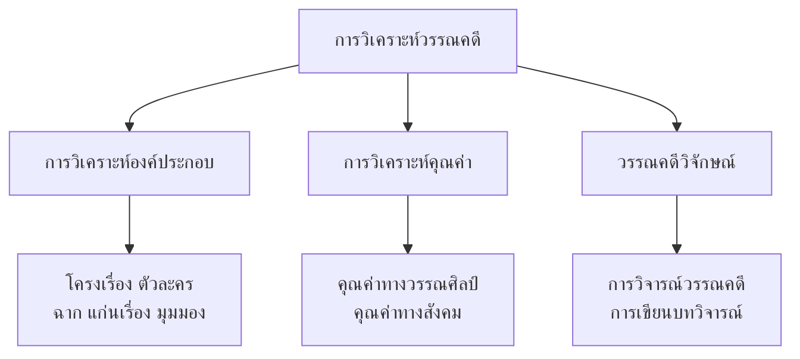

# การวิเคราะห์วรรณคดี

> ทักษะในการวิเคราะห์และวิจารณ์วรรณคดีอย่างมีวิจารณญาณ

---

## เกี่ยวกับการวิเคราะห์วรรณคดี

| รายละเอียด | ข้อมูล |
|---|---|
| **ระดับชั้น** | ม.๔-๖ |
| **วัตถุประสงค์** | ฝึกให้ผู้เรียนวิเคราะห์และวิจารณ์วรรณคดีอย่างมีวิจารณญาณ |
| **ทักษะ** | การวิเคราะห์องค์ประกอบ การวิเคราะห์คุณค่า การวิจารณ์ |

---

## ทักษะย่อย

---

## ผลงานสำคัญ

| # | ทักษะ | บทเรียน |
|---|---|---|
| ๑ | การวิเคราะห์องค์ประกอบ | [[01_การวิเคราะห์องค์ประกอบ]] |
| ₂ | วรรณคดีวิจักษณ์ | [[02_วรรณคดีวิจักษณ์]] |

---

## ดูเพิ่มเติม

- [[00_ภาพรวม|← กลับไปภาพรวมวรรณคดี]]
