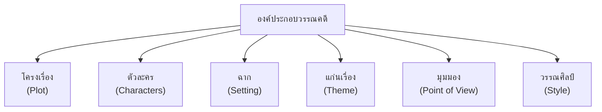

# การวิเคราะห์องค์ประกอบของวรรณคดี

> การวิเคราะห์โครงเรื่อง ตัวละคร ฉาก แก่นเรื่อง และมุมมอง

---

## องค์ประกอบของวรรณคดี

---

## ๑. โครงเรื่อง (Plot)

| ส่วน | รายละเอียด |
|---|---|
| **เปิดเรื่อง** | แนะนำตัวละคร สถานการณ์เริ่มต้น |
| **พัฒนา** | เหตุการณ์ที่นำไปสู่ความขัดแย้ง |
| **จุดสูงสุด** | จุดตื่นเต้นที่สุด |
| **คลี่คลาย** | การแก้ปัญหา |
| **จบ** | สรุปเรื่อง |

---

## ๒. ตัวละคร (Characters)

| ประเภทท | รายละเอียด |
|---|---|
| **ตัวเอก** | ผู้ที่เรื่องเกี่ยวกับเขา/เธอ |
| **ตัวรอง** | สนับสนุนตัวเอก |
| **ตัวปฏิปักษ์** | ผู้ต่อต้านตัวเอก |
| **ตัวประกอบ** | ปรากฏสั้นๆ |

**การวิเคราะห์ตัวละคร:**

| ประเด็น | คำถามวิเคราะห์ |
|---|---|
| **บุคลิก** | เป็นคนแบบไหน |
| **แรงจูงใจ** | ทำไมถึงทำเช่นนั้น |
| **การพัฒนา** | เปลี่ยนแปลงอย่างไร |
| **ความสัมพันธ์** | สัมพันธ์กับผู้อื่นอย่างไร |

---

## ๓. ฉาก (Setting)

| องค์ประกอบ | คำถามวิเคราะห์ |
|---|---|
| **สถานที่** | เรื่องเกิดที่ไหน |
| **เวลา** | เมื่อไร (ยุคสมัย/เวลาในวัน) |
| **บรรยากาศ** | อารมณ์/ความรู้สึก |

---

## ๔. แก่นเรื่อง (Theme)

| คำถาม | ตัวอย่าง |
|---|---|
| เรื่องนี้สอนอะไร? | ความดีชนะความชั่ว |
| ข้อคิดหลักคืออะไร? | ความรัก ความจงรักภักดี |

---

## ๕. มุมมอง (Point of View)

| มุมมอง | รายละเอียด |
|---|---|
| **มุมมองบุรุษที่ ๑** | ผู้เล่าเป็นตัวละคร ("ฉัน") |
| **มุมมองบุรุษที่ ๓** | ผู้เล่าเป็นผู้สังเกต ("เขา") |
| **มุมมองรอบรู้** | ผู้เล่ารู้ทุกอย่าง (ความคิดของทุกตัวละคร) |

---

## ๖. วรรณศิลป์ (Style)

| วิธีการ | รายละเอียด |
|---|---|
| **ฉันทลักษณ์** | กลอน โคลง กาพย์ ฉันท์ |
| **โวหาร** | บรรยาย เทศนา อุปมา |
| **ภาษา** | โบราณ สมัยใหม่ ราชาศัพท์ |

---

## ขั้นตอนการวิเคราะห์วรรณคดี

1. **อ่านทั้งเรื่อง**: เข้าใจเนื้อหาทั้งหมด
2. **ระบุโครงเรื่อง**: ต้น-กลาง-ท้าย
3. **วิเคราะห์ตัวละคร**: บุคลิก แรงจูงใจ พัฒนาการ
4. **วิเคราะห์ฉาก**: สถานที่ เวลา บรรยากาศ
5. **ระบุแก่นเรื่อง**: ข้อคิดหลัก
6. **วิเคราะห์วรรณศิลป์**: ฉันทลักษณ์ โวหาร
7. **สรุปคุณค่า**: ทางภาษา สังคม คุณธรรม

---

## สรุปสำคัญ

1. **วรรณคดีมี ๖ องค์ประกอบหลัก** โครงเรื่อง ตัวละคร ฉาก แก่นเรื่อง มุมมอง วรรณศิลป์
2. **การวิเคราะห์ต้องมีหลักฐาน** จากตัวเรื่อง ไม่ใช่ความคิดเห็นลอยๆ
3. **เป้าหมาย** คือการเข้าใจวรรณคดีอย่างลึกซึ้ง

---

## ดูเพิ่มเติม

- [[00_overview|← กลับไปภาพรวมการวิเคราะห์วรรณคดี]]
