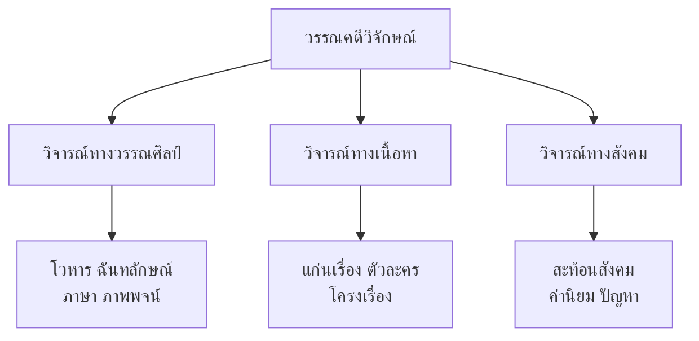

# วรรณคดีวิจักษณ์

> การวิจารณ์วรรณคดี — ประเมินคุณค่าอย่างมีวิจารณญาณ

---

## ความหมาย

**วรรณคดีวิจักษณ์** คือ การวิจารณ์วรรณคดี เป็นกระบวนการประเมินคุณค่าของวรรณคดีอย่างมีวิจารณญาณ โดยอาศัยหลักเกณฑ์และมาตรฐานทางวรรณศิลป์

---

## แนวทางการวิจารณ์วรรณคดี

---

## ขั้นตอนการเขียนบทวิจารณ์

| ขั้นตอน | รายละเอียด |
|---|---|
| **๑. อ่านวรรณคดี** | อ่านให้เข้าใจทั้งเรื่อง |
| **๒. ระบุประเด็น** | เลือกประเด็นที่จะวิจารณ์ |
| **๓. รวบรวมหลักฐาน** | บทอ้างอิงจากตัวเรื่อง |
| **๔. วิเคราะห์** | วิเคราะห์ตามหลักเกณฑ์ |
| **๕. สรุปและประเมิน** | สรุปคุณค่าและข้อดี-ข้อด้อย |

---

## เกณฑ์การวิจารณ์

| เกณฑ์ | คำถาม |
|---|---|
| **ภาษาและโวหาร** | ภาษางดงามหรือไม่? ใช้โวหารที่หลากหลายหรือไม่? |
| **โครงสร้าง** | โครงเรื่องสมเหตุสมผลหรือไม่? |
| **ตัวละคร** | ตัวละครมีความสมจริงหรือไม่? |
| **แก่นเรื่อง** | แก่นเรื่องมีความหมายลึกซึ้งหรือไม่? |
| **คุณค่าทางสังคม** | สะท้อนสังคมได้ดีหรือไม่? |

---

## เคล็ดลับการวิจารณ์วรรณคดี

1. **มีหลักฐาน**: อย่าวิจารณ์โดยไม่มีบทอ้างอิง
2. **เป็นกลาง**: ไม่มีอคติ
3. **วิเคราะห์ ไม่ใช่ตัดสิน**: อธิบายคุณค่า ไม่ใช่ตัดสินว่าดี-เลว
4. **เชื่อมโยงบริบท**: พิจารณายุคสมัยและสังคมที่แต่ง

---

## สรุปสำคัญ

1. **วรรณคดีวิจักษณ์** คือ การวิจารณ์วรรณคดีอย่างมีวิจารณญาณ
2. **๓ แนวทางหลัก** วรรณศิลป์ เนื้อหา สังคม
3. **ต้องมีหลักฐาน** จากตัวเรื่อง
4. **เป้าหมาย** คือการประเมินคุณค่าอย่างเป็นกลาง

---

## ดูเพิ่มเติม

- [[00_overview|← กลับไปภาพรวมการวิเคราะห์วรรณคดี]]
- [[01_การวิเคราะห์องค์ประกอบ|← การวิเคราะห์องค์ประกอบ]]
