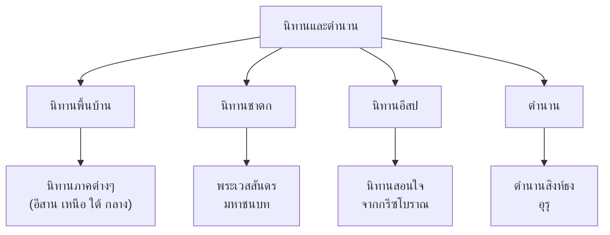

# นิทานและตำนาน

> เรื่องเล่าพื้นบ้านที่ส่งผ่านภูมิปัญญาและค่านิยมไทย

---

## เกี่ยวกับนิทานและตำนาน

| รายละเอียด | ข้อมูล |
|---|---|
| **ช่วงเวลา** | ทุกยุคสมัย (ส่งผ่านปากเปล่ามาหลายร้อยปี) |
| **ลักษณะ** | ส่งผ่านปากเปล่า (oral tradition) ก่อนจะรวบรวมเป็นลายลักษณ์อักษร |
| **หน้าที่** | บันเทิง สอนคุณธรรม อธิบายปรากฏการณ์ |
| **ตอนที่เรียน** | ป.๑-๓ |

---

## ประเภททของนิทานและตำนาน

---

## ลักษณะของนิทานพื้นบ้าน

| ลักษณะ | รายละเอียด |
|---|---|
| **ตัวละคร** | มนุษย์ สัตว์ ยักษ์ นางฟ้า |
| **โครงเรื่อง** | ดีต่อสู้กับชั่ว ผู้กล้าหาญได้รับรางวัล |
| **คติธรรม** | ทำดีได้ดี ทำชั่วได้ชั่ว ความขยัน ความซื่อสัตย์ |
| **ภาษา** | ภาษาเรียบง่าย ภาษาถิ่น สำนวนพื้นบ้าน |

---

## ตัวอย่างนิทานพื้นบ้าน

| ภาค | นิทานตัวอย่าง | คติธรรม |
|---|---|---|
| เหนือ | กะหรี่แกง แม่นาคพระโขนง | ความซื่อสัตย์ ความกลัว |
| อีสาน | ผาแดงนางไอ่ | ความรัก ความเสียสละ |
| ใต้ | หนังตะลุง หลิงโจว | ความขยัน ความสามัคคี |
| กลาง | โกงกาง ชาลาทำตัวดี | ความกตัญญู |

---

## รายชื่อบทเรียน

| # | ชื่อบทเรียน | ประเภท |
|---|---|---|
| ๑ | [[01_นิทานพื้นบ้าน]] | นิทานภาคต่างๆ (แม่นาค โกงกาง ผาแดงนางไอ่) |
| ๒ | [[02_นิทานชาดก]] | เรื่องพระพุทธเจ้าในชาติก่อน (เวสสันดร สุวรรณสาม) |
| ๓ | [[03_นิทานอีสป]] | นิทานสอนใจจากกรีซโบราณ (กระต่ายกับเต่า) |
| ๔ | [[04_ตำนานและเรื่องเล่าเมือง]] | ตำนานสถานที่ วีรบุรุษ เรื่องเล่าผี |

---

## สรุปสำคัญ

1. **นิทานและตำนาน** เป็นเรื่องเล่าพื้นบ้านที่ส่งผ่านภูมิปัญญาไทย
2. **สอนคุณธรรม** ทำดีได้ดี ทำชั่วได้ชั่ว
3. **สะท้อนวัฒนธรรม** ของแต่ละภาค
4. **ส่งเสริมจินตนาการ** และการเรียนรู้ในเด็ก

---

## ดูเพิ่มเติม

- [[00_ภาพรวม|← กลับไปภาพรวมวรรณคดี]]
