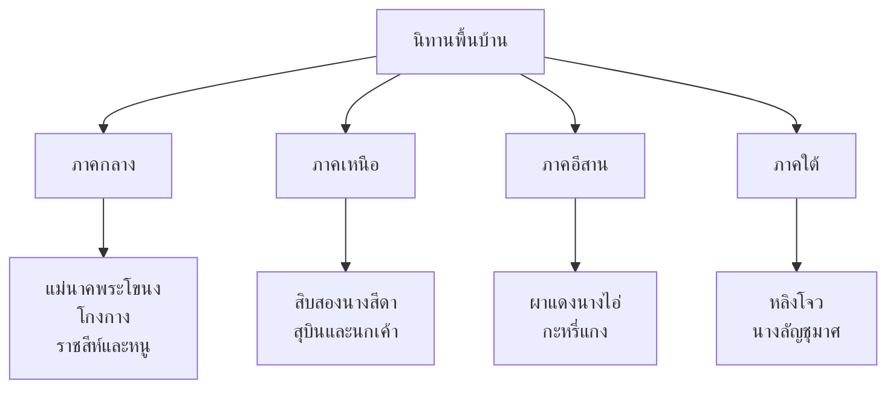

# นิทานพื้นบ้าน

> เรื่องเล่าของแต่ละภาคที่สะท้อนวิถีชีวิตและภูมิปัญญาท้องถิ่น

---

## เกี่ยวกับนิทานพื้นบ้าน

| รายละเอียด | ข้อมูล |
|---|---|
| **ประเภท** | นิทานพื้นบ้าน (Folk Tale) |
| **รูปแบบ** | ส่งผ่านปากเปล่า (oral tradition) ก่อนรวบรวมเป็นลายลักษณ์อักษร |
| **หน้าที่** | บันเทิง สอนคุณธรรม อธิบายปรากฏการณ์ธรรมชาติ |
| **ระดับชั้น** | ป.๑-๓ |

---

## นิทานพื้นบ้านตามภาค

---

## ๑. ภาคกลาง

### แม่นาคพระโขนง

| รายละเอียด | ข้อมูล |
|---|---|
| **ประเภท** | นิทานผี (Ghost Story) |
| **เนื้อเรื่อง** | นางนาคตายตอนตั้งครรภ์ แต่วิญญาณกลับมาหาสามี (มาน) และทารกที่ยังมีชีวิต |
| **คติธรรม** | ความรักที่แม่มีต่อลูก ความกตัญญู |
| **คุณค่า** | สะท้อนความเชื่อเรื่องผีและชีวิตหลังความตายของคนไทย |

**เนื้อเรื่องโดยสังเขป:**
> นางนาคเป็นภรรยามาน วันหนึ่งนางนาคตายขณะตั้งครรภ์ แต่วิญญาณของนางกลับมาดูแลสามีและทารกเหมือนยังมีชีวิตอยู่ เพื่อนบ้านพยายามบอกมานว่านางนาคตายแล้ว แต่มานไม่เชื่อ ในที่สุดพระสงฆ์ช่วยไล่ผีนางนาค นางยอมไปหลังจากได้ดูแลลูกเป็นครั้งสุดท้าย

---

### โกงกาง

| รายละเอียด | ข้อมูล |
|---|---|
| **ประเภท** | นิทานสอนใจ |
| **เนื้อเรื่อง** | พี่น้องสองคน คนพี่โลภ เอาเปลือกข้าวเหนียว คนน้องดี ได้เมล็ดข้าวเหนียว ปลูกต้นโกงกางที่มีทอง |
| **คติธรรม** | ความโลภนำมาซึ่งความหายนะ ความดีได้รับรางวัล |

---

### ราชสีห์และหนู

| รายละเอียด | ข้อมูล |
|---|---|
| **ประเภท** | นิทานอีสป (สอนใจ) |
| **เนื้อเรื่อง** | สิงห์โตจับหนูไว้ หนูขอให้ปล่อยแล้วสัญญาว่าจะช่วยเหลือตอบแทน ภายหลังสิงห์โตถูกหลอก หนูช่วยกัดเชือกปล่อยสิงห์ |
| **คติธรรม** | อย่าดูถูกคนเล็กคนน้อย เพราะทุกคนมีประโยชน์ |

---

## ๒. ภาคเหนือ

### สิบสองนางสีดา

| รายละเอียด | ข้อมูล |
|---|---|
| **ประเภท** | นิทานมหากาพย์ล้านนา |
| **เนื้อเรื่อง** | นางสีดา ๑๒ นาง ที่เป็นบุตรสาวของกษัตริย์ ต้องเผชิญอุปสรรคต่างๆ |
| **คติธรรม** | ความกล้าหาญ ความสามัคคี |
| **คุณค่า** | สะท้อนวัฒนธรรมล้านนา |

---

## ๓. ภาคอีสาน

### ผาแดงนางไอ่

| รายละเอียด | ข้อมูล |
|---|---|
| **ประเภท** | นิทานโศกนาฏกรรมอีสาน |
| **เนื้อเรื่อง** | นางไอ่เป็นหญิงงามที่รักชายหนุ่ม แต่ถูกบังคับให้แต่งงานกับคนรวย นางไอ่หนีและตกจากหน้าผา ตัวนางกลายเป็น "ผาแดง" |
| **คติธรรม** | ความรักแท้ การเสียสละ |
| **คุณค่า** | สะท้อนค่านิยมเรื่องความรักของคนอีสาน |

---

### กะหรี่แกง

| รายละเอียด | ข้อมูล |
|---|---|
| **ประเภท** | นิทานสอนใจภาคเหนือ |
| **เนื้อเรื่อง** กะหรี่แกงเป็นคนจนที่ทำดี ในที่สุดได้รับรางวัล |
| **คติธรรม** | ทำดีได้ดี ความขยัน |

---

## ๔. ภาคใต้

### หลิงโจว

| รายละเอียด | ข้อมูล |
|---|---|
| **ประเภท** | นิทานวีรบุรุษภาคใต้ |
| **เนื้อเรื่อง** | หลิงโจวเป็นชายหนุ่มที่แข็งแกร่ง ปกป้องหมู่บ้านจากโจรสลัด |
| **คติธรรม** | ความกล้าหาญ การปกป้องชุมชน |

---

## คุณค่าของนิทานพื้นบ้าน

| ประเภท | รายละเอียด |
|---|---|
| **คุณค่าทางคุณธรรม** | สอนให้เป็นคนดี ขยัน ซื่อสัตย์ กตัญญู |
| **คุณค่าทางวัฒนธรรม** | สะท้อนวิถีชีวิตและความเชื่อของแต่ละภาค |
| **คุณค่าทางภาษา** | สำนวนพื้นบ้าน ภาษาถิ่น คำเปรียบเทียบ |
| **คุณค่าทางสังคม** | ส่งเสริมความสามัคคีและค่านิยมที่ดี |
| **คุณค่าทางจิตวิทยา** | ช่วยพัฒนาจินตนาการและความคิดสร้างสรรค์ของเด็ก |

---

## สรุปสำคัญ

1. **นิทานพื้นบ้าน** มีทุกภาคของไทย สะท้อนวิถีชีวิตและค่านิยมท้องถิ่น
2. **คติธรรมหลัก** ทำดีได้ดี ทำชั่วได้ชั่ว ความขยัน ความซื่อสัตย์
3. **ส่งผ่านปากเปล่า** ก่อนรวบรวมเป็นลายลักษณ์อักษร
4. **สอนเด็ก** เรื่องคุณธรรมผ่านเรื่องเล่าที่สนุก

---

## ดูเพิ่มเติม

- [[00_overview|← กลับไปภาพรวมนิทานและตำนาน]]
- [[02_นิทานชาดก|นิทานชาดก →]]
