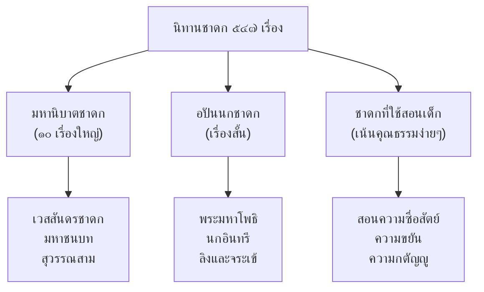

# นิทานชาดก

> เรื่องเล่าพระพุทธเจ้าในชาติก่อน — สอนคุณธรรมผ่านเรื่องที่สนุก

---

## เกี่ยวกับนิทานชาดก

| รายละเอียด | ข้อมูล |
|---|---|
| **ประเภท** | นิทานคติธรรมทางพุทธศาสนา |
| **ที่มา** | พระไตรปิฎก (คัมภีร์หลักของพุทธศาสนา) |
| **จำนวน** | ๕๔๗ เรื่อง |
| **เนื้อหา** | เล่าเรื่องพระพุทธเจ้าในชาติก่อน (พระโพธิสัตว์) |
| **หน้าที่** | สอนคุณธรรมทางพุทธศาสนา |
| **ระดับชั้น** | ป.๑-๖ |

---

## ประเภทของชาดก

---

## มหานิบาตชาดก (ชาดกใหญ่ ๑๐ เรื่อง)

| # | ชื่อชาดก | พระโพธิสัตว์เกิดเป็น | คุณธรรมหลัก |
|---|---|---|---|
| ๑ | เวสสันดรชาดก | เจ้าชายเวสสันดร | การให้ (ทาน) |
| ๒ | มหาชนบท | พราหมณ์ | ความกตัญญู |
| ๓ | สุวรรณสาม | พราหมณ์หนุ่ม | ความกตัญญูต่อพ่อแม่ |
| ๔ | เนมิราช | พระราชา | ความเสียสละ |
| ๕ | ภูริพัด | นักปราชญ์ | ปัญญา |
| ๖ | จันทกุมาร | พระราชา | ความซื่อสัตย์ |
| ๗ | นาควินท์ | พระราชา | ความอดทน |
| ๘ | อุทธานกุมาร | นักเรียน | การให้อภัย |
| ๙ | วิฑูรบัณฑิต | ที่ปรึกษา | ปัญญาและความกล้า |
| ๑๐ | เวสสันดร | เจ้าชาย | การให้สูงสุด |

---

## ชาดกที่เด็กไทยรู้จักดี

### ๑. พระเวสสันดร (เวสสันดรชาดก)

| รายละเอียด | ข้อมูล |
|---|---|
| **เนื้อเรื่อง** | เจ้าชายเวสสันดรทรงบริจาคทุกสิ่ง แม้แต่ช้างปัจจัยและบุตรี (นางมัทรี) |
| **คติธรรม** | การให้ (ทานบารมี) เป็นคุณธรรมสูงสุด |
| **ระดับชั้น** | ม.๕ (ตอนมัทรี) |

### ๒. สุวรรณสาม

| รายละเอียด | ข้อมูล |
|---|---|
| **เนื้อเรื่อง** | สุวรรณสามดูแลพ่อแม่ตาบอดด้วยความกตัญญู วันหนึ่งถูกลูกธนู พระอินทร์ช่วยให้ฟื้นคืนชีพ |
| **คติธรรม** | ความกตัญญูต่อพ่อแม่ |

### ๓. มหาชนบท (พระมหาโพธิ)

| รายละเอียด | ข้อมูล |
|---|---|
| **เนื้อเรื่อง** | พราหมณ์หนุ่มดูแลแม่ตาบอดด้วยความกตัญญู |
| **คติธรรม** | ความกตัญญู |

### ๔. นกอินทรีและลิง

| รายละเอียด | ข้อมูล |
|---|---|
| **เนื้อเรื่อง** | นกอินทรีช่วยลิงที่ติดอยู่บนเกาะ แต่ลิงกลับทำร้ายนกอินทรี ในที่สุดลิงได้รับกรรม |
| **คติธรรม** | อย่าทำร้ายผู้ที่ช่วยเรา ความอกตัญญูนำมาซึ่งความหายนะ |

### ๕. ลิงและจระเข้

| รายละเอียด | ข้อมูล |
|---|---|
| **เนื้อเรื่อง** | จระเข้หลอกลิงให้ลงไปในปาก ลิงหลอกกลับว่าหัวใจอยู่บนต้นไม้ จระเข้จึงปล่อยลิง |
| **คติธรรม** | สติปัญญาช่วยให้รอดจากอันตราย |

---

## คุณค่าของนิทานชาดก

| ประเภท | รายละเอียด |
|---|---|
| **คุณค่าทางพุทธศาสนา** | สอนพระโพธิสัตว์บารมี ๑๐ (ทาน ศีล อัปปิจฉะ ฯลฯ) |
| **คุณค่าทางคุณธรรม** | สอนความกตัญญู ความซื่อสัตย์ การให้ |
| **คุณค่าทางภาษา** | คำศัพท์บาลี/สันสกฤต ในเนื้อเรื่อง |
| **คุณค่าทางสังคม** | ปลูกฝังค่านิยมไทยที่ดีงาม |

---

## สรุปสำคัญ

1. **นิทานชาดก** เล่าเรื่องพระพุทธเจ้าในชาติก่อน
2. **๕๔๗ เรื่อง** แบ่งเป็นมหานิบาตชาดก (๑๐ เรื่องใหญ่) และชาดกสั้น
3. **คุณธรรมหลัก** ความกตัญญู การให้ ความซื่อสัตย์ ปัญญา
4. **เป็นพื้นฐานของวัฒนธรรมไทย** ที่ใช้สอนเด็กมาตั้งแต่โบราณ

---

## ดูเพิ่มเติม

- [[00_overview|← กลับไปภาพรวมนิทานและตำนาน]]
- [[01_นิทานพื้นบ้าน|← นิทานพื้นบ้าน]]
- [[03_นิทานอีสป|นิทานอีสป →]]
