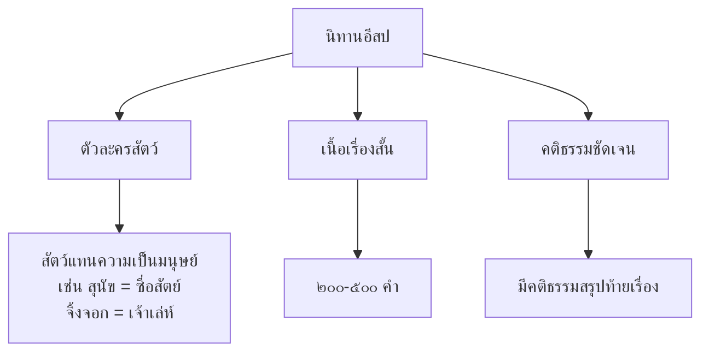

# นิทานอีสป

> นิทานสอนใจจากกรีซโบราณที่คนไทยรู้จักดี

---

## เกี่ยวกับนิทานอีสป

| รายละเอียด | ข้อมูล |
|---|---|
| **ประเภท** | นิทานสอนใจ (Fable) |
| **ที่มา** | กรีซโบราณ โดย "อีสป" (Aesop) ทาสที่เล่าเรื่องเก่ง |
| **จำนวน** | ๖๐๐ เรื่องขึ้นไป |
| **ตัวละครหลัก** | สัตว์ที่พูดและทำตัวเหมือนมนุษย์ |
| **ความสำคัญ** | นิทานสอนใจที่คนทั่วโลกรู้จัก รวมถึงไทย |
| **ระดับชั้น** | ป.๑-๓ |

---

## ลักษณะของนิทานอีสป

---

## นิทานอีสปที่คนไทยรู้จัก

### ๑. กระต่ายกับเต่า

| รายละเอียด | ข้อมูล |
|---|---|
| **เนื้อเรื่อง** | กระต่ายจองหวงว่าวิ่งเร็วที่สุด ท้าเต่าแข่งวิ่ง กระต่ายวิ่งนำแล้วนอนหลับ เต่าเดินต่อไปเรื่อยๆ จนถึงเส้นชัยก่อน |
| **คติธรรม** | ความขยันอดทนชนะความจองหวง |

### ๒. สิงห์โตกับหนู

| รายละเอียด | ข้อมูล |
|---|---|
| **เนื้อเรื่อง** | หนูติดเชือกสิงห์โต สิงห์ปล่อยหนู ภายหลังสิงห์ติดกับดัก หนูช่วยกัดเชือกปล่อยสิงห์ |
| **คติธรรม** | อย่าดูถูกคนเล็กคนน้อย เพราะทุกคนมีคุณค่า |

### ๓. จิ้งจอกกับพวงองุ่น

| รายละเอียด | ข้อมูล |
|---|---|
| **เนื้อเรื่อง** | จิ้งจอกอยากกินองุ่นแต่หยิบไม่ถึง จึงบอกว่า "องุ่นยังไม่สุด ไม่อร่อยหรอก" |
| **คติธรรม** | คนที่ทำไม่สำเร็จมักจะหาข้ออ้าง (sour grapes) |

### ๔. มดกับตั๊กแตน

| รายละเอียด | ข้อมูล |
|---|---|
| **เนื้อเรื่อง** | มดเก็บอาหารตลอดฤดูร้อน ตั๊กแตนเล่นสนุก ฤดูหนาวมา ตั๊กแตนหิวข้าว มดมีอาหารเพียงพอ |
| **คติธรรม** | ความขยันเตรียมตัวล่วงหน้าชนะความเกียจคร้าน |

### ๕. หมาป่าร้องเพลงแกะ

| รายละเอียด | ข้อมูล |
|---|---|
| **เนื้อเรื่อง** | เด็กเลี้ยงแกะโกหกว่ามีหมาป่า ชาวบ้านวิ่งมาช่วย ครั้งที่สองก็โกหก ครั้งที่สามมีหมาป่าจริง ชาวบ้านไม่มาช่วย |
| **คติธรรม** | คนที่โกหกเสมอ เมื่อพูดความจริงก็ไม่มีใครเชื่อ |

### ๖. อาหรับกับสองลูกโข่ง

| รายละเอียด | ข้อมูล |
|---|---|
| **เนื้อเรื่อง** | หญิงชรามีลูกโข่ง ๒ ใบ ใบหนึ่งทองคำ อีกใบหนึ่งไม้ หญิงตัดสินใจเลือกใบทองคำ แต่ทองคำหนักทำให้เธอจมน้ำ |
| **คติธรรม** | ความโลภทำลายตนเอง |

---

## การเปรียบเทียบนิทานอีสปกับนิทานไทย

| ลักษณะ | นิทานอีสป | นิทานไทย |
|---|---|---|
| **ตัวละคร** | สัตว์ | มนุษย์ สัตว์ ยักษ์ ผี |
| **ความยาว** | สั้นมาก | ยาวกว่า |
| **คติธรรม** | ชัดเจน มีสรุปท้าย | ซ่อนอยู่ในเรื่อง |
| **ที่มา** | กรีซโบราณ | ไทยพื้นบ้าน |

---

## คุณค่าของนิทานอีสป

| ประเภท | รายละเอียด |
|---|---|
| **คุณค่าทางคุณธรรม** | สอนคุณธรรมสากล: ความขยัน ความซื่อสัตย์ ความอดทน |
| **คุณค่าทางวัฒนธรรม** | นิทานสากลที่คนทั่วโลกรู้จัก |
| **คุณค่าทางภาษา** | เรียนภาษาไทยผ่านเรื่องสั้นที่เข้าใจง่าย |
| **คุณค่าทางจิตวิทยา** | พัฒนาจินตนาการและความคิดสร้างสรรค์ |

---

## สรุปสำคัญ

1. **นิทานอีสป** เป็นนิทานสอนใจจากกรีซโบราณที่คนไทยรู้จักดี
2. **ใช้สัตว์เป็นตัวละคร** เพื่อสอนคุณธรรม
3. **คติธรรมชัดเจน** และเป็นสากล: ขยัน ซื่อสัตย์ อดทน
4. **เรียนภาษาไทยผ่านนิทาน** ที่สั้นและสนุก

---

## ดูเพิ่มเติม

- [[00_overview|← กลับไปภาพรวมนิทานและตำนาน]]
- [[02_นิทานชาดก|← นิทานชาดก]]
- [[04_ตำนานและเรื่องเล่าเมือง|ตำนานและเรื่องเล่าเมือง →]]
