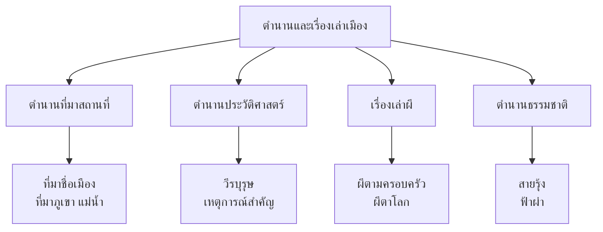
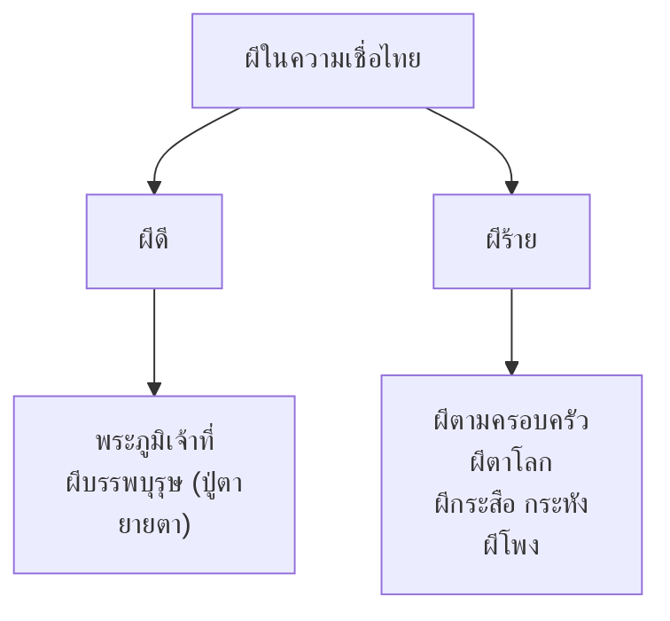

# ตำนานและเรื่องเล่าเมือง

> เรื่องเล่าที่อธิบายที่มาของสถานที่ ปรากฏการณ์ และความเชื่อไทย

---

## เกี่ยวกับตำนานและเรื่องเล่าเมือง

| รายละเอียด | ข้อมูล |
|---|---|
| **ประเภท** | ตำนาน (Legend) และเรื่องเล่าเมือง (Urban Legend) |
| **หน้าที่** | อธิบายที่มาของสถานที่ ปรากฏการณ์ธรรมชาติ ความเชื่อ |
| **เนื้อหา** | อิงประวัติศาสตร์/อธิบายปรากฏการณ์ แต่ผสมจินตนาการ |
| **ระดับชั้น** | ป.๑-๓ เรื่องง่ายๆ / ม.๑-๖ วิเคราะห์ |

---

## ประเภทของตำนานและเรื่องเล่าเมือง

---

## ๑. ตำนานที่มาของสถานที่

### ที่มาชื่อเมืองและจังหวัด

| เมือง | ตำนาน | ความหมาย |
|---|---|---|
| **กรุงเทพฯ** | กรุงเทพมหานคร = "เมืองของท้อพยุกษ์" | ท้อพยุกษ์หมายถึงพื้นที่ที่อุดมสมบูรณ์ |
| **เชียงใหม่** | "เชียงใหม่" = เมืองใหม่ | สร้างใหม่ในปี พ.ศ. ๑๒๐๐ สมัยพระเจ้าเม็งราย |
| **นครราชสีมา (โคราช)** | "นคร" + "ราชสีมา" | เมืองหลวงที่มีอาณาเขตกว้างขวาง |
| **ภูเก็ต** | "ภูเก็ต" จาก "บูกิต" (เขา ในภาษามลายู) | เกาะที่มีภูเขา |
| **สุพรรณบุรี** | "สุพรรณ" = ทอง, "บุรี" = เมือง | เมืองทอง |
| **พระนครศรีอยุธยา** | อิงจาก "อโยธยา" ในรามายณะ | เมืองในมหากาพย์อินเดีย |

---

### ที่มาของภูเขาและแม่น้ำ

| สถานที่ | ตำนาน | ความหมาย |
|---|---|---|
| **เขาพระสุเมรุ** | ภูเขาศักดิ์สิทธิ์กึ่งกลางจักรวาล | ความเชื่อฮินดู/พุทธ |
| **แม่น้ำเจ้าพระยา** | ตำนานเจ้าพระยาที่เลี้ยงดูคน | แม่น้ำที่ให้ชีวิต |
| **เขาสมอคอน** | ตำนานหญิงสาวที่รอสามี | ความรักและความเสียใจ |
| **เขาค้อ** | ตำนานวีรบุรุษภาคอีสาน | ความกล้าหาญ |

---

## ๒. ตำนานประวัติศาสตร์

### วีรบุรุษและวีรสตรี

| ชื่อ | สมัย | ความสำคัญ |
|---|---|---|
| **สมเด็จพระนเรศวรมหาราช** | อยุธยา | ทรงประกาศอิสรภาพ และตีเมืองหลวงพระบาง |
| **สมเด็จพระเจ้าตากสินมหาราช** | ธนบุรี | ทรงรวบรวมไทยหลังเสียกรุงศรีอยุธยา |
| **ท้าวสุรนารี (ย่าฮีโอ)** | รัตนโกสินทร์ | หญิงผู้กล้าที่ช่วยปกป้องเมืองโคราช |
| **พระยาพิชัยดาบสิงห์** | ธนบุรี-รัตนโกสินทร์ | นักรบผู้กล้าที่ดาบพุ่มข้าวเหนียว |

---

### ตำนานสมเด็จพระนเรศวร

| รายละเอียด | ข้อมูล |
|---|---|
| **เนื้อเรื่อง** | สมเด็จพระนเรศวรทรงถูกจับเป็นตัวประกันที่อยุธยา แต่ทรงหนีกลับมาและทรงประกาศอิสรภาพ |
| **ตอนเด่น** | ยุทธหัตถีที่หนองสาหร่าย รบกับพระมหาอุปราชา |
| **คติธรรม** | ความรักชาติ ความกล้าหาญ การเสียสละ |

---

## ๓. เรื่องเล่าผี (Ghost Stories)

### ผีในความเชื่อไทย

### ผีตามครอบครัว

| รายละเอียด | ข้อมูล |
|---|---|
| **เนื้อเรื่อง** | ผีในครอบครัวที่ดูแลบ้านและคนในครอบครัว แต่ถ้าคนในครอบครัวละเมิดข้อห้าม ผีจะทำร้าย |
| **ความหมาย** | สะท้อนความเชื่อเรื่อง "กรรม" และการเคารพบรรพบุรุษ |
| **คุณค่า** | ความเชื่อไทยที่เชื่อมโยงคนเป็นกับคนตาย |

### ผีตาโลก

| รายละเอียด | ข้อมูล |
|---|---|
| **เนื้อเรื่อง** | ผีที่มีตาที่อยู่บนโลกตามล่าคนที่ทำผิด |
| **ความหมาย** | สะท้อนความเชื่อเรื่องความยุติธรรม ผู้ทำผิดจะได้รับผลกรรม |
| **คุณค่า** | สอนให้ทำดี ไม่ทำชั่ว เพราะมี "ตา" ที่เห็นทุกอย่าง |

---

### ผีกระสือ กระหัง

| รายละเอียด | ข้อมูล |
|---|---|
| **เนื้อเรื่อง** | หญิงที่มีดวงตาและปากส่งแสงเจิกจันทร์ ออกหากินเวลากลางคืน |
| **ความหมาย** | สะท้อนความเชื่อไทยเรื่อง "อาจ" ของผู้หญิง |
| **คุณค่า** | สะท้อนความเชื่อเรื่องความดี-ชั่ว แม้กระทั่งผี |

---

## ๔. ตำนานธรรมชาติ

### สายรุ้ง

| รายละเอียด | ข้อมูล |
|---|---|
| **เนื้อเรื่อง** | สายรุ้งเป็นสะพานที่เชื่อมโลกมนุษย์กับสวรรค์ |
| **ความหมาย** | ความเชื่อฮินดู/พุทธเรื่องสวรรค์และโลก |

### ฟ้าผ่า

| รายละเอียด | ข้อมูล |
|---|---|
| **เนื้อเรื่อง** | ฟ้าผ่าเป็นการลงโทษของเทวดาที่มีความโกรธ ใครที่ทำชั่วจะถูกฟ้าผ่า |
| **ความหมาย** | สะท้อนความเชื่อเรื่องกรรมและความยุติธรรม |

---

## คุณค่าของตำนานและเรื่องเล่าเมือง

| ประเภท                | รายละเอียด                                        |
| --------------------- | ------------------------------------------------- |
| **คุณค่าทางสังคม**    | สะท้อนความเชื่อ ความกลัว และค่านิยมของคนไทย       |
| **คุณค่าทางภาษา**     | สำนวนไทยและภาษาถิ่น                               |
| **คุณค่าทางจิตวิทยา** | ทำความเข้าใจจิตวิทยาของเรื่องความกลัวและความเชื่อ |
| **ข้อคิด**            | ทำดีได้ดี ทำชั่วได้ชั่ว เคารพบรรพบุรุษและธรรมชาติ |

---

## สรุปสำคัญ

1. **ตำนานและเรื่องเล่าเมือง** อธิบายที่มาของสถานที่ ปรากฏการณ์ และความเชื่อ
2. **ผสมประวัติศาสตร์กับจินตนาการ** เพื่อสร้างเรื่องที่น่าสนใจ
3. **สะท้อนความเชื่อไทย** เรื่องผี กรรม บรรพบุรุษ ธรรมชาติ
4. **สอนคุณธรรม** ทำดีได้ดี ทำชั่วได้ชั่ว

---

## ดูเพิ่มเติม

- [[00_overview|← กลับไปภาพรวมนิทานและตำนาน]]
- [[03_นิทานอีสป|← นิทานอีสป]]
