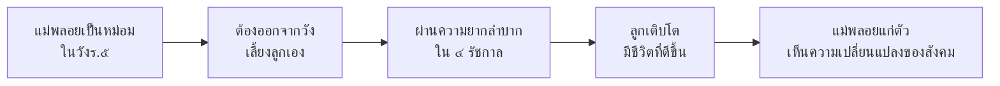

# สี่แผ่นดิน

> นวนิยายที่สะท้อนชีวิตหญิงไทยผ่าน ๔ รัชกาล

---

## เกี่ยวกับผลงาน

| รายละเอียด | ข้อมูล |
|---|---|
| **ชื่อผลงาน** | สี่แผ่นดิน |
| **ผู้แต่ง** | หม่อมราชวงศ์คึกฤทธิ์ ปราโมช |
| **ช่วงเวลา** | พ.ศ. ๒๔๙๖ |
| **ประเภทท** | นวนิยาย (ร้อยแก้ว) |
| **เนื้อหา** | เล่าเรื่องชีวิตของแม่พลอย หญิงไทยที่ผ่าน ๔ รัชกาล (ร.๕-ร.๘) |
| **ความสำคัญ** | นวนิยายที่สะท้อนสังคมไทยและความเปลี่ยนแปลงผ่านชีวิตหญิงไทยคนหนึ่ง |
| **ตอนที่เรียน** | ม.๖ |

---

## เนื้อหาสาระ

---

## วรรณศิลป์

| วิธีการ | รายละเอียด |
|---|---|
| **ร้อยแก้ว** | นวนิยายภาษาเขียน |
| **โวหารเล่าเรื่อง** | เล่าเรื่องตามลำดับเวลา |
| **ภาษาเรียบง่าย** | ภาษาที่ประชาชนเข้าใจง่าย |
| **การสร้างตัวละคร** | ตัวละครมีหลายมิติ สมจริง |

---

## คติธรรมและคุณค่า

| ประเภทท | รายละเอียด |
|---|---|
| **คุณค่าทางวรรณศิลป์** | นวนิยายที่สะท้อนสังคมไทยยอดเยี่ยม |
| **คุณค่าทางสังคม** | สะท้อนสภาพสังคมและการเปลี่ยนแปลงของไทย ๔ รัชกาล |
| **คุณค่าทางประวัติศาสตร์** | บันทึกชีวิตและขนบธรรมเนียมไทย |
| **ข้อคิด** | ความเข้มแข็งของแม่ไทยที่เลี้ยงดูครอบครัวผ่านความยากลำบาก |

---

## สรุปสำคัญ

1. **สี่แผ่นดิน** เป็นนวนิยายโดย ม.ร.ว.คึกฤทธิ์ ปราโมช
2. **แก่นเรื่อง** ชีวิตหญิงไทยผ่าน ๔ รัชกาล
3. **สะท้อนสังคมไทย** และการเปลี่ยนแปลงผ่านชีวิตแม่พลอย
4. **ความเข้มแข็งของแม่ไทย** เป็นแก่นเรื่องหลัก

---

## ดูเพิ่มเติม

- [[00_overview|← กลับไปภาพรวมวรรณกรรมสมัยใหม่]]
