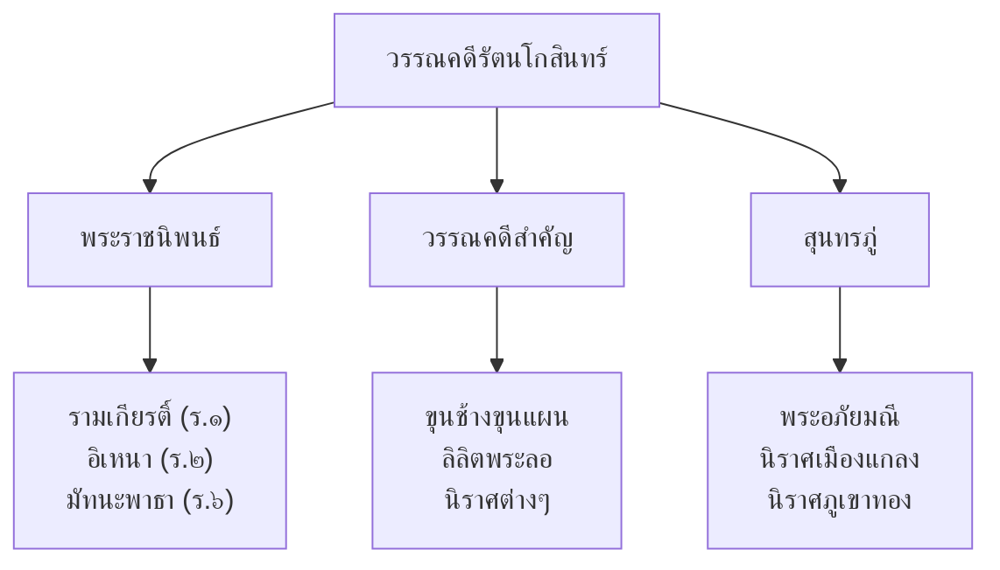

# วรรณคดีสมัยรัตนโกสินทร์

> ยุคทองของวรรณกรรมไทย — รามเกียรติ์ อิเหนา ขุนช้างขุนแผน สุนทรภู่

---

## เกี่ยวกับยุครัตนโกสินทร์ตอนต้น

| รายละเอียด | ข้อมูล |
|---|---|
| **ช่วงเวลา** | พ.ศ. ๒๓๒๕ (กรุงรัตนโกสินทร์) เป็นต้นมา |
| **ราชธานี** | กรุงเทพมหานคร |
| **กษัตริย์ที่สำคัญ** | รัชกาลที่ ๑-๓ |
| **ลักษณะวรรณคดี** | ฟื้นฟูวรรณคดีหลังเสียกรุงศรีอยุธยา สร้างวรรณคดีเอกของชาติ |
| **วรรณคดีเอก** | รามเกียรติ์ อิเหนา ขุนช้างขุนแผน พระอภัยมณี มัทนะพาธา |

---

## ลักษณะเด่น

---

## ผลงานสำคัญ

| # | ชื่อผลงาน | ผู้แต่ง | ประเภทท | บทเรียน |
|---|---|---|---|---|
| ๑ | รามเกียรติ์ | รัชกาลที่ ๑ (ทรงรวบรวม) | บทเสภา/กาพย์ | [[01_รามเกียรติ์]] |
| ๒ | อิเหนา | รัชกาลที่ ๒ | บทเสภา/กาพย์ | [[02_อิเหนา]] |
| ๓ | ขุนช้างขุนแผน | ไม่ปรากฏ | บทเสภา | [[03_ขุนช้างขุนแผน]] |
| ๔ | สุนทรภู่ | สุนทรภู่ | หลายประเภทท | [[สุนทรภู่/00_overview]] |
| ๕ | มัทนะพาธา | รัชกาลที่ ๖ | บทละครพูด | [[04_มัทนะพาธา]] |

---

## ดูเพิ่มเติม

- [[00_ภาพรวม|← กลับไปภาพรวมวรรณคดี]]
- [[สมัยอยุธยา/00_overview|← วรรณคดีสมัยอยุธยา]]
- [[วรรณกรรมสมัยใหม่/00_overview|วรรณกรรมสมัยใหม่ →]]
