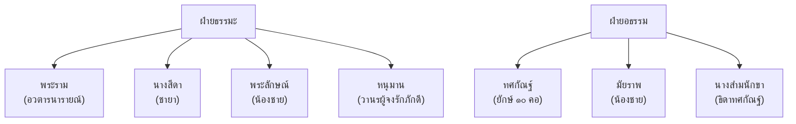
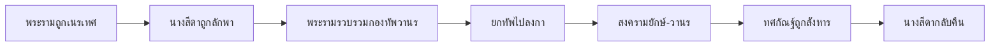

# รามเกียรติ์

> มหากาพย์แห่งชาติไทย — อิงจากรามายณะของอินเดีย แต่งขึ้นใหม่ในสไตล์ไทย

---

## เกี่ยวกับผลงาน

| รายละเอียด | ข้อมูล |
|---|---|
| **ชื่อผลงาน** | รามเกียรติ์ |
| **ผู้แต่ง** | พระบาทสมเด็จพระพุทธยอดฟ้าจุฬาโลกมหาราช (รัชกาลที่ ๑) |
| **ช่วงเวลา** | ต้นกรุงรัตนโกสินทร์ |
| **ประเภทท** | บทเสภาและกาพย์ |
| **ที่มา** | อิงจากมหากาพย์รามายณะของอินเดีย |
| **ความสำคัญ** | มหากาพย์ประจำชาติไทย และแบบอย่างของศิลปะไทย (จิตรกรรม ประติมากรรม นาฏศิลป์) |
| **ตอนที่เรียน** | ม.๒: ตอนนารายณ์ปราบนนทก |

---

## เนื้อหาสาระ

รามเกียรติ์เล่าเรื่องราวของพระราม (อวตารของพระนารายณ์) ที่ต้องเดินทางช่วยนางสีดา ผู้เป็นชายา จากทศกัณฐ์ (ยักษ์)

### ตัวละครหลัก

### เนื้อหาโดยสังเขป

---

## บทอักษรสำคัญ + คำแปลปัจจุบัน

### ตอนนารายณ์ปราบนนทก (ม.๒ เรียน)

> **ภาษาเดิม:**
> ผู้ใดมีศรัทธา ในองค์อิศวร บูชาด้วยใจจริง...

> **คำแปลปัจจุบัน:**
> ผู้ใดมีความศรัทธา ในองค์พระอิศวร บูชาด้วยใจจริง...

---

## วรรณศิลป์

| วิธีการ | รายละเอียด |
|---|---|
| **บทเสภา** | ใช้บทเสภาเล่าเรื่อง (เสภา = ร้อยแก้วที่มีจังหวะ) |
| **กาพย์** | ใช้กาพย์ในตอนที่มีอารมณ์สูง |
| **ภาพพจน์** | บรรยายการรบ ความงาม อารมณ์ |
| **ราชาศัพท์** | ใช้ราชาศัพท์สำหรับเทพและกษัตริย์ |

---

## คติธรรมและคุณค่า

| ประเภทท | รายละเอียด |
|---|---|
| **คุณค่าทางวรรณศิลป์** | มหากาพย์ประจำชาติไทย |
| **คุณค่าทางสังคม** | สะท้อนค่านิยมไทย: ความกตัญญู ความจงรักภักดี คุณธรรม |
| **คุณค่าทางศิลปะ** | แบบอย่างของจิตรกรรม ประติมากรรม นาฏศิลป์ (โขน) |
| **คุณค่าทางภาษา** | แบบอย่างของภาษาเสภาและราชาศัพท์ |
| **ข้อคิด** | ความดีชนะความชั่ว ความจงรักภักดีเป็นคุณธรรมสูงสุด |

---

## คำศัพท์เฉพาะ

| คำ | ความหมาย |
|---|---|
| รามเกียรติ์ | คีรติ (ความสรรเสริญ) ของพระราม |
| ทศกัณฐ์ | ยักษ์ ๑๐ คอ (ทศ = ๑๐, กัณฐ์ = คอ) |
| นนทก | ยักษ์ผู้ล่วงละเมิดศีล |
| สีดา | ชายาของพระราม |
| หนุมาน | วานรผู้จงรักภักดี |
| ลงกา | เมืองของทศกัณฐ์ |
| เสภา | ร้อยแก้วที่มีจังหวะ ใช้เล่าเรื่อง |

---

## ความรู้ที่เชื่อมโยง

- [[หลักการใช้ภาษาไทย/16_ราชาศัพท์|ราชาศัพท์]] — คำราชาศัพท์สำหรับเทพและกษัตริย์
- [[หลักการใช้ภาษาไทย/19_กาพย์|กาพย์]] — กาพย์ในรามเกียรติ์
- [[หลักการใช้ภาษาไทย/12_คำยืมจากภาษาต่างประเทศ|คำยืม]] — คำจากภาษาบาลี/สันสกฤต
- [[การวิเคราะห์วรรณคดี/01_การวิเคราะห์องค์ประกอบ|การวิเคราะห์องค์ประกอบวรรณคดี]] — ตัวละคร โครงเรื่อง แก่นเรื่อง

---

## สรุปสำคัญ

1. **รามเกียรติ์** เป็นมหากาพย์ประจำชาติไทย อิงจากรามายณะของอินเดีย
2. **แก่นเรื่อง** ความดีชนะความชั่ว ความจงรักภักดี (หนุมาน)
3. **ตัวละครเด่น** พระราม นางสีดา พระลักษณ์ หนุมาน ทศกัณฐ์
4. **อิทธิพลต่อศิลปะไทย** จิตรกรรมวัดและปราสาท โขน นาฏศิลป์

---

## ดูเพิ่มเติม

- [[00_overview|← กลับไปภาพรวมสมัยรัตนโกสินทร์]]
- [[02_อิเหนา|อิเหนา →]]
