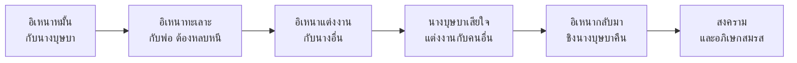

# อิเหนา

> วรรณคดีเรื่องความรักที่งดงามที่สุดเรื่องหนึ่งของไทย

---

## เกี่ยวกับผลงาน

| รายละเอียด | ข้อมูล |
|---|---|
| **ชื่อผลงาน** | อิเหนา (อิเหนาคำกลอน) |
| **ผู้แต่ง** | พระบาทสมเด็จพระพุทธเลิศหล้านภาลัย (รัชกาลที่ ๒) |
| **ช่วงเวลา** | รัตนโกสินทร์ตอนต้น |
| **ประเภทท** | บทเสภาและกาพย์ |
| **ที่มา** | อิงจากเรื่องจากชาวชวา (อินโดนีเซีย) |
| **ความสำคัญ** | วรรณคดีเรื่องความรักที่งดงามที่สุดเรื่องหนึ่ง |
| **ตอนที่เรียน** | ม.๓: ตอนศึกกะหมังกุหนิง |

---

## เนื้อหาสาระ

อิเหนาเล่าเรื่องความรักของอิเหนา (ดาหาโอ) กับนางบุษบา (จินดา) ผ่านอุปสรรคต่างๆ

---

## บทอักษรสำคัญ + คำแปลปัจจุบัน

### ตอนอิเหนาชมนางบุษบา

> **ภาษาเดิม:**
> งามจริงๆ เจ้าสาวเอย ทั้งราหูทั้งเดช...

> **คำแปลปัจจุบัน:**
> งามจริงๆ เจ้าสาวเอย ทั้งรูปร่างทั้งฐานะ...

---

## วรรณศิลป์

| วิธีการ | รายละเอียด |
|---|---|
| **กลอนสุภาพ** | ใช้กลอนสุภาพที่ไพเราะ |
| **โวหารพรรณนา** | บรรยายความงามของนางอย่างละเอียด |
| **ราชาศัพท์** | ใช้ราชาศัพท์สำหรับเจ้านาย |
| **ภาพพจน์** | เปรียบเทียบความงามกับธรรมชาติ |

---

## คติธรรมและคุณค่า

| ประเภทท | รายละเอียด |
|---|---|
| **คุณค่าทางวรรณศิลป์** | กลอนสุภาพที่ไพเราะที่สุดเรื่องหนึ่ง |
| **คุณค่าทางสังคม** | สะท้อนค่านิยมเรื่องความรักและการแต่งงาน |
| **ข้อคิด** | ความรักต้องผ่านอุปสรรค และความซื่อสัตย์สำคัญที่สุด |

---

## สรุปสำคัญ

1. **อิเหนา** เป็นวรรณคดีเรื่องความรักโดยรัชกาลที่ ๒
2. **กลอนสุภาพที่ไพเราะ** ทำให้เรื่องนี้เป็นวรรณคดีเอก
3. **แก่นเรื่อง** ความรัก ความซื่อสัตย์ และการเอาชนะอุปสรรค
4. **ที่มา** อิงจากเรื่องชาวชวา (อินโดนีเซีย) แต่ปรับเป็นสไตล์ไทย

---

## ดูเพิ่มเติม

- [[00_overview|← กลับไปภาพรวมสมัยรัตนโกสินทร์]]
- [[03_ขุนช้างขุนแผน|ขุนช้างขุนแผน →]]
