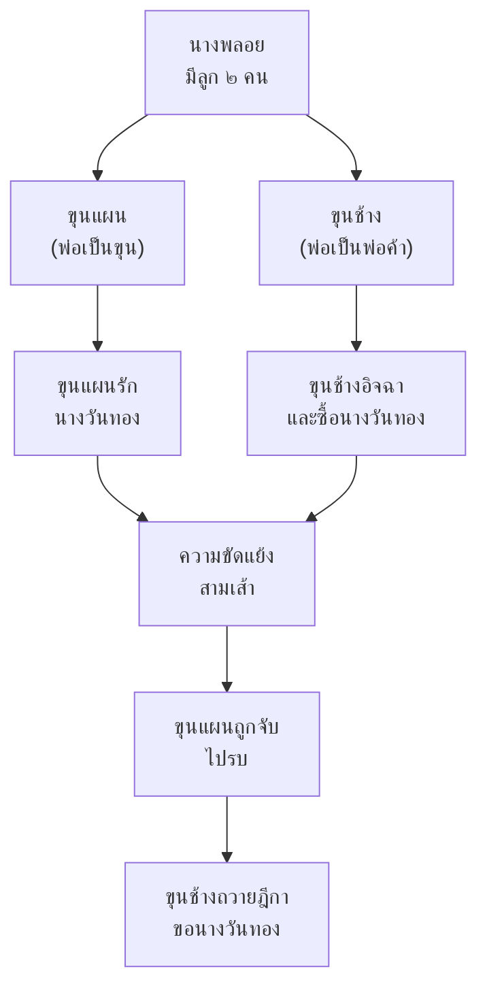

# ขุนช้างขุนแผน

> สุภาษิตเยาวชนแห่งชาติไทย — เล่าเรื่องสองชายคนเดียวหญิง ผสมจินตนาการและความสมจริง

---

## เกี่ยวกับผลงาน

| รายละเอียด | ข้อมูล |
|---|---|
| **ชื่อผลงาน** | ขุนช้างขุนแผน |
| **ผู้แต่ง** | ไม่ปรากฏ (รวบรวมในรัชกาลที่ ๒) |
| **ช่วงเวลา** | สมัยอยุธยา-รัตนโกสินทร์ |
| **ประเภทท** | เสภา |
| **เนื้อหา** | เล่าเรื่องความรักสามเส้า: ขุนแผน-นางวันทอง-ขุนช้าง |
| **ความสำคัญ** | วรรณคดีเอกที่สะท้อนสังคมไทยโบราณ |
| **ตอนที่เรียน** | ม.๔: ตอนขุนช้างถวายฎีกา |

---

## เนื้อหาสาระ

ขุนช้างขุนแผนเล่าเรื่องความรักสามเส้าระหว่างขุนแผน (วีรบุรุษ) ขุนช้าง (คนรวยแต่ไม่หล่อ) และนางวันทอง (หญิงงาม)

---

## บทอักษรสำคัญ + คำแปลปัจจุบัน

### ตอนขุนช้างถวายฎีกา (ม.๔ เรียน)

> **ภาษาเดิม (เสภา):**
> สมเด็จพระพนัดบันลือศักดา ราชาธิบดินทร์...

> **คำแปลปัจจุบัน:**
> สมเด็จพระเจ้าแผ่นดินผู้ทรงฤทธิ์...

---

## วรรณศิลป์

| วิธีการ | รายละเอียด |
|---|---|
| **เสภา** | ใช้บทเสภาเล่าเรื่อง (ร้อยแก้วที่มีจังหวะ) |
| **โวหารเทศนา** | เล่าเรื่องพร้อมแสดงความคิดเห็น |
| **การบรรยายสมจริง** | บรรยายสังคมไทยโบราณอย่างละเอียด |
| **ภาพพจน์** | บรรยายความงามของนางและการรบ |

---

## คติธรรมและคุณค่า

| ประเภทท | รายละเอียด |
|---|---|
| **คุณค่าทางวรรณศิลป์** | วรรณคดีเสภาที่ยาวที่สุดและสมบูรณ์ที่สุด |
| **คุณค่าทางสังคม** | สะท้อนสังคมไทยโบราณ: การค้าขาย การเมือง ความรัก |
| **คุณค่าทางประวัติศาสตร์** | บรรยายวัตถุ ขนบธรรมเนียม สมัยอยุธยา-รัตนโกสินทร์ |
| **ข้อคิด** | ความรักและอำนาจเป็นเรื่องซับซ้อน ต้องมีคุณธรรม |

---

## สรุปสำคัญ

1. **ขุนช้างขุนแผน** เป็นวรรณคดีเสภาที่สะท้อนสังคมไทยโบราณ
2. **ความรักสามเส้า** ขุนแผน-นางวันทอง-ขุนช้าง
3. **สังคมไทยโบราณ** สะท้อนการค้าขาย การเมือง ความรัก ขนบธรรมเneียม
4. **เป็นสุภาษิตเยาวชนแห่งชาติ** เพราะสะท้อนค่านิยamไทย

---

## ดูเพิ่มเติม

- [[00_overview|← กลับไปภาพรวมสมัยรัตนโกสินทร์]]
- [[02_อิเหนา|← อิเหนา]]
- [[04_มัทนะพาธา|มัทนะพาธา →]]
