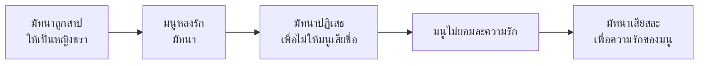

# มัทนะพาธา

> บทละครพูดที่แสดงความรักและความเสียสละ

---

## เกี่ยวกับผลงาน

| รายละเอียด | ข้อมูล |
|---|---|
| **ชื่อผลงาน** | มัทนะพาธา |
| **ผู้แต่ง** | พระบาทสมเด็จพระมงกุฎเกล้าเจ้าอยู่หัว (รัชกาลที่ ๖) |
| **ช่วงเวลา** | รัตนโกสินทร์ (พ.ศ. ๒๔๖๖) |
| **ประเภทท** | บทละครพูด |
| **เนื้อหา** | เล่าเรื่องความรักของมัทนา (หญิงเฒ่า) ที่ยอมเสียสละเพื่อความรักของพระอภัยมณี |
| **ความสำคัญ** | บทละครพูดที่แสดงประเด็นความรักและสิทธิสตรี |
| **ตอนที่เรียน** | ม.๖ |

---

## เนื้อหาสาระ

มัทนะพาธาเล่าเรื่องความรักระหว่างมัทนา (สาวเฒ่าที่ถูกสาปให้เป็นหญิงชรา) กับมนู (ชายหนุ่ม)

---

## บทอักษรสำคัญ

### ตอนมัทนาปฏิเสธความรัก

> ข้าพเจ้าเป็นหญิงชรา ไม่สมควรที่จะได้รับความรักจากท่านชายหนุ่ม...

---

## วรรณศิลป์

| วิธีการ | รายละเอียด |
|---|---|
| **บทละครพูด** | รูปแบบละครพูด (dialogue) |
| **โวหารเทศนา** | แสดงความคิดเห็นผ่านบทพูด |
| **ภาษาสมัยใหม่** | ใช้ภาษาเขียนสมัยใหม่ |

---

## คติธรรมและคุณค่า

| ประเภทท | รายละเอียด |
|---|---|
| **คุณค่าทางวรรณศิลป์** | บทละครพูดที่แสดงความรักและความเสียสละ |
| **คุณค่าทางสังคม** | สะท้อนประเด็นสิทธิสตรีและความยุติธรรมทางเพศ |
| **ข้อคิด** | ความรักแท้คือการเสียสละเพื่อความสุขของอีกฝ่าย |

---

## สรุปสำคัญ

1. **มัทนะพาธา** เป็นบทละครพูดโดยรัชกาลที่ ๖
2. **แก่นเรื่อง** ความรัก ความเสียสละ สิทธิสตรี
3. **บทละครพูด** เป็นรูปแบบวรรณกรรมสมัยใหม่ของไทย
4. **ประเด็นสิทธิสตรี** ล้ำสมัยสำหรับยุคนั้น

---

## ดูเพิ่มเติม

- [[00_overview|← กลับไปภาพรวมสมัยรัตนโกสินทร์]]
