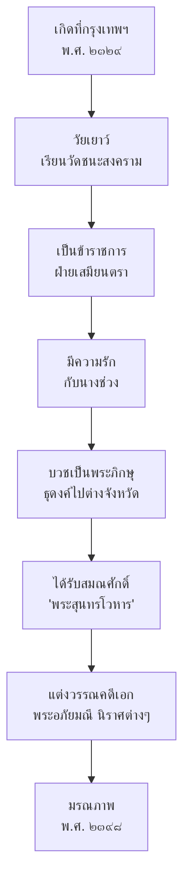

# สุนทรภู่

> กวีเอกแห่งกรุงรัตนโกสินทร์ — "ชาเลิศแห่งเจ้าซอย กวีแห่งประชาชน"

---

## เกี่ยวกับสุนทรภู่

| รายละเอียด | ข้อมูล |
|---|---|
| **ชื่อ** | พระสุนทรโวหาร (สุนทรภู่) |
| **ช่วงชีวิต** | พ.ศ. ๒๓๒๙–๒๓๙๘ |
| **ยุค** | รัตนโกสินทร์ตอนต้น (รัชกาลที่ ๑-๓) |
| **ราชทินนาม** | พระสุนทรโวหาร |
| **สถานะ** | กวีเอกแห่งรัตนโกสินทร์ ยุครัชกาลที่ ๒-๓ |
| **ฉายา** | กวีแห่งประชาชน / กวีเอกแห่งกรุงรัตนโกสินทร์ |
| **ความสำคัญ** | ได้รับการยกย่องเป็น "บุรุษแห่งวรรณกรรมโลก" โดยยูเนสโก (พ.ศ. ๒๕๒๙) |

---

## ประวัติโดยสังเขป

---

## ลักษณะเด่นของสุนทรภู่

| ลักษณะ | รายละเอียด |
|---|---|
| **ภาษาที่ใช้** | ภาษาเรียบง่าย เข้าใจง่าย ไม่ใช้คำศัพท์ยาก |
| **เนื้อหา** | เล่าเรื่องจากชีวิตจริง สะท้อนสังคม ความรัก ความเสียใจ |
| **โวหาร** | โวหารพรรณนา บรรยายธรรมชาติและอารมณ์อย่างละเอียด |
| **จุดเด่น** | เป็น "กวีแห่งประชาชน" ไม่เน้นภาษาเป็นทางการ |

---

## ผลงานสำคัญ

| # | ชื่อผลงาน | ประเภทท | บทเรียน |
|---|---|---|---|
| ๑ | พระอภัยมณี | เสภา | [[01_พระอภัยมณี]] |
| ₂ | นิราศเมืองแกลง | นิราศ | [[02_นิราศเมืองแกลง]] |
| ₃ | นิราศภูเขาทอง | นิราศ | [[03_นิราศภูเขาทอง]] |
| ๔ | นิราศพระบาท | นิราศ | — |
| ๕ | สุภาษิตสอนหญิง | สุภาษิต | — |

---

## ดูเพิ่มเติม

- [[00_overview|← กลับไปภาพรวมสมัยรัตนโกสินทร์]]
- [[01_พระอภัยมณี|พระอภัยมณี →]]
