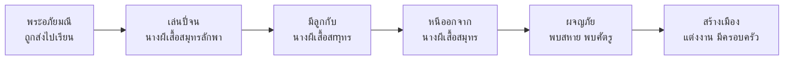

# พระอภัยมณี

> มหากาพย์เสภาที่ยิ่งใหญ่ที่สุดของสุนทรภู่

---

## เกี่ยวกับผลงาน

| รายละเอียด | ข้อมูล |
|---|---|
| **ชื่อผลงาน** | เสภาพระอภัยมณี |
| **ผู้แต่ง** | พระสุนทรโวหาร (สุนทรภู่) |
| **ประเภทท** | เสภา |
| **เนื้อหา** | เล่าเรื่องการผจญภัยของพระอภัยมณี |
| **ความสำคัญ** | วรรณคดีเอกที่สะท้อนความคิดและวิถีชีวิตไทย |
| **ตอนเด่น** | ตอนพระอภัยมณีถูกนางผีเสื้อสมุทรลักพา |

---

## เนื้อหาสาระ

---

## บทอักษรสำคัญ + คำแปลปัจจุบัน

### ตอนพระอภัยมณีเล่นปี่ริมทะเล

> **ภาษาเดิม (เสภา):**
> โอ้ราชาบุตรพระอภัย มณีเอย
> ดังใดเจ็บแสบที่วิญญาณ...

> **คำแปลปัจจุบัน:**
> โอ้ราชาบุตรพระอภัยมณีเอย
> เจ็บแสบที่วิญญาณเหลือกว่า...

---

## วรรณศิลป์

| วิธีการ | รายละเอียด |
|---|---|
| **เสภา** | ใช้เสภาเล่าเรื่อง มีจังหวะ ไพเราะ |
| **โวหารพรรณนา** | บรรยายธรรมชาติและอารมณ์อย่างละเอียด |
| **ภาษาเรียบง่าย** | ใช้ภาษาที่ประชาชนเข้าใจง่าย |
| **การสร้างตัวละคร** | ตัวละครมีหลายมิติ ไม่ขาว-ดำ |

---

## คติธรรมและคุณค่า

| ประเภทท | รายละเอียด |
|---|---|
| **คุณค่าทางวรรณศิลป์** | มหากาพย์เสภาที่ยิ่งใหญ่ที่สุดของสุนทรภู่ |
| **คุณค่าทางสังคม** | สะท้อนสังคมไทยสมัยรัตนโกสินทร์ตอนต้น |
| **ข้อคิด** | การดำเนินชีวิตต้องผ่านอุปสรรค แต่ต้องยึดมั่นในความดี |

---

## สรุปสำคัญ

1. **พระอภัยมณี** เป็นมหากาพย์เสภาที่ยิ่งใหญ่ที่สุดของสุนทรภู่
2. **เล่าเรื่องการผจญภัย** ของพระอภัยมณี
3. **ภาษาเรียบง่าย** ทำให้เข้าใจง่าย เป็นกวีแห่งประชาชน
4. **สะท้อนสังคมไทย** สมัยรัตนโกสินทร์ตอนต้น

---

## ดูเพิ่มเติม

- [[00_overview|← กลับไปภาพรวมสุนทรภู่]]
- [[02_นิราศเมืองแกลง|นิราศเมืองแกลง →]]
