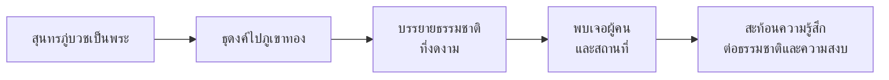

# นิราศภูเขาทอง

> นิราศที่บรรยายธรรมชาติและความรักที่งดงาม

---

## เกี่ยวกับผลงาน

| รายละเอียด | ข้อมูล |
|---|---|
| **ชื่อผลงาน** | นิrาศภูเขาทอง |
| **ผู้แต่ง** | พระสุนทรโวหาร (สุนทรภู่) |
| **ประเภทท** | นิราศ (กลอนสุภาพ) |
| **เนื้อหา** | บรรยายการเดินทางของสุนทรภู่เมื่อครั้งบวชเป็นพระ ไปธุดงค์ที่ภูเขาทอง |
| **ฉันทลักษณ์** | กลอนแปด (กลอนสุภาพ) |

---

## เนื้อหาสาระ

---

## บทอักษรสำคัญ + คำแปลปัจจุบัน

### ตอนบรรยายธรรมชาติที่ภูเขาทอง

> **ภาษาเดิม (กลอนสุภาพ):**
> โอ้สิ่งใดจะพอ จะเปรียบประดับ
> กับภูเขาทองที่ตั้งเด่น
> ดูสวยงามราวกับทอง
> ที่พระอาทิตย์ทอแสง

> **คำแปลปัจจุบัน:**
> โอ้สิ่งใดจะพอเปรียบ
> กับภูเขาทองที่ตั้งเด่น
> ดูสวยงามราวกับทอง
> ที่พระอาทิตย์ทอแสง

---

## วรรณศิลป์

| วิธีการ | รายละเอียด |
|---|---|
| **กลอนสุภาพ** | ใช้กลอนแปด (กลอนสุภาพ) |
| **โวหารพรรณnา** | บรรยายธรรมชาติอย่างสวยงาม |
| **โวหารเทศนา** | แสดงความรู้สึกต่อธรรมชาติ |
| **ภาพพจน์** | เปรียบเทียบธรรมชาติกับสิ่งต่างๆ |

---

## คติธรรมและคุณค่า

| ประเภทท | รายละเอียด |
|---|---|
| **คุณค่าทางวรรณศิลป์** | แบบอย่างของการบรรยายธรรมชาติในรูปกลอน |
| **คุณค่าทางภาษา** | ภาษาสุนทรภู่ที่เรียบง่ายแต่ไพเราะ |
| **ข้อคิด** | ธรรมชาติเป็นสิ่งที่งดงามและทำให้จิตใจสงบ |

---

## สรุปสำคัญ

1. **นิราศภูเขาทอง** เป็นนิราศที่บรรยายการธุดงค์ของสุนทรภู่
2. **แก่นเรื่อง** ความงามของธรรมชาติ และความสงบของจิตใจ
3. **กลอนสุภาพ** ที่ไพเราะ บรรยายธรรมชาติและความรู้สึก
4. **กวีแห่งประชาชน** ภาษาเรียบง่าย แต่สะท้อนความงดงามของธรรมชาติ

---

## ดูเพิ่มเติม

- [[00_overview|← กลับไปภาพรวมสุนทรภู่]]
- [[02_นิราศเมืองแกลง|← นิราศเมืองแกลง]]
