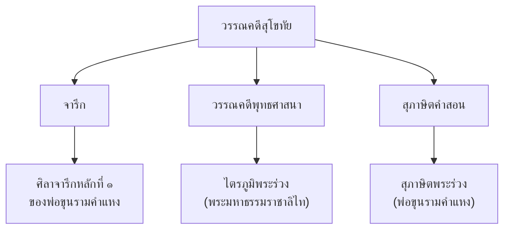

# วรรณคดีสมัยสุโขทัย

> รากเหง้าของวรรณกรรมไทย — ศิลาจารึก ไตรภูมิพระร่วง สุภาษิตพระร่วง

---

## เกี่ยวกับยุคสุโขทัย

| รายละเอียด | ข้อมูล |
|---|---|
| **ช่วงเวลา** | พ.ศ. ๑๗๙๔–๑๘๘๒ (ประมาณ ๘๘ ปี) |
| **ราชธานี** | เมืองสุโขทัย |
| **กษัตริย์ที่สำคัญ** | พ่อขุนศรีอินทราทิตย์ พ่อขุนรามคำแหงมหาราช พระมหาธรรมราชาลิไท |
| **ลักษณะวรรณคดี** | จารึกลงแผ่นศิลา วรรรณคดีทางพระพุทธศาสนา สุภาษิตคำสอน |
| **ภาษาที่ใช้** | ภาษาไทยดั้งเดิม ผสมบาลี สันสกฤต |
| **วรรณคดีเอก** | ศิลาจารึกพ่อขุนรามคำแหง ไตรภูมิพระร่วง สุภาษิตพระร่วง |

---

## ลักษณะเด่นของวรรณคดีสุโขทัย

### ลักษณะภาษา
- ใช้ภาษาไทยแท้ ภาษาเรียบง่าย ไม่หลงกล
- ผสมคำบาลี/สันสกฤตในเรื่องพุทธศาสนา
- เน้นเนื้อหาสาระมากกว่าความสวยงามของภาษา

---

## ผลงานสำคัญ

| # | ชื่อผลงาน | ผู้แต่ง | ประเภทท | บทเรียน |
|---|---|---|---|---|
| ๑ | ศิลาจารึกพ่อขุนรามคำแหง | พ่อขุนรามคำแหงมหาราช | จารึก | [[01_ศิลาจารึกพ่อขุนรามคำแหง]] |
| ๒ | ไตรภูมิพระร่วง | พระมหาธรรมราชาลิไท | วรรณคดีพุทธศาสนา | [[02_ไตรภูมิพระร่วง]] |
| ๓ | สุภาษิตพระร่วง | พ่อขุนรามคำแหง (สันนิษฐาน) | สุภาษิตคำสอน | [[03_สุภาษิตพระร่วง]] |

---

## ดูเพิ่มเติม

- [[00_ภาพรวม|← กลับไปภาพรวมวรรณคดี]]
- [[สมัยอยุธยา/00_overview|วรรณคดีสมัยอยุธยา →]]
