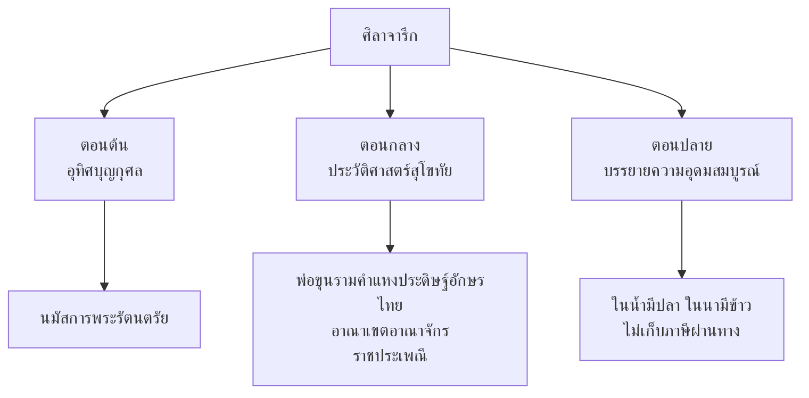

# ศิลาจารึกพ่อขุนรามคำแหง

> มหาลัพธ์แห่งวรรณกรรมสุโขทัย และหลักฐานการประดิษฐ์อักษรไทย

---

## เกี่ยวกับผลงาน

| รายละเอียด | ข้อมูล |
|---|---|
| **ชื่อผลงาน** | ศิลาจารึกหลักที่ ๑ (ศิลาจารึกพ่อขุนรามคำแหง) |
| **ผู้สร้าง** | พ่อขุนรามคำแหงมหาราช |
| **ช่วงเวลา** | พ.ศ. ๑๘๒๖ (ค.ศ. ๑๒๘๓) |
| **ประเภทท** | จารึกลงแผ่นศิลา |
| **วัสดุ** | หินทราย |
| **สถานที่** | เมืองสุโขทัย |
| **ความสำคัญ** | หลักฐานการประดิษฐ์อักษรไทย และบันทึกประวัติศาสตร์สุโขทัย |
| **สถานะ** | ขึ้นทะเบียนเป็นมรดกโลกของยูเนสโก (พ.ศ. ๒๕๔๖) |

---

## เนื้อหาสาระ

ศิลาจารึกพ่อขุนรามคำแหงบันทึกเรื่องราวของอาณาจักรสุโขทัย ตั้งแต่ประวัติศาสตร์การสร้างเมือง ราชประเพณี ขนบธรรมเนียม ไปจนถึงความอุดมสมบูรณ์ของบ้านเมือง

### เนื้อหาโดยสังเขป

---

## บทอักษรสำคัญ + คำแปลปัจจุบัน

### ตอนที่ ๑: การประดิษฐ์อักษรไทย

> **ภาษาจารึก:**
> ปูชารพบุทธคุณอันใด ญาธิบดีศรีภูทินทราธิราช บดินทร์ ประกษิตติราช...

> **คำแปลปัจจุบัน:**
> สรรเสริญพระพุทธคุณอันใด พระเจ้าแผ่นดินผู้ทรงศรีอันประเสริฐ พระมหากษัตริย์ผู้ทรงพระปรีชา...

### ตอนที่ ๒: ความอุดมสมบูรณ์ของสุโขทัย

> **ภาษาจารึก:**
> ที่นี้เป็นที่ดีอนในน้ำมีปลาในนามีข้าว เจ้าเมืองบ่เอาเงินบ่เอาทอกได้เลี้ยงช้างม้าศัสตราวุธ...

> **คำแปลปัจจุบัน:**
> ที่นี้เป็นที่ดี ในน้ำมีปลา ในนามีข้าว เจ้าเมืองไม่เก็บภาษี เลี้ยงช้าง ม้า ศาสตราวุธได้...

---

### ตารางวิเคราะห์บทอักษร: ความอุดมสมบูรณ์

| # | ภาษาจารึก | คำแปลปัจจุบัน | หมายเหตุ |
|---|---|---|---|
| ๑ | ที่นี้เป็นที่ดีอน | ที่นี้เป็นที่ดี | คำว่า "อน" เป็นคำเน้น |
| ๒ | ในน้ำมีปลา | ในน้ำมีปลา | สำนวนไทยที่ใช้จนปัจจุบัน |
| ๓ | ในนามีข้าว | ในนามีข้าว | สำนวนไทยที่ใช้จนปัจจุบัน |
| ๔ | เจ้าเมืองบ่เอาเงินบ่เอาทอก | เจ้าเมืองไม่เก็บเงินไม่เก็บทอง | "บ่" = ไม่, "ทอก" = ทอง |
| ๕ | ได้เลี้ยงช้างม้าศัสตราวุธ | ได้เลี้ยงช้างม้าอาวุธ | "ศัสตราวุธ" = อาวุธยุทธภัณฑ์ |

---

## วรรณศิลป์

| วิธีการ | รายละเอียด |
|---|---|
| **ภาษาเรียบง่าย** | ใช้ภาษาพูดที่เข้าใจง่าย ไม่ใช้คำศัพท์ยาก |
| **การบรรยาย** | บรรยายสภาพสุโขทัยที่อุดมสมบูรณ์อย่างเป็นรูปธรรม |
| **สำนวนคู่** | "ในน้ำมีปลา ในนามีข้าว" — ลักษณะการพูดคู่ของไทย |

---

## คติธรรมและคุณค่า

| ประเภทท | รายละเอียด |
|---|---|
| **คุณค่าทางภาษา** | หลักฐานการประดิษฐ์อักษรไทย และรากเหง้าของภาษาไทย |
| **คุณค่าทางสังคม** | สะท้อนสังคมสุโขทัยที่ยุติธรรม อุดมสมบูรณ์ |
| **คุณค่าทางประวัติศาสตร์** | บันทึกประวัติศาสตร์อาณาจักรสุโขทัย |
| **คุณค่าทางขนบธรรมเนียม** | สะท้อนราชประเพณีและวิถีชีวิตสุโขทัย |
| **ข้อคิด** | การปกครองที่ดี = การดูแลประชาชน ให้มีความสุข |

---

## คำศัพท์โบราณ

| ภาษาโบราณ | ภาษาปัจจุบัน | หมายเหตุ |
|---|---|---|
| บ่ | ไม่ | ภาษาถิ่นเหนือที่ใช้ในจารึก |
| ทอก | ทอง | การเปลี่ยนเสียง |
| อัน | ที่ | คำนำหน้านาม |
| เผ้า | ตอนเช้า | ภาษาโบราณ |
| กยี | ควาย | การสะกดคำโบราณ |
| พะ | พ่อ | ภาษาโบราณ |
| ญาธิบดี | ผู้ทรงปัญญาเป็นใหญ่ | คำบาลี/สันสกฤต |

---

## ความรู้ที่เชื่อมโยง

- [[หลักการใช้ภาษาไทย/01_อักษรไทย|อักษรไทย]] — การประดิษฐ์อักษรไทยของพ่อขุนรามคำแหง
- [[หลักการใช้ภาษาไทย/18_ภาษากับวัฒนธรรม|ภาษากับวัฒนธรรม]] — ภาษาโบราณและการเปลี่ยนแปลงของภาษา
- [[หลักการใช้ภาษาไทย/12_คำยืมจากภาษาต่างประเทศ|คำยืมจากภาษาต่างประเทศ]] — คำบาลี/สันสกฤตในจารึก

---

## สรุปสำคัญ

1. **ศิลาจารึกพ่อขุนรามคำแหง** เป็นหลักฐานการประดิษฐ์อักษรไทยและบันทึกประวัติศาสตร์สุโขทัย
2. **สำนวน "ในน้ำมีปลา ในนามีข้าว"** สะท้อนสังคมเกษตรกรรมที่อุดมสมบูรณ์ของสุโขทัย
3. **ภาษาที่ใช้** เป็นภาษาไทยแท้ เรียบง่าย แสดงถึงรากเหง้าของภาษาไทย
4. **คุณค่าทางประวัติศาสตร์** แสดงราชประเพณีและวิถีชีวิตของสุโขทัยที่ยุติธรรมและอุดมสมบูรณ์

---

## ดูเพิ่มเติม

- [[00_overview|← กลับไปภาพรวมสมัยสุโขทัย]]
- [[02_ไตรภูมิพระร่วง|ไตรภูมิพระร่วง →]]
