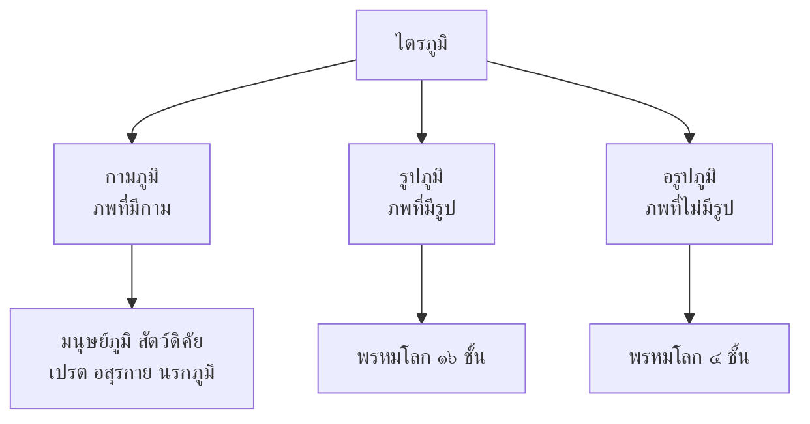

# ไตรภูมิพระร่วง

> สารานุกรมแห่งจักรวาลและพุทธศาสนาของไทยสมัยสุโขทัย

---

## เกี่ยวกับผลงาน

| รายละเอียด | ข้อมูล |
|---|---|
| **ชื่อผลงาน** | ไตรภูมิพระร่วง (ตำราไตรภูมิ) |
| **ผู้แต่ง** | พระมหาธรรมราชาลิไท (สันนิษฐาน) |
| **ช่วงเวลา** | พ.ศ. ๑๘๘๒ |
| **ประเภทท** | นิทานคติธรรม / ตำราทางพุทธศาสนา |
| **รูปแบบ** | ร้อยแก้ว |
| **ความสำคัญ** | วรรณกรรมเรื่องแรกที่เขียนเป็นร้อยแก้วภาษาไทย |
| **เนื้อหา** | บรรยายจักรวาลตามคติพุทธแบบไตรภูมิ (กามภูมิ รูปภูมิ อรูปภูมิ) |

---

## เนื้อหาสาระ

ไตรภูมิพระร่วงบรรยายโครงสร้างของจักรวาลตามความเชื่อทางพุทธศาสนา แบ่งเป็น ๓ ภพภูมิ:

### เนื้อหาโดยสังเขป

๑. **กามภูมิ** — บรรยายนรกภูมิ สวรรค์ มนุษย์ สัตว์
๒. **รูปภูมิ** — บรรยายพรหมโลกที่มีรูป
๓. **อรูปภูมิ** — บรรยายพรหมโลกที่ไม่มีรูป

---

## บทอักษรสำคัญ + คำแปลปัจจุบัน

### ตอนที่ ๑: บรรยายนรกภูมิ

> **ภาษาเดิม:**
> ผู้ใดทำกรรมหนัก เบียดเบียนผู้อื่น ล่วงละเมิดศีลธรรม เมื่อตายไปย่อมตกนรก...

> **คำแปลปัจจุบัน:**
> ผู้ใดทำกรรมหนัก เบียดเบียนผู้อื่น ละเมิดศีลธรรม เมื่อตายไปย่อมตกนรก...

---

## วรรณศิลป์

| วิธีการ | รายละเอียด |
|---|---|
| **ภาษาสันสกฤต/บาลี** | ใช้คำศัพท์ทางพุทธศาสนาเป็นจำนวนมาก |
| **การบรรยาย** | บรรยายสวรรค์และนรกอย่างละเอียด |
| **โวหารสาธก** | ยกตัวอย่างประกอบคำสอน |

---

## คติธรรมและคุณค่า

| ประเภทท | รายละเอียด |
|---|---|
| **คุณค่าทางพุทธศาสนา** | สอนเรื่องกรรม สวรรค์ นรก และการดำเนินชีวิต |
| **คุณค่าทางภาษา** | วรรณคดีเรื่องแรกที่เขียนเป็นร้อยแก้วภาษาไทย |
| **คุณค่าทางสังคม** | สะท้อนความเชื่อของคนไทยสมัยสุโขทัย |
| **คุณค่าทางวิทยาศาสตร์** | บรรยายโครงสร้างจักรวาลตามความเชื่อสมัยนั้น |
| **ข้อคิด** | ทำความดีได้ดี ทำชั่วได้ชั่ว กรรมมีจริง |

---

## คำศัพท์เฉพาะ

| คำ | ความหมาย |
|---|---|
| ไตรภูมิ | ๓ ภพภูมิ (กาม รูป อรูป) |
| กามภูมิ | ภพที่มีกาม (ตัณหา) |
| รูปภูมิ | ภพที่มีรูป |
| อรูปภูมิ | ภพที่ไม่มีรูป |
| มรรค | ทาง |
| ผล | ผลของการปฏิบัติ |
| นิพพาน | ความดับทุกข์ |

---

## ความรู้ที่เชื่อมโยง

- [[หลักการใช้ภาษาไทย/12_คำยืมจากภาษาต่างประเทศ|คำยืมจากภาษาต่างประเทศ]] — คำบาลี/สันสกฤต
- [[หลักการใช้ภาษาไทย/17_สำนวน สุภาษิต และคำพังเพย|สุภาษิต]] — คำสอนทางพุทธศาสนา

---

## สรุปสำคัญ

1. **ไตรภูมิพระร่วง** เป็นวรรณคดีเรื่องแรกที่เขียนเป็นร้อยแก้วภาษาไทย
2. **บรรยายจักรวาล** ตามคติพุทธแบบไตรภูมิ (กามภูมิ รูปภูมิ อรูปภูมิ)
3. **สอนเรื่องกรรม** ทำดีได้ดี ทำชั่วได้ชั่ว
4. **สารานุกรมแห่งจักรวาล** ของคนไทยสมัยสุโขทัย

---

## ดูเพิ่มเติม

- [[00_overview|← กลับไปภาพรวมสมัยสุโขทัย]]
- [[01_ศิลาจารึกพ่อขุนรามคำแหง|← ศิลาจารึกพ่อขุนรามคำแหง]]
- [[03_สุภาษิตพระร่วง|สุภาษิตพระร่วง →]]
