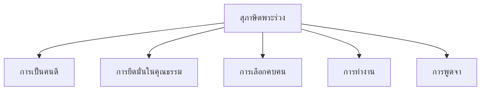

# สุภาษิตพระร่วง

> ตำราสุภาษิตคำสอนที่เก่าแก่ที่สุดของไทย

---

## เกี่ยวกับผลงาน

| รายละเอียด | ข้อมูล |
|---|---|
| **ชื่อผลงาน** | สุภาษิตพระร่วง (หรือ หนังสือสุภาษิตสอนคน) |
| **ผู้แต่ง** | พ่อขุนรามคำแหงมหาราช (สันนิษฐาน) |
| **ช่วงเวลา** | สมัยสุโขทัย |
| **ประเภทท** | สุภาษิตคำสอน |
| **รูปแบบ** | ร้อยแก้ว บทความสั้นๆ |
| **ความสำคัญ** | ตำราสุภาษิตคำสอนที่เก่าแก่ที่สุดของไทย |
| **เนื้อหา** | คำสอนเกี่ยวกับการดำเนินชีวิต คุณธรรม และจริยธรรม |

---

## เนื้อหาสาระ

สุภาษิตพระร่วงเป็นชุดคำสอนสั้นๆ ที่ให้ข้อคิดเกี่ยวกับการดำเนินชีวิต ส่วนใหญ่สอนเกี่ยวกับ:

---

## บทอักษรสำคัญ + คำแปลปัจจุบัน

### สุภาษิตที่ ๑: การเลือกคบคน

> **ภาษาเดิม:**
> คบคนพาล ทำตนให้พลอยกลายเป็นคนพาล

> **คำแปลปัจจุบัน:**
> คบคนพาล ทำตนให้พลอยกลายเป็นคนพาล

### สุภาษิตที่ ๒: การยึดมั่นในคุณธรรม

> **ภาษาเดิม:**
> อายนูกหนึ่งเจ็ดคาบตั้งแต่ ให้ยึดเอาความดีเป็นทาง...

> **คำแปลปัจจุบัน:**
> ไม่ว่าจะเกิดในสภาพใด ให้ยึดเอาความดีเป็นทาง...

---

### ตารางวิเคราะห์สุภาษิต

| # | สุภาษิตเดิม | คำแปลปัจจุบัน | ความหมาย |
|---|---|---|---|
| ๑ | คบคนพาล ทำตนให้พลอยเป็นคนพาล | คบคนพาล ทำตนให้พลอยเป็นคนพาล | คบคนไม่ดี ทำตนให้เสียชื่อ |
| ๒ | คบบัณฑิต ทำตนให้พลอยเป็นบัณฑิต | คบบัณฑิต ทำตนให้พลอยเป็นบัณฑิต | คบคนดี ทำตนให้เป็นคนดี |
| ๓ | ผู้รู้พอ ผู้เลี้ยงทุกข์ | ผู้รู้จักพอ ผู้เลี้ยงทุกข์ | รู้จักพอ ทำให้ไม่ทุกข์ |
| ๔ | ผู้มีตาเห็นรูป ผู้มีหูได้ยินเสียง | ผู้มีตาเห็นรูป ผู้มีหูได้ยินเสียง | สิ่งที่เราเห็นและได้ยิน มีผลต่อจิตใจ |

---

## วรรณศิลป์

| วิธีการ | รายละเอียด |
|---|---|
| **ภาษาเรียบง่าย** | ใช้ภาษาที่เข้าใจง่าย สั้น กระชับ |
| **การขยายความ** | คำสอนสั้นแต่มีความหมายลึกซึ้ง |
| **โวหารสาธก** | ยกตัวอย่างประกอบคำสอน |
| **คำคู่** | ใช้คำคู่เพื่อเน้นความหมาย เช่น "คบคนพาล — คบบัณฑิต" |

---

## คติธรรมและคุณค่า

| ประเภทท | รายละเอียด |
|---|---|
| **คุณค่าทางคุณธรรม** | สอนให้เป็นคนดี คบคนดี ยึดความดีเป็นทาง |
| **คุณค่าทางภาษา** | ภาษาไทยแท้ เรียบง่าย คมคาย |
| **คุณค่าทางสังคม** | สะท้อนค่านิยมของสังคมสุโขทัย |
| **ข้อคิด** | คบคนดีทำให้เป็นคนดี คบคนพาลทำให้เป็นคนพาล |

---

## คำศัพท์เฉพาะ

| คำโบราณ | คำปัจจุบัน | หมายเหตุ |
|---|---|---|
| พาล | คนโง่ คนไม่ดี | คำบาลี |
| บัณฑิต | คนฉลาด คนดี | คำสันสกฤต |
| พึ่ง | พึ่งพา | — |
| สมาทาน | ยึดถือปฏิบัติ | คำบาลี |

---

## ความรู้ที่เชื่อมโยง

- [[หลักการใช้ภาษาไทย/17_สำนวน สุภาษิต และคำพังเพย|สุภาษิตและคำพังเพย]] — สุภาษิตไทย
- [[หลักการใช้ภาษาไทย/15_ระดับภาษา|ระดับภาษา]] — ภาษาคำสอน

---

## สรุปสำคัญ

1. **สุภาษิตพระร่วง** เป็นตำราสุภาษิตคำสอนที่เก่าแก่ที่สุดของไทย
2. **สอนเรื่องคุณธรรม** การคบคน การพูดจา การทำงาน
3. **ภาษาไทยแท้** เรียบง่าย คมคาย
4. **ยังใช้ได้ในปัจจุบัน** สุภาษิตหลายอันยังใช้กันจนทุกวันนี้

---

## ดูเพิ่มเติม

- [[00_overview|← กลับไปภาพรวมสมัยสุโขทัย]]
- [[02_ไตรภูมิพระร่วง|← ไตรภูมิพระร่วง]]
