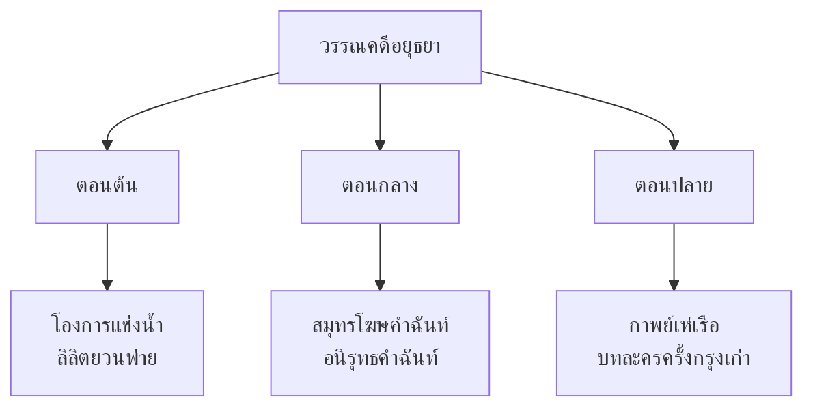

# วรรณคดีสมัยอยุธยา

> ยุคทองของวรรณกรรมไทย — โองการแช่งน้ำ สมุทรโฆษคำฉันท์ กาพย์เห่เรือ

---

## เกี่ยวกับยุคอยุธยา

| รายละเอียด | ข้อมูล |
|---|---|
| **ช่วงเวลา** | พ.ศ. ๑๘๙๓–๒๓๑๐ (๔๑๗ ปี) |
| **ราชธานี** | กรุงศรีอยุธยา |
| **แบ่งย่อย** | ตอนต้น ตอนกลาง ตอนปลาย |
| **ลักษณะวรรณคดี** | คำฉันท์ ลิลิต กาพย์เห่เรือ บทละคร |
| **ภาษาที่ใช้** | ภาษาไทย ผสมคำบาลี/สันสกฤต มากขึ้น |
| **วรรณคดีเอก** | สมุทรโฆษคำฉันท์ กาพย์เห่เรือ โองการแช่งน้ำ |

---

## ลักษณะเด่นของวรรณคดีอยุธยา

### ลักษณะภาษา
- เริ่มใช้คำบาลี/สันสกฤตมากขึ้น
- ความสวยงามของภาษาเด่นกว่าสุโขทัย
- รูปแบบร้อยกรองที่หลากหลาย (คำฉันท์ ลิลิต กาพย์)

---

## ผลงานสำคัญ

| # | ชื่อผลงาน | ผู้แต่ง | ประเภทท | บทเรียน |
|---|---|---|---|---|
| ๑ | โองการแช่งน้ำ | ไม่ปรากฏ | คำสาบาน | [[01_โองการแช่งน้ำ]] |
| ๒ | ลิลิตยวนพ่าย | ไม่ปรากฏ | ลิลิต | [[02_ลิลิตยวนพ่าย]] |
| ๓ | สมุทรโฆษคำฉันท์ | พระมหาราชครู | คำฉันท์ | [[03_สมุทรโฆษคำฉันท์]] |
| ๔ | กาพย์เห่เรือ | เจ้าฟ้าธรรมธิเบศร | กาพย์เห่เรือ | [[04_กาพย์เห่เรือ]] |

---

## ดูเพิ่มเติม

- [[00_ภาพรวม|← กลับไปภาพรวมวรรณคดี]]
- [[สมัยสุโขทัย/00_overview|← วรรณคดีสมัยสุโขทัย]]
- [[สมัยรัตนโกสินทร์/00_overview|วรรณคดีสมัยรัตนโกสินทร์ →]]
