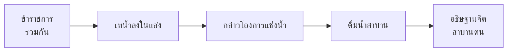

# โองการแช่งน้ำ

> พิธีสาบานความจงรักภักดีด้วยน้ำพระราชดำรัส

---

## เกี่ยวกับผลงาน

| รายละเอียด | ข้อมูล |
|---|---|
| **ชื่อผลงาน** | โองการแช่งน้ำ (ลิลิตโองการแช่งน้ำ) |
| **ผู้แต่ง** | ไม่ปรากฏ (เชื่อว่าเป็นฝ่ายพระราชสำนัก) |
| **ช่วงเวลา** | สมัยอยุธยาตอนต้น |
| **ประเภทท** | ลิลิต / คำสาบาน |
| **วัตถุประสงค์** | พิธีสาบานความจงรักภักดีของข้าราชการ |
| **ความสำคัญ** | สะท้อนความสัมพันธ์ระหว่างพระมหากษัตริย์และข้าราชการ |

---

## เนื้อหาสาระ

โองการแช่งน้ำเป็นคำสาบานที่ใช้ในพิธีแช่งน้ำสาบาน เพื่อสำแดงความจงรักภักดีต่อพระมหากษัตริย์

### ขั้นตอนพิธีแช่งน้ำสาบาน

---

## บทอักษรสำคัญ + คำแปลปัจจุบัน

### ตอนที่ ๑: คำสาบาน

> **ภาษาเดิม:**
> ข้าพระพุทธเจ้าทั้งหลาย จะจงรักภักดีต่อองค์พระประมุข มิได้ละเมิด มิได้ทรยศต่อพระเจ้าแผ่นดิน...

> **คำแปลปัจจุบัน:**
> ข้าพระพุทธเจ้าทั้งหลาย จะจงรักภักดีต่อองค์พระประมุข ไม่ละเมิด ไม่ทรยศต่อพระเจ้าแผ่นดิน...

### ตอนที่ ๒: คำแช่ง (หากทรยศ)

> **ภาษาเดิม:**
> ถ้าผู้ใดไม่จงรักภักดีต่อพระเจ้าแผ่นดิน จงประสบความวิบัติ...

> **คำแปลปัจจุบัน:**
> ถ้าผู้ใดไม่จงรักภักดีต่อพระเจ้าแผ่นดิน จงประสบความวิบัติ...

---

## วรรณศิลป์

| วิธีการ | รายละเอียด |
|---|---|
| **โวหารขู่เตือน** | ใช้คำแช่งที่รุนแรงเพื่อข่มขู่ |
| **ภาษาเป็นทางการ** | ใช้ภาษาเขียนเป็นทางการ สุภาพ |
| **รูปแบบลิลิต** | ผสมร้อยแก้วและร้อยกรอง |
| **คำเน้นหนัก** | ใช้คำเน้นความสำคัญ เช่น "จง" |

---

## คติธรรมและคุณค่า

| ประเภทท | รายละเอียด |
|---|---|
| **คุณค่าทางสังคม** | สะท้อนระบบสวัสดิการและความจงรักภักดีในสังคมอยุธยา |
| **คุณค่าทางประวัติศาสตร์** | แสดงพิธีกรรมทางการเมืองสมัยอยุธยา |
| **คุณค่าทางภาษา** | ภาษาทางการและคำสาบาน |
| **ข้อคิด** | ความจงรักภักดีคือพื้นฐานของสังคม |

---

## คำศัพท์เฉพาะ

| คำโบราณ | คำปัจจุบัน | หมายเหตุ |
|---|---|---|
| โองการ | คำสั่ง / คำประกาศ | คำสันสกฤต |
| แช่งน้ำ | สาบานด้วยน้ำ | พิธีกรรม |
| ทรยศ | ทรยศคุณ / หักหลัง | คำสันสกฤต |
| จงรักภักดี | จงรักภักดี | คำเดียวกันในปัจจุบัน |
| วิบัติ | พังทลาย / ตาย | คำสันสกฤต |

---

## ความรู้ที่เชื่อมโยง

- [[หลักการใช้ภาษาไทย/16_ราชาศัพท์|ราชาศัพท์]] — คำราชาศัพท์ในพิธีสาบาน
- [[หลักการใช้ภาษาไทย/15_ระดับภาษา|ระดับภาษา]] — ภาษาทางการ
- [[หลักการใช้ภาษาไทย/23_ร่าย|ร่าย]] — ลิลิต (ผสมร้อยแก้วและร้อยกรอง)

---

## สรุปสำคัญ

1. **โองการแช่งน้ำ** เป็นพิธีสาบานความจงรักภักดีของข้าราชการ
2. **สะท้อนความสัมพันธ์** ระหว่างพระมหากษัตริย์และข้าราชการ
3. **คำแช่ง** ข่มขู่ผู้ทรยศด้วยความวิบัติ
4. **วัฒนธรรมการสาบาน** ด้วยน้ำมีมาตั้งแต่สมัยอยุธยา

---

## ดูเพิ่มเติม

- [[00_overview|← กลับไปภาพรวมสมัยอยุธยา]]
- [[02_ลิลิตยวนพ่าย|ลิลิตยวนพ่าย →]]
