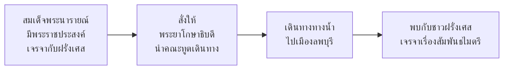

# สมุทรโฆษคำฉันท์

> ยอดคำฉันท์แห่งวรรณคดีไทย — บรรยายการเดินทางเพื่อเจรจากับชาวต่างชาติ

---

## เกี่ยวกับผลงาน

| รายละเอียด | ข้อมูล |
|---|---|
| **ชื่อผลงาน** | สมุทรโฆษคำฉันท์ |
| **ผู้แต่ง** | พระมหาราชครู ความเป็นมาเชื่อมโยงกับสมเด็จพระนารายณ์ฯ |
| **ช่วงเวลา** | อยุธยาตอนกลาง (ราชวงศ์บ้านพลูหัว) |
| **ประเภทท** | คำฉันท์ |
| **เนื้อหา** | บรรยายการเดินทางของพระยาโกษาธิบดี ไปเจรจากับชาวฝรั่งเศสที่เมืองลพบุรี |
| **ความสำคัญ** | วรรณคดีคำฉันท์ที่มีความสวยงามที่สุดเรื่องหนึ่ง |

---

## เนื้อหาสาระ

สมุทรโฆษคำฉันท์บรรยายการเดินทางของคณะทูตที่นำโดยพระยาโกษาธิบดี (กัลยาณมิตร) ไปเจรจากับชาวฝรั่งเศส ตามพระราชประสงค์ของสมเด็จพระนารายณ์มหาราช

### เนื้อหาโดยสังเขป

---

## บทอักษรสำคัญ + คำแปลปัจจุบัน

### ตอนที่ ๑: พระยาโกษาธิบดีลงเรือ

> **ภาษาเดิม:**
> ครั้นครั้งเวลาเป็นนิจ กาลมิ่งนฤพาน สมุทรเห็นดั่งฤทธิ...

> **คำแปลปัจจุบัน:**
> เมื่อถึงเวลาอันสมควร ที่จะเดินทาง จึงได้ลงเรือเดินทางไป...

### ตอนที่ ๒: บรรยายธรรมชาติริมแม่น้ำ

> **ภาษาเดิม:**
> บานชื่นนานาพรรณไม้ เห็นผลสดใสสว่าง ดั่งกลมเกลียวเจริญ...

> **คำแปลปัจจุบัน:**
> พรรณไม้นานาชนิดเบ่งบาน ผลสดใส ดูสวยงาม...

---

## วรรณศิลป์

| วิธีการ | รายละเอียด |
|---|---|
| **คำฉันท์** | ใช้ฉันท์มาตราพฤติหลายชนิด |
| **โวหารพรรณนา** | บรรยายธรรมชาติอย่างสวยงาม |
| **ภาพพจน์** | ใช้ภาพพจน์เปรียบเทียบธรรมชาติกับสิ่งต่างๆ |
| **คำกราบไหว้** | ใช้คำบาลี/สันสกฤตเป็นจำนวนมาก |

---

## คติธรรมและคุณค่า

| ประเภทท | รายละเอียด |
|---|---|
| **คุณค่าทางวรรณศิลป์** | คำฉันท์ที่งดงามที่สุดเรื่องหนึ่งของไทย |
| **คุณค่าทางประวัติศาสตร์** | สะท้อนการทูตและความสัมพันธ์กับชาวต่างชาติ |
| **คุณค่าทางภาษา** | แบบอย่างของการใช้คำฉันท์และคำบาลี/สันสกฤต |
| **คุณค่าทางสังคม** | สะท้อนความเปิดกว้างของสังคมอยุธยาที่ติดต่อกับต่างชาติ |
| **ข้อคิด** | การทูตเป็นศิลปะที่ต้องใช้ปัญญาและวาจา |

---

## คำศัพท์เฉพาะ

| คำโบราณ | คำปัจจุบัน | หมายเหตุ |
|---|---|---|
| สมุทร | ทะเล / แม่น้ำใหญ่ | คำสันสกฤต |
| โฆษ | ผู้พูด / ผู้ประกาศ | คำสันสกฤต |
| พยุหโยธา | กองทัพ / ขบวนเรือ | คำราชาศัพท์ |
| นฤพาน | การเดินทาง | คำบาลี/สันสกฤต |
| มิ่ง | สมควร / ถึงเวลา | คำโบราณ |
| ธิบดี | ผู้เป็นใหญ่ | คำสันสกฤต |

---

## ความรู้ที่เชื่อมโยง

- [[หลักการใช้ภาษาไทย/22_ฉันท์|ฉันท์]] — ฉันท์มาตราพฤติ
- [[หลักการใช้ภาษาไทย/12_คำยืมจากภาษาต่างประเทศ|คำยืมจากภาษาต่างประเทศ]] — คำบาลี/สันสกฤต
- [[07_คำวิเศษณ์|คำวิเศษณ์]] — การขยายกริยาและนาม

---

## สรุปสำคัญ

1. **สมุทรโฆษคำฉันท์** บรรยายการเดินทางเพื่อเจรจากับชาวฝรั่งเศส
2. **คำฉันท์ที่งดงามที่สุด** ของวรรณคดีไทย
3. **สะท้อนการทูต** และความสัมพันธ์กับชาวต่างชาติสมัยอยุธยา
4. **แบบอย่างการใช้คำฉันท์** และคำบาลี/สันสกฤต

---

## ดูเพิ่มเติม

- [[00_overview|← กลับไปภาพรวมสมัยอยุธยา]]
- [[02_ลิลิตยวนพ่าย|← ลิลิตยวนพ่าย]]
- [[04_กาพย์เห่เรือ|กาพย์เห่เรือ →]]
