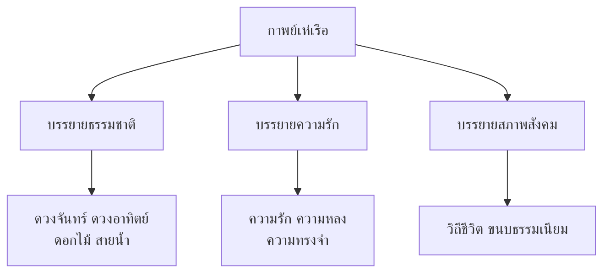

# กาพย์เห่เรือ

> กาพย์ที่แสดงความไพเราะของภาษาและความรัก

---

## เกี่ยวกับผลงาน

| รายละเอียด | ข้อมูล |
|---|---|
| **ชื่อผลงาน** | กาพย์เห่เรือ |
| **ผู้แต่ง** | เจ้าฟ้าธรรมธิเบศร (เจ้าฟ้าเทพ) |
| **ช่วงเวลา** | สมัยอยุธยาตอนปลาย |
| **ประเภทท** | กาพย์เห่เรือ (กาพย์สุรางคนางค์) |
| **เนื้อหา** | บรรยายธรรมชาติและความรัก |
| **ความสำคัญ** | วรรณคดีที่แสดงความไพเราะของภาษาไทย |
| **ฉันทลักษณ์** | กาพย์สุรางคนางค์ (วรรคหน้า ๗ คำ วรรคหลัง ๙ คำ) |

---

## เนื้อหาสาระ

กาพย์เห่เรือบรรยายความงามของธรรมชาติและความรัก ผ่านการเห่เรือแบบโบราณ

---

## บทอักษรสำคัญ + คำแปลปัจจุบัน

### ตอนที่ ๑: บรรยายพระจันทร์

> **ภาษาเดิม:**
> ดวงเดือนเพ็ญเต็มองค์ อันเชิญชมพู่
> นวลเนื้อเย็นนวล ดังรุ่งทัศน์วารี
> จันทร์กระจ่างแจ้ง สว่างไกล
> เห็นต่างราศี ผ่องอำไล ในอากาศ

> **คำแปลปัจจุบัน:**
> ดวงจันทร์เพ็ญเต็มดวง งดงาม
> แสงนวลเย็น ดังรุ่งอรุณเหนือน้ำ
> จันทร์กระจ่างแจ้ง สว่างไกล
> เห็นต่างราศี ผ่องอำไล ในท้องฟ้า

---

### ตารางวิเคราะห์บทกาพย์: บรรยายพระจันทร์

| # | ภาษาเดิม | คำแปลปัจจุบัน | หมายเหตุ |
|---|---|---|---|
| ๑ | ดวงเดือนเพ็ญเต็มองค์ | ดวงจันทร์เต็มดวง | คืนเดือนเพ็ญ |
| ๒ | อันเชิญชมพู่ | งดงาม | "ชมพู่" = ดอกชมพู่ |
| ๓ | นวลเนื้อเย็นนวล | แสงนวลเย็น | แสงจันทร์สีนวล |
| ๔ | ดังรุ่งทัศน์วารี | ดังรุ่งอรุณเหนือน้ำ | เปรียบเทียบกับรุ่งอรุณ |
| ๕ | จันทร์กระจ่างแจ้ง | จันทร์กระจ่างแจ้ง | คำเดียวกับปัจจุบัน |
| ๖ | เห็นต่างราศี | เห็นต่างราศี | แสงจันทร์เห็นทุกสรรพางค์ |
| ๗ | ผ่องอำไล ในอากาศ | ผ่องอำไล ในท้องฟ้า | "อำไล" = สว่าง |

---

## วรรณศิลป์

| วิธีการ | รายละเอียด |
|---|---|
| **กาพย์สุรางคนางค์** | วรรคหน้า ๗ คำ วรรคหลัง ๙ คำ |
| **โวหารพรรณนา** | บรรยายธรรมชาติอย่างสวยงาม |
| **ภาพพจน์** | เปรียบเทียบจันทร์กับสิ่งต่างๆ |
| **สัมผัส** | สัมผัสสระ สัมผัสพยัญชนะ สัมผัสเสียงสูง-ต่ำ |

---

## คติธรรมและคุณค่า

| ประเภทท | รายละเอียด |
|---|---|
| **คุณค่าทางวรรณศิลป์** | แสดงความไพเราะของภาษาไทย |
| **คุณค่าทางฉันทลักษณ์** | แบบอย่างของกาพย์สุรางคนางค์ |
| **คุณค่าทางสังคม** | สะท้อนวิถีชีวิตและความรักของคนอยุธยา |
| **ข้อคิด** | ธรรมชาติงดงามและความรักเป็นสิ่งที่มนุษย์เทิดทูน |

---

## คำศัพท์เฉพาะ

| คำโบราณ | คำปัจจุบัน | หมายเหตุ |
|---|---|---|
| เห่เรือ | ร้องเพลงกล่อมขณะพายเรือ | วัฒนธรรมไทย |
| ชมพู่ | ดอกชมพู่ / สีชมพู | ดอกไม้ |
| อำไล | สว่าง | คำโบราณ |
| ทัศน์ | เห็น / มองเห็น | คำสันสกฤต |
| วารี | น้ำ | คำบาลี/สันสกฤต |
| ราศี | แสง / ลักษณะ | คำสันสกฤต |
| ผ่อง | สว่าง | คำโบราณ |

---

## ความรู้ที่เชื่อมโยง

- [[หลักการใช้ภาษาไทย/19_กาพย์|กาพย์]] — กาพย์สุรางคนางค์
- [[หลักการใช้ภาษาไทย/15_ระดับภาษา|ระดับภาษา]] — ภาษาวรรณคดี
- [[หลักการใช้ภาษาไทย/18_ภาษากับวัฒนธรรม|ภาษากับวัฒนธรรม]] — วัฒนธรรมการเห่เรือ

---

## สรุปสำคัญ

1. **กาพย์เห่เรือ** แสดงความไพเราะของภาษาไทยในการบรรยายธรรมชาติ
2. **เจ้าฟ้าธรรมธิเบศร** เป็นกวีเอกแห่งยุคอยุธยาตอนปลาย
3. **กาพย์สุรางคนางค์** เป็นฉันทลักษณ์ที่ซับซ้อนและไพเราะ
4. **ธรรมชาติและความรัก** เป็นแก่นเรื่องหลัก

---

## ดูเพิ่มเติม

- [[00_overview|← กลับไปภาพรวมสมัยอยุธยา]]
- [[03_สมุทรโฆษคำฉันท์|← สมุทรโฆษคำฉันท์]]
