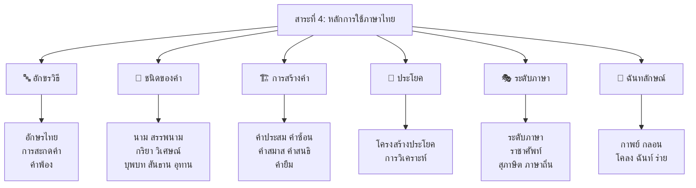

# สาระที่ 4: หลักการใช้ภาษาไทย

> ฐานความรู้ของทั้ง 5 สาระ — หากไม่เข้าใจหลักภาษา ก็ไม่สามารถใช้ภาษาได้ถูกต้อง

**หลักการใช้ภาษาไทย** เป็นแกนกลางของวิชาภาษาไทย ครอบคลุมตั้งแต่การสะกดคำ ชนิดของคำ การสร้างคำ ประโยค ระดับภาษา ไปจนถึงฉันทลักษณ์ สาระนี้เป็น "ไวยากรณ์ไทย" ที่เป็นเครื่องมือสำหรับการอ่าน การเขียน การพูด และการเข้าใจวรรณคดีอย่างลึกซึ้ง

---

## โครงสร้างของสาระ

---

## การแบ่งตามระดับชั้น

| หัวข้อ | ป.1–3 | ป.4–6 | ม.1–3 | ม.4–6 |
|---|---|---|---|---|
| อักษรไทย | พยัญชนะ สระ วรรณยุกต์ | อักษรสามหมู่ การผัน | — | — |
| การสะกดคำ | มาตราตัวสะกดพื้นฐาน | มาตราตัวสะกดทั้งหมด | คำต่างประเทศ | — |
| ชนิดของคำ | นาม กริยา พื้นฐาน | ชนิดของคำทั้ง 7 | วิเคราะห์หน้าที่ | — |
| การสร้างคำ | — | คำประสม คำซ้ำ | คำซ้อน สมาส สนธิ | วิเคราะห์การสร้าง |
| ประโยค | ประโยคพื้นฐาน | ประโยคความเดียว | ความรวม ความซ้อน | วิเคราะห์ประโยค |
| ระดับภาษา | — | ภาษาพูด เขียน | ระดับภาษา 5 ระดับ | กาลเทศะ |
| ราชาศัพท์ | — | คำราชาศัพท์พื้นฐาน | หมวดต่างๆ | บริบท |
| สุภาษิต | — | สุภาษิตง่ายๆ | สำนวน สุภาษิต | ที่มาและการใช้ |
| กาพย์ | บทร้อยกรองง่ายๆ | กาพย์ยานี ฉบัง | สุรางคนางค์ | — |
| กลอน | — | กลอนสุภาพเบื้องต้น | กลอนสุภาพ | หลากประเภท |
| โคลง | — | — | โคลงสี่สุภาพ | วิเคราะห์โคลง |
| ฉันท์ | — | — | — | ฉันท์มาตราพฤติ |
| ร่าย | — | — | — | ร่ายโบราณ สุภาพ |

---

## รายชื่อบทเรียน (23 บท)

| ลำดับ | ชื่อบทเรียน | หมวด |
|---|---|---|
| 01 | [[01_อักษรไทย]] | อักขรวิธี |
| 02 | [[02_การสะกดคำ]] | อักขรวิธี |
| 03 | [[03_คำพ้อง]] | อักขรวิธี |
| 04 | [[04_คำนาม]] | ชนิดของคำ |
| 05 | [[05_คำสรรพนาม]] | ชนิดของคำ |
| 06 | [[06_คำกริยา]] | ชนิดของคำ |
| 07 | [[07_คำวิเศษณ์]] | ชนิดของคำ |
| 08 | [[08_คำบุพบท]] | ชนิดของคำ |
| 09 | [[09_คำสันธาน]] | ชนิดของคำ |
| 10 | [[10_คำอุทาน]] | ชนิดของคำ |
| 11 | [[11_การสร้างคำแบบต่างๆ]] | การสร้างคำ |
| 12 | [[12_คำยืมจากภาษาต่างประเทศ]] | การสร้างคำ |
| 13 | [[13_ประโยคในภาษาไทย]] | ประโยค |
| 14 | [[14_การวิเคราะห์ประโยค]] | ประโยค |
| 15 | [[15_ระดับภาษา]] | ระดับภาษา |
| 16 | [[16_ราชาศัพท์]] | ระดับภาษา |
| 17 | [[17_สำนวน สุภาษิต และคำพังเพย]] | ระดับภาษา |
| 18 | [[18_ภาษากับวัฒนธรรม]] | ระดับภาษา |
| 19 | [[19_กาพย์]] | ฉันทลักษณ์ |
| 20 | [[20_กลอน]] | ฉันทลักษณ์ |
| 21 | [[21_โคลง]] | ฉันทลักษณ์ |
| 22 | [[22_ฉันท์]] | ฉันทลักษณ์ |
| 23 | [[23_ร่าย]] | ฉันทลักษณ์ |

---

## ดูเพิ่มเติม

- [[00_ภาพรวม|← กลับไปภาพรวมภาษาไทย]]
- [[การอ่าน/00_ภาพรวมการอ่าน|สาระที่ 1: การอ่าน]]
- [[การเขียน/00_ภาพรวมการเขียน|สาระที่ 2: การเขียน]]
- [[การฟัง การดู และการพูด/00_ภาพรวมการฟัง การดู และการพูด|สาระที่ 3: การฟัง การดู และการพูด]]
- [[00_ภาพรวม|สาระที่ 5: วรรณคดีและวรรณกรรม]]
