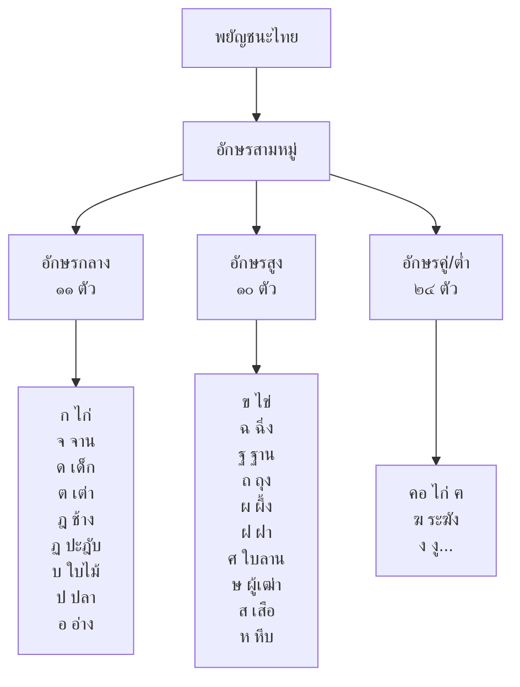
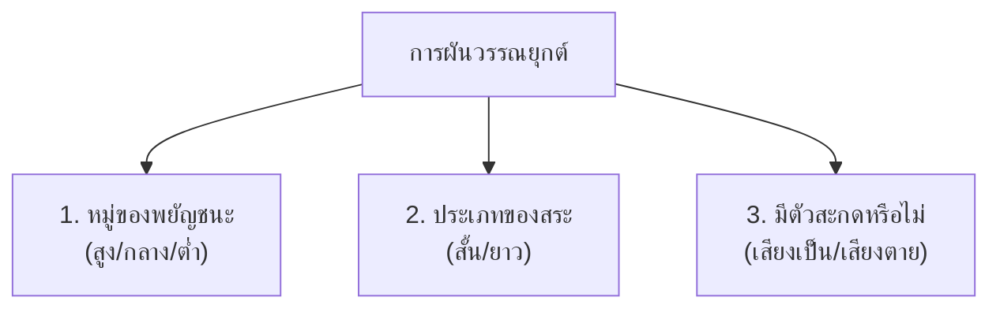

# อักษรไทย

> พยัญชนะ ๔๔ รูป สระ ๓๒ เสียง วรรณยุกต์ ๕ เสียง อักษรสามหมู่ การผันวรรณยุกต์

**อักษรไทย** เป็นระบบการเขียนของภาษาไทย ประกอบด้วยพยัญชนะ สระ วรรณยุกต์ และเครื่องหมายต่างๆ การเข้าใจอักษรไทยเป็นพื้นฐานของการอ่าน การเขียน และการใช้ภาษาไทยที่ถูกต้อง

---

## เนื้อหาตามช่วงชั้น

| ช่วงชั้น | เนื้อหา |
|---|---|
| **ป.1–3** | พยัญชนะ ๔๔ ตัว สระ ๒๑ รูป วรรณยุกต์ ๕ เสียง |
| **ป.4–6** | อักษรสามหมู่ การผันวรรณยุกต์ |

---

## พยัญชนะไทย

### จำนวนและการจัดกลุ่ม

- พยัญชนะไทยมีทั้งหมด **๔๔ รูป** แต่มีเสียง **๓๒ เสียง** (เพราะบางตัวมีเสียงซ้ำกัน)

### การจัดหมู่พยัญชนะ: อักษรสามหมู่

### ตารางพยัญชนะสามหมู่

| หมู่ | จำนวน | พยัญชนะ |
|---|---|---|
| **อักษรกลาง** | ๙ ตัว | ก จ ฎ ฏ ด ต บ ป อ |
| **อักษรสูง** | ๑๐ ตัว | ข ฉ ฐ ถ ผ ฝ ศ ษ ส ห |
| **อักษรคู่** | ๘ ตัว | ค ฅ ฆ ง ช ซ ญ ฑ (พยัญชนะคู่กับอักษรต่ำ) |
| **อักษรเดี่ยว/ต่ำ** | ๑๖ ตัว | ฒ ณ ด ต ถ ท ธ น บ ป พ ฟ ภ ม ย ร ล ว ฬ ฮ |

---

## สระไทย

### สระเดี่ยวและสระประสม

| ประเภท | รูปสระ | เสียง | ตัวอย่าง |
|---|---|---|---|
| สระเดี่ยว | ◌ะ | -ะ (สระ a สั้น) | พะ |
| สระเดี่ยว | ◌า | -า (สระ a ยาว) | พา |
| สระเดี่ยว | ิ | -ิ (สระ i สั้น) | พิ |
| สระเดี่ยว | ี | -ี (สระ i ยาว) | พี |
| สระเดี่ยว | ึ | -ึ (สระ ue สั้น) | พึ |
| สระเดี่ยว | ื | -ื (สระ ue ยาว) | พื |
| สระเดี่ยว | ุ | -ุ (สระ u สั้น) | พุ |
| สระเดี่ยว | ู | -ู (สระ u ยาว) | พู |
| สระเดี่ยว | เ◌ะ | เ-ะ (สระ e สั้น) | เพะ |
| สระเดี่ยว | เ | เ- (สระ e ยาว) | เพ |
| สระเดี่ยว | แ◌ะ | แ-ะ (สระ ae สั้น) | แพะ |
| สระเดี่ยว | แ | แ- (สระ ae ยาว) | แพ |
| สระเดี่ยว | โ◌ะ | โ-ะ (สระ o สั้น) | โพะ |
| สระเดี่ยว | โ | โ- (สระ o ยาว) | โพ |
| สระประสม | เ◌ียะ | เ-ียะ (สระ ia สั้น) | เพียะ |
| สระประสม | เ◌ีย | เ-ีย (สระ ia ยาว) | เพีย |
| สระประสม | เ◌ือะ | เ-ือะ (สระ uea สั้น) | เพือะ |
| สระประสม | เ◌ือ | เ-ือ (สระ uea ยาว) | เพือ |
| สระประสม | ◌ัวะ | -ัวะ (สระ ua สั้น) | พัวะ |
| สระประสม | ◌ัว | -ัว (สระ ua ยาว) | พัว |

---

## วรรณยุกต์

วรรณยุกต์ไทยมี **๕ เสียง** ที่ทำให้คำมีความหมายแตกต่างกัน:

| วรรณยุกต์      | ชื่อ       | ลักษณะเสียง | ตัวอยาง |
| -------------- | ---------- | ----------- | ------- |
| -              | เสียงกลาง  | กลาง        |         |
| ไม้เอก ( ่ )   | เสียงเอก   | ต่ำลง       |         |
| ไม้โท ( ้ )    | เสียงโท    | ตกลง        |         |
| ไม้ตรี ( ๊ )   | เสียงตรี   | สูงขึ้น     |         |
| ไม้จัตวา ( ๋ ) | เสียงจัตวา | ขึ้นสูง     |         |

---

## การผันวรรณยุกต์

การผันวรรณยุกต์ขึ้นอยู่กับ **๓ ปัจจัย**:

### ตัวอย่างการผัน: พยัญชนะกลาง (ก-ไก่)

| เสียง | สระยาว + เสียงเป็น | สระยาว + เสียงตาย | สระสั้น |
|---|---|---|---|
| เสียงสามัญ | นอน | คลอ | หยุด |
| เสียงเอก ( ่ ) | น่อง | — | — |
| เสียงโท ( ้ ) | น้อง | ต้อ | — |
| เสียงตรี ( ๊ ) | น้อร้อง | — | — |
| เสียงจัตวา ( ๋ ) | น๋อง | — | — |

> **หมายเหตุ:** พยัญชนะแต่ละหมู่ผันวรรณยุกต์ได้จำนวนเสียงไม่เท่ากัน อักษรกลางผันได้ ๕ เสียง, อักษรสูงผันได้ ๓ เสียง, อักษรต่ำผันได้ ๓ เสียง

---

## เครื่องหมายวิรามและเครื่องหมายอื่นๆ

| เครื่องหมาย | ชื่อ | หน้าที่ |
|---|---|---|
| ◌์ | ทัณฑฆาต (การันต์) | เป็นเครื่องหมายบอกว่าไม่ออกเสียงพยัญชนะนั้น |
| ๆ | ไม้ยมก | แสดงความซ้ำของคำก่อนหน้า |
| ฯ | ไม้ไตรยางศ์ | แสดงความยาวของคำที่ละไว |
| ฯลฯ | ไปยาลน้อย | แปลว่า "ต่อไปในทำนองเดียวกัน" |
| — | นิคหิต | เสียง ง หรือ ม ผสมกับสระ |

---

## ดูเพิ่มเติม

- [[02_การสะกดคำ|การสะกดคำ]]
- [[03_คำพ้อง|คำพ้อง]]
