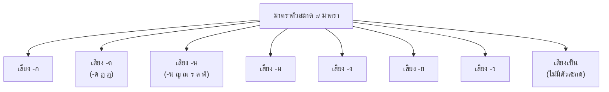

# การสะกดคำ

> มาตราตัวสะกด ๘ มาตรา การสะกดคำที่ตรงมาตราและไม่ตรงมาตรา อักษรนำ อักษรนำ-นาง

**การสะกดคำ** คือ การเขียนคำให้ถูกต้องตามหลักอักขรวิธีของภาษาไทย โดยเฉพาะการใช้ตัวสะกดท้ายคำ ซึ่งมีหลักเกณฑ์ที่เรียกว่า "มาตราตัวสะกด"

---

## เนื้อหาตามช่วงชั้น

| ช่วงชั้น | เนื้อหา |
|---|---|
| **ป.1–3** | มาตราตัวสะกดพื้นฐาน |
| **ป.4–6** | มาตราตัวสะกดทั้ง ๘ มาตรา |
| **ม.1–3** | การสะกดคำที่มาจากภาษาต่างประเทศ |

---

## มาตราตัวสะกด ๘ มาตรา

มาตราตัวสะกดแบ่งตามเสียงท้ายคำ (เสียงตัวสะกด) เป็น ๘ มาตรา:

### ตารางมาตราตัวสะกด

| มาตรา | ตัวสะกดที่ใช้ | ตัวอย่าง |
|---|---|---|
| **มาตรา -ก** | ก ข ค ฆ | รัก ราก ธรรมะ |
| **มาตรา -ด** | ด จ ช ซ ฎ ฏ ฑ ฒ ต ถ ท ธ ส ษ ศ | นัด นาฏ ราช |
| **มาตรา -น** | น ญ ณ ร ล ฬ | กิน ญัตถ์ คุรุ สาคล กาฬ |
| **มาตรา -ม** | ม | กลม หลาม |
| **มาตรา -ง** | ง | ส้วง กลัง |
| **มาตรา -ย** | ย | พันธุ์ คุกกี้ย |
| **มาตรา -ว** | ว | ราว เลว |
| **มาตราเป็น** | ไม่มีตัวสะกด | จะ กา ทีป |

---

## การสะกดคำตรงมาตราและไม่ตรงมาตรา

### คำตรงมาตรา

**คำตรงมาตรา** คือ คำที่เขียนตัวสะกดตามมาตราของเสียงนั้นๆ

| เสียงท้ายคำ | ตัวสะกดที่ใช้ | ตัวอย่าง |
|---|---|---|
| เสียง -ก | ก | หนังสือ → หนังสือ (ส-สือ มาตรา -ก) |
| เสียง -ด | ด | นักเรียน → นักเรียน (น-นัก มาตรา -ก) |
| เสียง -น | น | กิน → กิน (น-น มาตรา -น) |
| เสียง -ม | ม | ดื่ม → ดื่ม (ม-ม มาตรา -ม) |

### คำไม่ตรงมาตรา

**คำไม่ตรงมาตรา** คือ คำที่เขียนตัวสะกดไม่ตรงกับเสียงท้ายคำ ส่วนใหญ่เป็นคำยืมจากภาษาบาลี/สันสกฤต/เขมร

| คำ | เสียงออก | ตัวสะกดจริง | มาตรา |
|---|---|---|---|
| พรรค | -ก | พรรค (ค) | มาตรา -ก |
| อาจารย์ | -ย | ย์ (ที่ไม่ออกเสียง ร) | มาตรา -ก |
| ศาสตร์ | -ะ (สั้น) | ศาสตร์ | มาตรา -ก |
| วิทยา | -ยา | ยา | มาตราเป็น |
| โอตส์ | -ซ | ส์ (ส+ทันฑฆาต) | มาตรา -ด |

---

## อักษรนำ

**อักษรนำ** คือ พยัญชนะที่นำหน้าพยัญชนะอื่น โดยมีเสียงอ่านออกแต่ตัวนำ ไม่อ่านออกเสียงตัวที่ถูกนำ

### อักษรนำที่สำคัญ

| อักษรนำ | ความหมาย | ตัวอย่าง |
|---|---|---|
| **ห (ห นำ)** | ทำให้พยัญชนะต่ำกลายเป็นเสียงสูง/ต่ำเป็นเสียงสามัญ | หน้า หลาน หญิง |
| **อ (อ นำ)** | ใช้นำหน้าสระบางตัว | อ้อน อ่อน อก |
| **สิ่งที่ห นำ** | — | หน หง หย หญ หล หร หว หอ |

### ตัวอย่างการอ่าน

| คำ | อ่านออกเสียง | คำอธิบาย |
|---|---|---|
| หน้า | ห + น้ำา + วรรณยุกต์ | ห นำ น |
| หลาน | ห + ล + -า + น | ห นำ ล |
| หญิง | ห + ญ + -ิ + ง | ห นำ ญ |
| อ้อน | อ + -อ + น + วรรณยุกต์ | อ นำ ออน |

---

## เคล็ดลับการสะกดคำ

1. **จำมาตราตัวสะกด**: ๗ มาตราเสียงตาย + ๑ มาตราเสียงเป็น
2. **รู้จักคำยืม**: คำบาลี/สันสกฤตมักไม่ตรงมาตรา
3. **ระวังอักษรนำ**: ห นำ และ อ นำ
4. **อ่านหนังสือมาก**: ช่วยจดจำรูปคำ
5. **ใช้พจนานุกรม**: เมื่อสงสัยให้ตรวจสอบ

---

## ดูเพิ่มเติม

- [[01_อักษรไทย|อักษรไทย]]
- [[03_คำพ้อง|คำพ้อง]]
- [[12_คำยืมจากภาษาต่างประเทศ|คำยืมจากภาษาต่างประเทศ]]
