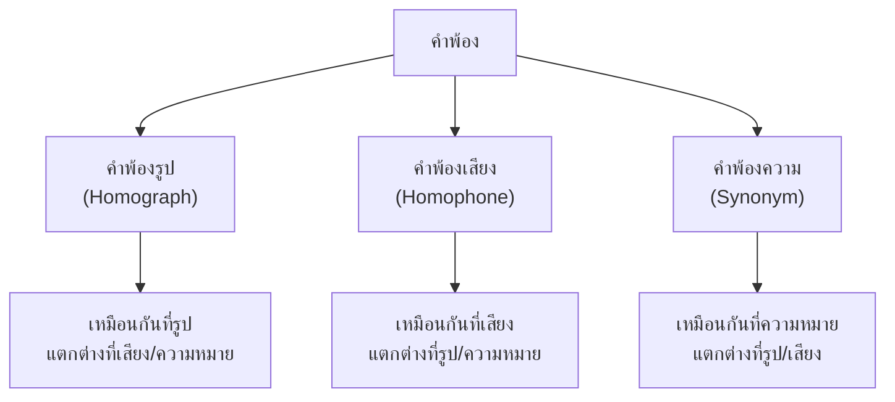

# คำพ้อง

> คำพ้องรูป คำพ้องเสียง คำพ้องความ — คำที่มีลักษณะคล้ายกันแต่อาจมีความหมายต่างกัน

**คำพ้อง** คือ คำที่มีลักษณะบางอย่างเหมือนกัน (รูป เสียง หรือความหมาย) แต่อาจมีความหมายหรือหน้าที่ทางไวยากรณ์ต่างกัน

---

## เนื้อหาตามช่วงชั้น

| ช่วงชั้น | เนื้อหา |
|---|---|
| **ป.4–6** | เริ่มรู้จักคำพ้องเสียง |
| **ม.1–3** | วิเคราะห์คำพ้องรูป พ้องเสียง พ้องความ |

---

## ประเภทของคำพ้อง

---

## 1. คำพ้องรูป (Homograph)

**คำพ้องรูป** คือ คำที่เขียนเหมือนกันทุกประการ แต่อ่านออกเสียงหรือมีความหมายต่างกัน

| คำ | เสียงที่ 1 | เสียงที่ 2 | ความหมาย |
|---|---|---|---|
| ใกล้ | ใกล้ (สามัญ) | — | ไม่ไกล |
| น้ำ | น้ำ (สามัญ) | น้ำา (เอก) | ของเหลว / น้ำา |
| หนึ่ง | หนึ่ง (สามัญ) | — | จำนวน ๑ |
| อ่าน | อ่าน (สามัญ) | — | กิริยาอ่าน |

**ตัวอย่างคำพ้องรูปที่อ่านเสียงต่างกัน:**

| คำ | เสียงที่ 1 | เสียงที่ 2 |
|---|---|---|
| กระจาย | กระ-จาย (กระจายไป) | กฺระ-จาย (ของกระจาย) |
| หนังสือ | หนัง-สือ (book) | — |

---

## 2. คำพ้องเสียง (Homophone)

**คำพ้องเสียง** คือ คำที่อ่านออกเสียงเหมือนกัน แต่เขียนต่างกันและมีความหมายต่างกัน

| คำที่ 1 | ความหมาย | คำที่ 2 | ความหมาย |
|---|---|---|---|
| ขาว | สีขาว | ข่าว | ข่าวสาร |
| ม้า | สัตว์ | หมา | สัตว์ |
| ไกล่ | ไกล่เกลี่ย | ไกล | ไม่ใกล้ |
| ก้าว | ก้าวเท้า | การ | แผนงาน |
| พาน | พานรอง | พ่าน | นกพ่าน |

**ตัวอย่างเพิ่มเติม:**

| เสียง | คำ 1 | คำ 2 | คำ 3 |
|---|---|---|---|
| "kâaw" | ข้าว (rice) | ขาว (white) | ข่าว (news) |
| "mâa" | ม้า (horse) | หมา (dog) | มา (come) |
| "sǎai" | สาย (string) | ทราย (sand) | สาว (girl) |

---

## 3. คำพ้องความ (Synonym)

**คำพ้องความ** คือ คำที่มีความหมายเหมือนกันหรือใกล้เคียงกัน แต่อาจเขียนและออกเสียงต่างกัน

| คำ | คำพ้องความ | ความหมาย |
|---|---|---|
| สวย | งดงาม ไพเราะ | มีความสวย |
| ใหญ่ | มหาศาล มหาศาล | มีขนาดใหญ่ |
| รวดเร็ว | ฉับพลัน ทันที | เร็ว |
| ดีใจ | ยินดี ปิติ | มีความสุข |
| โกรธ | พิโรธ โมโห | ไม่พอใจ |

### การใช้คำพ้องความตามระดับภาษา

| ความหมาย | ภาษาพูด | ภาษาเขียน/ทางการ | ราชาศัพท์ |
|---|---|---|---|
| กิน | กิน | รับประทาน | เสวย |
| นอน | นอน | บรรทม | บรรทม |
| ตาย | ตาย | ถึงแก่กรรม | สวรรคต |
| ชื่อ | ชื่อ | นาม | พระนาม |

---

## ความสำคัญของคำพ้อง

| ประโยชน์ | รายละเอียด |
|---|---|
| **หลีกเลี่ยงคำซ้ำ** | ใช้คำพ้องความแทนเพื่อความหลากหลาย |
| **สร้างความชัดเจน** | เลือกคำที่เหมาะสมกับบริบท |
| **สร้างความเพลิดเพลิน** | ในวรรณกรรม กวีนิพนธ์ |
| **แก้ความคลุมเครือ** | แยกคำพ้องเสียง/รูป |

---

## เคล็ดลับการใช้คำพ้อง

1. **ตรวจสอบความหมาย**: อย่าใช้ตามเสียงเพียงอย่างเดียว
2. **พิจารณาบริบท**: บริบทช่วยแยกคำพ้องเสียง
3. **ใช้คำพ้องความให้เหมาะสม**: ไม่มากเกินไป
4. **รู้จักระดับภาษา**: คำพ้องความบางคำใช้ในสถานการณ์ต่างกัน

---

## ดูเพิ่มเติม

- [[01_อักษรไทย|อักษรไทย]]
- [[02_การสะกดคำ|การสะกดคำ]]
- [[15_ระดับภาษา|ระดับภาษา]]
