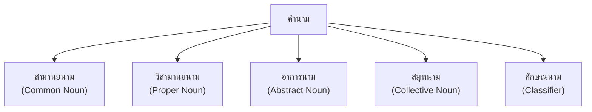

# คำนาม

> สามานยนาม วิสามานยนาม อาการนาม สมุหนาม ลักษณนาม

**คำนาม** (Noun) คือ คำที่ใช้เรียกชื่อคน สัตว์ สิ่งของ สถานที่ ความคิด หรือสิ่งที่เป็นนามธรรม คำนามเป็นหนึ่งในหน้าที่ของคำที่สำคัญที่สุด เพราะเป็นพยัญชนะของข้อความ

---

## เนื้อหาตามช่วงชั้น

| ช่วงชั้น | เนื้อหา |
|---|---|
| **ป.1–3** | รู้จักคำนามพื้นฐาน |
| **ป.4–6** | ชนิดของคำนามทั้งหมด |
| **ม.1–3** | วิเคราะห์หน้าที่ของคำนามในประโยค |

---

## ประเภทของคำนาม

---

## 1. สามานยนาม (Common Nown)

**สามานยนาม** คือ คำนามที่เรียกชื่อคน สัตว์ สิ่งของ สถานที่ โดยทั่วไป ไม่เจาะจง

| หมวด | ตัวอย่าง |
|---|---|
| คน | คน ลูก พ่อ แม่ ครู นักเรียน |
| สัตว์ | สุนัข แมว ช้าง นก |
| สิ่งของ | โต๊ะ เก้าอี้ หนังสือ ปากกา |
| สถานที่ | โรงเรียน บ้าน ตลาด โรงพยาบาล |
| เวลา | วัน เดือน ปี เช้า เย็น |

---

## 2. วิสามานยนาม (Proper Noun)

**วิสามานยนาม** คือ คำนามที่เรียกชื่อเฉพาะเจาะจง เพื่อให้ทราบว่าเป็นคน สัตว์ สิ่งของ สถานที่ หนึ่งเดียว

| หมวด | ตัวอย่าง |
|---|---|
| ชื่อคน | สมชาย สมหญิง นาวาอากาศเอกพระเจ้าวรวงศ์เธอ |
| ชื่อสถานที่ | กรุงเทพมหานคร เชียงใหม่ ภูเก็ต |
| ชื่อโรงเรียน | โรงเรียนสาธิตจุฬา โรงเรียนเทพศิรินทร์ |
| ชื่อประเทศ | ประเทศไทย ประเทศญี่ปุ่น |
| ชื่อเทศกาล | สงกรานต์ คริสต์มาส |

> **กฎ:** วิสามานยนามในภาษาไทยมักไม่ต้องใช้คำนำหน้า แต่ในภาษาอังกฤษต้องขึ้นต้นด้วยอักษรตัวใหญ่ (Capital letter)

---

## 3. อาการนาม (Abstract Noun)

**อาการนาม** คือ คำนามที่เรียกชื่อสิ่งที่ไม่มีรูปร่าง ต้องสัมผัสด้วยจิตใจ ความรู้สึก ความคิด

| หมวด | ตัวอย่าง |
|---|---|
| ความรู้สึก | ความรัก ความ Happiness ความโกรธ ความเศร้า |
| ความคิด | ความคิด ความจำ ความฝัน |
| คุณธรรม | ความซื่อสัตย์ ความขยัน ความ อดทน |
| สภาวะ | ความงาม ความสุข ความสงบ |

---

## 4. สมุหนาม (Collective Noun)

**สมุหนาม** คือ คำนามที่เรียกชื่อสิ่งที่รวมกันเป็นกลุ่ม มีความหมายในลักษณะข集J

| หมวด | ตัวอย่าง |
|---|---|
| คน | คณะ ครอบครัว กลุ่ม ฝูงชน มวลชน |
| สัตว์ | ฝูง โขยง (ช้าง) |
| สิ่งของ | พวก หมู่ กอง |
| สถานที่ | ชุมชน ชนบท |

---

## 5. ลักษณนาม (Classifier)

**ลักษณนาม** คือ คำที่ใช้นับนามในภาษาไทย บอกลักษณะของสิ่งนั้น ภาษาไทยมีลักษณนามมากมายตามรูปแบบของสิ่งที่นับ

| นาม | ลักษณนาม | ตัวอย่าง |
|---|---|---|
| คน | คน | คน 3 คน |
| สุนัข | ตัว | สุนัข 2 ตัว |
| ดอกไม้ | ดอก | ดอกไม้ 5 ดอก |
| หนังสือ | เล่ม | หนังสือ 10 เล่ม |
| ปลา | ตัว | ปลา 3 ตัว |
| เสื้อ | ตัว | เสื้อ 5 ตัว |
| น้ำ | แก้ว/ขวด | น้ำ 2 แก้ว |
| รถ | คัน | รถ 3 คัน |
| มีด | เล่ม | มีด 1 เล่ม |
| บ้าน | หลัง | บ้าน 2 หลัง |
| ภาพ | ภาพ/หนุาม | ภาพ 5 ภาพ |
| ถนน | สาย | ถนน 3 สาย |
| อาคาร | หลัง | อาคาร 2 หลัง |
| พืช | ต้น | ต้นไม้ 5 ต้น |

### ลักษณนามที่ใช้ได้หลายอย่าง

| ลักษณนาม | ใช้นับ | ตัวอยาง |
|---|---|---|
| ตัว | สัตว์ เสื้อผ้า คน (ไม่สุภาพ) | สุนัข 2 ตัว |
| เล่ม | สิ่งที่เป็นเล่ม | หนังสือ 3 เล่ม |
| อัน | ของเล็ก | ปากกา 2 อัน |
| คัน | ยานพาหนะ | รถยนต์ 1 คัน |
| หลัง | สิ่งที่มีหลังคา | บ้าน 3 หลัง |
| ดอก | ดอกไม้ ตรา | ดอกไม้ 5 ดอก |

---

## เคล็ดลับการใช้คำนาม

1. **เลือกลักษณนามให้ถูกต้อง**: แต่ละนามมีลักษณนามเฉพาะ
2. **จำแนกประเภท**: สามานยนาม vs วิสามานยนาม
3. **รู้จักอาการนาม**: สิ่งที่จับต้องไม่ได้
4. **ใช้สมุหนาม**: เมื่อพูดถึงกลุ่ม
5. **ใช้พจนานุกรม**: เมื่อสงสัย

---

## ดูเพิ่มเติม

- [[05_คำสรรพนาม|คำสรรพนาม]]
- [[06_คำกริยา|คำกริยา]]
