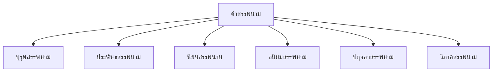
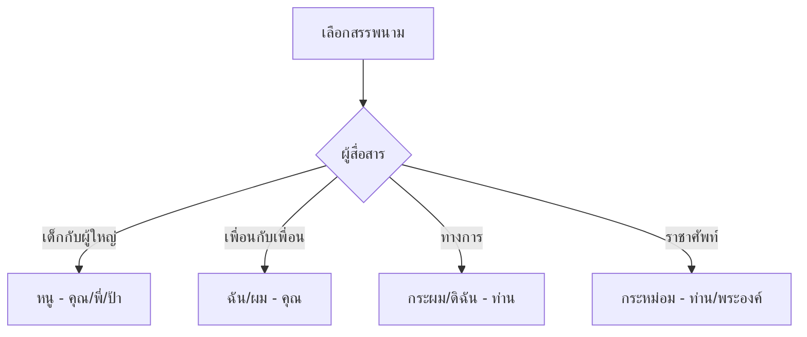

# คำสรรพนาม

> บุรุษสรรพนาม ประพันธสรรพนาม นิยมสรรพนาม อนิยมสรรพนาม ปฤจฉาสรรพนาม วิภาคสรรพนาม

**คำสรรพนาม** (Pronoun) คือ คำที่ใช้แทนคำนาม เพื่อหลีกเลี่ยงการพูดชื่อนามซ้ำๆ การเลือกใช้สรรพนามที่เหมาะสมบ่งบอกถึงมารยาทและกาลเทศะ

---

## เนื้อหาตามช่วงชั้น

| ช่วงชั้น | เนื้อหา |
|---|---|
| **ป.1–3** | สรรพนามพื้นฐาน: ฉัน ผม คุณ เขา |
| **ป.4–6** | ชนิดของสรรพนามทั้งหมด |
| **ม.1–3** | วิเคราะห์การใช้สรรพนามในบริบท |

---

## ประเภทของคำสรรพนาม



---

## 1. บุรุษสรรพนาม (Personal Pronoun)

**บุรุษสรรพนาม** คือ คำที่ใช้แทนคำนาม แบ่งตามบุรุษที่ ๑–๓

| บุรุษ | บุรุษที่ ๑ (พูด) | บุรุษที่ ๒ (ฟัง) | บุรุษที่ ๓ (ถูกพูดถึง) |
|---|---|---|---|
| **ราชาศัพท์** | กระหม่อม ข้าพระพุทธเจ้า | ท่าน พระองค์ | ท่าน พระองค์ |
| **ทางการ** | กระผม/หลวง | ท่าน | ท่าน |
| **กันเอง (ชาย)** | ผม กู | คุณ มึง | เขา/เธอ มัน |
| **กันเอง (หญิง)** | ฉัน ดิฉัน กู | คุณ มึง | เขา/เธอ มัน |
| **เด็ก** | หนู | พี่/ป้า/น้า/อา | เขา/เขา |
| **เพื่อนสนิท** | กู | มึง | มัน |

> **สำคัญ:** การเลือกสรรพนามต้องพิจารณา **อายุ ความสนิท สถานะ และกาลเทศะ**

---

## 2. ประพันธสรรพนาม (Possessive Pronoun)

**ประพันธสรรพนาม** คือ คำที่ใช้แทนชื่อผู้เป็นเจ้าของ

| คำนาม | ประพันธสรรพนาม | ตัวอย่าง |
|---|---|---|
| สมชาย | ของเขา | หนังสือของเขา |
| แม่ | ของคุณแม่ | บ้านของคุณแม่ |
| เพื่อน | ของเพื่อน | ปากกาของเพื่อน |

**รูปแบบ:**
```
[นาม] + ของ + [สรรพนาม]
เช่น หนังสือของฉัน = หนังสือฉัน
```

---

## 3. นิยมสรรพนาม (Demonstrative Pronoun)

**นิยมสรรพนาม** คือ คำที่ใช้ชี้เฉพาะเจาะจง

| คำ | ความหมาย | ตัวอย่าง |
|---|---|---|
| นี้ | ใกล้ผู้พูด | หนังสือเล่มนี้ |
| นั้น | ไกลผู้พูด | หนังสือเล่มนั้น |
| โน้น | ไกลมาก | หนังสือเล่มโน้น |
| นี่ | ใกล้ผู้พูด (ย่อ) | นี่คือหนังสือของฉัน |
| นั่น | ไกลผู้พูด (ย่อ) | นั่นคือหนังสือของเขา |
| อันนี้ | ใกล้ผู้พูด | อันนี้ดีกว่า |
| อันนั้น | ไกลผู้พูด | อันนั่นดีกว่า |

---

## 4. อนิยมสรรพนาม (Indefinite Pronoun)

**อนิยมสรรพนาม** คือ คำที่ไม่ชี้เฉพาะเจาะจง ใช้แทนคำนามโดยไม่ระบุชัดเจน

| คำ | ความหมาย | ตัวอย่าง |
|---|---|---|
| ทุกคน | ทั้งหมด | ทุกคนมาเรียน |
| บางคน | ไม่ทั้งหมด | บางคนไม่มา |
| ใคร | บุคคลไม่เจาะจง | ใครมาส่ง |
| อื่น | ไม่เหมือนเดิม | คนอื่น |
| ใครก็ตาม | บุคคลใดก็ได้ | ใครก็ตามที่มา |
| ทั้งหมด | รวมทั้งหมด | ทั้งหมดถูกต้อง |
| บาง | ไม่ทั้งหมด | บางครั้ง |

---

## 5. ปฤจฉาสรรพนาม (Interrogative Pronoun)

**ปฤจฉาสรรพนาม** คือ คำที่ใช้ถามเพื่อหาข้อมูล

| คำ | ใช้ถาม | ตัวอย่าง |
|---|---|---|
| ใคร | บุคคล | ใครทำการบ้าน? |
| อะไร | สิ่งของ | คุณกินอะไร? |
| ที่ไหน | สถานที่ | คุณไปที่ไหน? |
| อย่างไร | วิธีการ | คุณทำอย่างไร? |
| เมื่อไร | เวลา | คุณมาเมื่อไร? |
| กี่ | จำนวน | มีกี่คน? |
| อันไหน | เลือก | คุณเลือกอันไหน? |

---

## 6. วิภาคสรรพนาม (Relative Pronoun)

**วิภาคสรรพนาม** คือ คำที่ใช้แทนคำนามและเชื่อมประโยค

| คำ | หน้าที่ | ตัวอยาง |
|---|---|---|
| ที่ | เชื่อมข้อความ | คนที่มาเมื่อวาน |
| ผู้ | เชื่อมข้อความ (คน) | ผู้ที่มาเมื่อวาน |
| อัน | เชื่อมข้อความ (สิ่งของ) | หนังสืออันที่ฉันซื้อ |
| ซึ่ง | เชื่อมข้อความ | หนังสือซึ่งฉันซื้อ |

**ตัวอย่าง:**
> "คน**ที่**มาเมื่อวานเป็นเพื่อนของฉัน"
> "หนังสือ**ซึ่ง**อยู่บนโต๊ะเป็นของฉัน"

---

## การเลือกใช้สรรพนามตามกาลเทศะ



---

## เคล็ดลับการใช้คำสรรพนาม

1. **พิจารณาผู้สื่อสาร**: อายุ ความสนิท สถานะ
2. **รู้จักกาลเทศะ**: ทางการ vs กันเอง
3. **หลีกเลี่ยงคำหยาบ**: กู/มึง ใช้เฉพาะเพื่อนสนิท
4. **เคารพผู้ใหญ่**: ใช้ หนู/คุณ/พี่
5. **ไม่สับสน**: บุรุษที่ ๑ ๒ ๓

---

## ดูเพิ่มเติม

- [[04_คำนาม|คำนาม]]
- [[06_คำกริยา|คำกริยา]]
- [[15_ระดับภาษา|ระดับภาษา]]
- [[16_ราชาศัพท์|ราชาศัพท์]]
