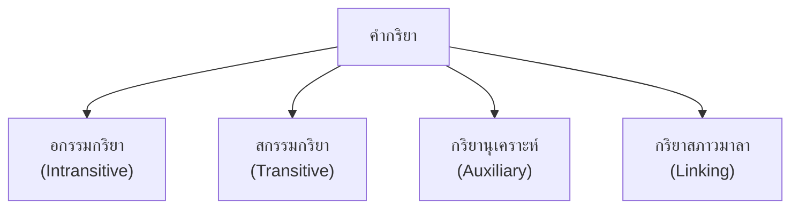
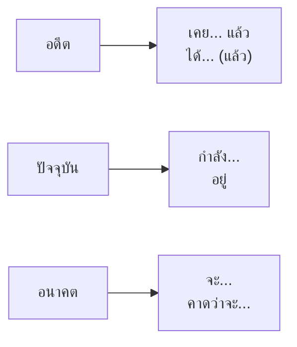

# คำกริยา

> อกรรมกริยา สกรรมกริยา กริยานุเคราะห์ กริยาสภาวมาลา

**คำกริยา** (Verb) คือ คำที่บอกอาการ การกระทำ หรือสภาวะของคน สัตว์ สิ่งของ คำกริยาเป็น "ภาคแสดง" ของประโยค บอกว่าประธาน "ทำอะไร" หรือ "เป็นอะไร"

---

## เนื้อหาตามช่วงชั้น

| ช่วงชั้น | เน้นหนัก |
|---|---|
| **ป.1–3** | รู้จักคำกริยาพื้นฐาน |
| **ป.4–6** | ชนิดของคำกริยา |
| **ม.1–3** | วิเคราะห์หน้าที่ในประโยค |

---

## ประเภทของคำกริยา

---

## 1. อกรรมกริยา (Intransitive Verb)

**อกรรมกริยา** คือ กริยาที่ไม่ต้องมีกรรม (ผู้ถูกกระทำ) ทำกรรมเสร็จสมบูรณ์ในตัวเอง

**โครงสร้าง:** ประธาน + กริยา

| ตัวอย่าง | ความหมาย |
|---|---|
| เขา**นอน** | เขานอน (ไม่ต้องบอกว่านอนใคร) |
| นก**บิน** | นกบิน (ไม่ต้องบอกว่าบินอะไร) |
| เด็ก**ร้องไห้** | เด็กร้องไห้ (กรรมเสร็จในตัว) |
| ฝน**ตก** | ฝนตก |
| ดอกไม้**บาน** | ดอกไม้บาน |

---

## 2. สกรรมกริยา (Transitive Verb)

**สกรรมกริยา** คือ กริยาที่ต้องมีกรรม (ผู้ถูกกระทำ) จึงจะสมบูรณ์

**โครงสร้าง:** ประธาน + กริยา + กรรม

| ตัวอย่าง | กรรม | ความหมาย |
|---|---|---|
| เขา**กิน**ข้าว | ข้าว | กินอะไร? → ข้าว |
| ครู**สอน**นักเรียน | นักเรียน | สอนใคร? → นักเรียน |
| ฉัน**ซื้อ**หนังสือ | หนังสือ | ซื้ออะไร? → หนังสือ |
| แม่**ตี**ไข่ | ไข่ | ตีอะไร? → ไข่ |
| นักเรียน**เขียน**บทความ | บทความ | เขียนอะไร? → บทความ |

---

## 3. กริยานุเคราะห์ (Auxiliary Verb)

**กริยานุเคราะห์** คือ คำที่อยู่หน้ากริยาอื่นเพื่อเติมความหมาย เช่น บอกกาล (เวลา), บอกความน่าจะเป็น

| กริยานุเคราะห์ | ความหมาย | ตัวอย่าง |
|---|---|---|
| จะ | อนาคต | พรุ่งนี้ฉัน**จะ**ไป |
| กำลัง | ปัจจุบัน | เขา**กำลัง**กิน |
| ได้ | สำเร็จ/อดีต | เขา**ได้**รางวัล |
| ควร | ความควร | คุณ**ควร**พักผ่อน |
| ต้อง | จำเป็น | เรา**ต้อง**ไป |
| อาจ | น่าจะเป็น | เขา**อาจ**มา |
| อาจจะ | น่าจะเป็น | เขา**อาจจะ**มา |
| เคย | อดีต | เขา**เคย**ไป |
| มักจะ | ความถี่ | เขา**มักจะ**สาย |
| ยัง | ยังไม่ | เขา**ยัง**ไม่มา |

---

## 4. กริยาสภาวมาลา (Linking Verb)

**กริยาสภาวมาลา** คือ กริยาที่เชื่อมประธานกับส่วนขยาย บอกสภาพ ลักษณะ หรือความเป็นอยู่

| กริยา | ความหมาย | ตัวอย่าง |
|---|---|---|
| เป็น | บอกตัวตน | เขา**เป็น**ครู |
| คือ | บอกนิยาม | น้ำ**คือ**ชีวิต |
| อยู่ | บอกสถานที่ | แมว**อยู่**บนโต๊ะ |
| มี | บอกการครอบครอง | ฉัน**มี**หนังสือ |
| ดูเหมือน | บอกลักษณะ | เขา**ดูเหมือน**เหนื่อย |
| กลายเป็น | บอกการเปลี่ยนแปลง | น้ำ**กลายเป็น**น้ำแข็ง |

---

## การผันกริยาตามกาล (Tense)

ภาษาไทยไม่มีการผันกริยาตามรูปแบบเหมือนภาษาอังกฤษ แต่ใช้ **กริยานุเคราะห์** หรือ **คำวิเศษณ์** บอกกาล

| กาล | คำเติม | ตัวอยาง |
|---|---|---|
| **อดีต** | ได้, แล้ว, เคย | เขา**ได้**ไป**แล้ว** |
| **ปัจจุบัน** | กำลัง, อยู่ | เขา**กำลัง**กิน**อยู่** |
| **อนาคต** | จะ, จัก | เขา**จะ**ไปพรุ่งนี้ |

---

## เคล็ดลับการใช้คำกริยา

1. **จำแนกประเภท**: อกรรม vs สกรรม
2. **ตรวจสอบกรรม**: มีผู้ถูกกระทำหรือไม่
3. **ใช้กริยานุเคราะห์**: บอกกาล ความน่าจะเป็น
4. **เลือกกริยาเหมาะสม**: ทางการ vs กันเอง
5. **รู้จักสภาวมาลา**: เป็น/คือ/มี/อยู่

---

## ดูเพิ่มเติม

- [[04_คำนาม|คำนาม]]
- [[07_คำวิเศษณ์|คำวิเศษณ์]]
- [[13_ประโยคในภาษาไทย|ประโยคในภาษาไทย]]
