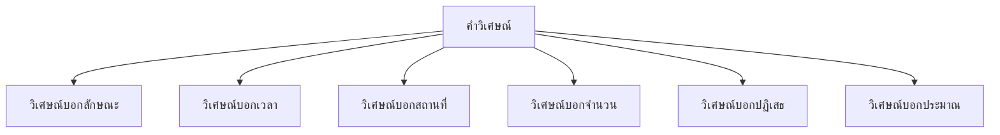

# คำวิเศษณ์

> วิเศษณ์บอกลักษณะ เวลา สถานที่ จำนวน ปฏิเสธ ประมาณ — ขยายกริยา นาม และวิเศษณ์อื่น

**คำวิเศษณ์** (Adverb) คือ คำที่ใช้ขยายกริยา คำนาม คำวิเศษณ์อื่น หรือคำคุณศัพท์ ทำให้ความหมายชัดเจนขึ้น

---

## เนื้อหาตามช่วงชั้น

| ช่วงชั้น | เนื้อหา |
|---|---|
| **ป.4–6** | รู้จักคำวิเศษณ์พื้นฐาน |
| **ม.1–3** | จำแนกประเภทวิเศษณ์ |

---

## ประเภทของคำวิเศษณ์

---

## 1. วิเศษณ์บอกลักษณะ

บอกอาการ คุณสมบัติ หรือวิธีการของกริยา

| คำวิเศษณ์ | ขยาย | ตัวอย่าง |
|---|---|---|
| เร็ว | วิ่ง | เขาวิ่งเร็ว |
| ช้า | เดิน | เขาเดินช้า |
| สวย | ร้อง | เขาร้องสวย |
| ขยัน | เรียน | เขาเรียนขยัน |
| ดี | ทำ | เขาทำดี |
| เต็มที่ | เล่น | เขาเล่นเต็มที่ |
| ตั้งใจ | ฟัง | เขาฟังตั้งใจ |

---

## 2. วิเศษณ์บอกเวลา

บอกเวลาที่เกิดการกระทำ

| คำวิเศษณ์ | ตัวอย่าง |
|---|---|
| วันนี้ | วันนี้เขามาสาย |
| เมื่อวาน | เมื่อวานฝนตก |
| พรุ่งนี้ | พรุ่งนี้เราจะไป |
| เช้า | เขามาเช้า |
| เย็น | เขากลับเย็น |
| บาดครั้ง | บางครั้งเขาสาย |
| สม่ำเสมอ | เขามาสม่ำเสมอ |
| ตลอดเวลา | เขาทำตลอดเวลา |

---

## 3. วิเศษณ์บอกสถานที่

บอกสถานที่ของการกระทำ

| คำวิเศษณ์ | ตัวอย่าง |
|---|---|
| ที่นี่ | ที่นี่สะอาด |
| ที่นั่น | ที่นั่นมีคนเยอะ |
| ข้างบน | แมวอยู่ข้างบน |
| ข้างล่าง | หนังสืออยู่ข้างล่าง |
| ข้างใน | เขาอยู่ข้างใน |
| ข้างนอก | เขาไปข้างนอก |
| ทุกที่ | เขาไปทุกที่ |
| โรงเรียน | เขาอยู่โรงเรียน |

---

## 4. วิเศษณ์บอกจำนวน

บอกจำนวนครั้งของการกระทำ

| คำวิเศษณ์ | ตัวอย่าง |
|---|---|
| ครั้งเดียว | เขาทำครั้งเดียวเสร็จ |
| สองครั้ง | เขาพูดสองครั้ง |
| หลายครั้ง | เขาลองหลายครั้ง |
| ทุกครั้ง | เขามาทุกครั้ง |
| เสมอ | เขาสายเสมอ |
| อีกครั้ง | เขาลองอีกครั้ง |

---

## 5. วิเศษณ์บอกปฏิเสธ

บอกความปฏิเสธ ไม่

| คำวิเศษณ์ | ตัวอย่าง |
|---|---|
| ไม่ | เขาไม่มา |
| มิ | มิใช่ |
| อย่า | อย่าไป |
| หามิได้ | หามิได้เป็นเช่นนั้น |

---

## 6. วิเศษณ์บอกประมาณ

บอกการประมาณการณ์

| คำวิเศษณ์ | ตัวอย่าง |
|---|---|
| ประมาณ | ประมาณ 10 คน |
| เกือบ | เกือบถึงแล้ว |
| ราวๆ | ราวๆ 5 โมง |
| กระมัง | คงจะมากระมัง |
| เล็กน้อย | เพิ่มเล็กน้อย |
| พอสมควร | ดีพอสมควร |

---

## คำวิเศษณ์กับระดับภาษา

| ความหมาย | ภาษาพูด | ภาษาเขียน |
|---|---|---|
| เร็วมาก | แรง | รวดเร็ว |
| ดีมาก | จัง | อย่างยิ่ง |
| ช้า | ยืดเยื้อ | นาน |
| เดี๋ยว | พักเดียว | ชั่วขณะ |

---

## เคล็ดลับการใช้คำวิเศษณ์

1. **วางในตำแหน่งที่ถูก**: มักวางหลังกริยา
2. **เลือกคำที่ขยายได้**: ไม่ซ้ำซ้อน
3. **ระวังการใช้ซ้อน**: เช่น "เร็วมากๆ แรง"
4. **รู้จักระดับภาษา**: พูด vs เขียน

---

## ดูเพิ่มเติม

- [[06_คำกริยา|คำกริยา]]
- [[08_คำบุพบท|คำบุพบท]]
